```mermaid
%% Current Mermaid version
info
```  -->



```mermaid
---
title: "CongLeSolutionX"
author: "Cong Le"
version: "1.0"
license(s): "MIT, CC BY 4.0"
copyright: "Copyright (c) 2025 Cong Le. All Rights Reserved."
config:
  theme: base
---
%%%%%%%% Mermaid version v11.4.1-b.14
%%{
  init: {
    'flowchart': { 'htmlLabels': false },
    'fontFamily': 'Bradley Hand',
    'themeVariables': {
      'primaryColor': '#fc82',
      'primaryTextColor': '#F8B229',
      'primaryBorderColor': '#27AE60',
      'secondaryColor': '#81c784',
      'secondaryTextColor': '#6C3483',
      'lineColor': '#F8B229',
      'fontSize': '20px'
    }
  }
}%%
flowchart LR
    My_Meme@{ img: "https://raw.githubusercontent.com/CongLeSolutionX/MY_GRAPHIC_ASSETS/refs/heads/main/MY_MEME/My-meme-ideas.png", label: "Ăn uống gì chưa ngừi đẹp?", pos: "b", w: 200, h: 150, constraint: "off" }

    Closing_quote@{ shape: braces, label: "With the right context,<br/>theory become reality" }

    Link_to_my_profile{{"<a href='https://github.com/CongLeSolutionX/CongLeSolutionX' target='_blank'>Click here if you care about my profile</a>"}}

Closing_quote ~~~ My_Meme
My_Meme animatingEdge@--> Link_to_my_profile
animatingEdge@{ animate: true }


```

# CHANGE_ME

> <ins>📢 **Disclaimer** 🚨</ins>
>
> This project is born from my fascination with blending digital art and artificial intelligence. 
> It's where I document my academic explorations, 
> share my findings with anyone interested, 
> and maintain a personal vault of my creative and technical journey. 
> I'm not sure the link for this repo being shared in the back by others, 
> since I havent plan for any analytics for this project yet. 
> Any user who shares, adapts, or builds upon this work is responsible for their own interpretations and applications. 
> ...and I'm actively looking for a job... 

> This document contains my personal notes on the topic, 
> compiled from publicly available documentation and various cited sources.
> 
> The materials are intended for educational purposes (<ins>sometimes, entertainment purposes</ins>), personal study, and technical reference.
> The content is dual-licensed:
> 1. **MIT License:** Applies to all code implementations (Swift, Mermaid, and other programming languages).
> 2. **Creative Commons Attribution-ShareAlike 4.0 International License (CC BY-SA 4.0):** Applies to all non-code content, including text, explanations, diagrams, and illustrations.

-----

## - A Diagrammatic Guide 

---

<!-- 

---
>
>**Licenses:**
>
>- **MIT License:**   - Full text in [LICENSE](LICENSE) file.
>- **Creative Commons Attribution 4.0 International:**  - Legal details in [LICENSE-CC-BY](LICENSE-CC-BY) and at [Creative Commons official site](http://creativecommons.org/licenses/by/4.0/).

---
