<div align="center">
  <p>⚠️🏗️🚧🦺🧱🪵🪨🪚🛠️👷</p>
  <i>This is a working draft in progress.</i>
  <br/>
  
  <br/>
  <blockquote>
	  <i>gif image is provided by <a href="https://giphy.com">Giphy</a></i>
  </blockquote>
  <p>⚠️🏗️🚧🦺🧱🪵🪨🪚🛠️👷</p>

</div>

---

# Euclidean Distance
<details open>
<summary>Click to show/hide the full disclaimer.</summary>
   
> <ins>📢 **Disclaimer** 🚨</ins>
>
> This document contains my personal notes on the topic,
> compiled from publicly available documentation and various cited sources.
> The materials are intended for 👨‍🎓 <ins>educational purposes</ins> 👨‍🎓 (<ins>:trollface:sometimes, entertainment purposes:trollface:</ins>), 📖 <ins> personal study </ins> 📖, and 🔖 <ins> reference </ins> 🔖.
> The content is dual-licensed:
> 1. **MIT License:** Applies to all code implementations (Swift, Mermaid, and other programming languages).
> 2. **Creative Commons Attribution-ShareAlike 4.0 International License (CC BY-SA 4.0):** Applies to all non-code content, including text, explanations, diagrams, and illustrations.

</details>


----

## Unraveling Euclidean Distance: From Pythagoras to Machine Learning

Euclidean distance is arguably the most intuitive and widely used method for measuring the "straight-line" distance between two points. It's the distance you'd measure with a ruler, representing the shortest possible path. This concept, rooted in ancient geometry as laid out in Euclid's *Elements*, has become a cornerstone of modern data science, powering algorithms in fields like machine learning, computer vision, and statistics[^1].

This explanation will explore its mathematical foundations, its formal properties, its pivotal role in foundational ML algorithms, and its limitations in high-dimensional contexts.


---

## 1. The Intuition: A Direct Path from Pythagoras

The simplest way to understand Euclidean distance is by looking at a two-dimensional plane. If you have two points, `P1` at `(x1, y1)` and `P2` at `(x2, y2)`, the distance between them forms the hypotenuse of a right-angled triangle. The other two sides are the difference in their x-coordinates (`|x1 - x2|`) and the difference in their y-coordinates (`|y1 - y2|`).

This is a direct application of the **Pythagorean Theorem**: $a^2 + b^2 = c^2$.

```mermaid
---
title: "A Direct Path from Pythagoras"
author: "Cong Le"
version: "1.0"
license(s): "MIT, CC BY-SA 4.0"
copyright: "Copyright © 2025 Cong Le. All Rights Reserved."
config:
  layout: elk
  theme: base
  look: handDrawn
---
%%%%%%%% Mermaid version v11.4.1-b.14
%%%%%%%% Available curve styles include the following keywords:
%% basis, bumpX, bumpY, cardinal, catmullRom, linear, monotoneX, monotoneY, natural, step, stepAfter, stepBefore.
%%{
  init: {
    'securityLevel': 'loose',
    'flowchart': { 'htmlLabels': true, 'curve': 'linear' },
    'fontFamily': 'Comic Sans MS, cursive, sans-serif',
    'themeVariables': {
      'primaryColor': '#22BB',
      'primaryTextColor': '#F8B229',
      'lineColor': '#F8B229',
      'primaryBorderColor': '#27AE60',
      'secondaryColor': '#EBF0',
      'secondaryTextColor': '#6C3483',
      'secondaryBorderColor': '#A569BD',
      'fontSize': '15px'
    }
  }
}%%
flowchart TD
    subgraph Pythagorean_Connection_in_2D["Pythagorean Connection in 2D"]
    style Pythagorean_Connection_in_2D fill:#F2F2,stroke:#333,stroke-width:1px, color: #FFFF
    direction LR
        A["<b>Point P1</b><br>(x1, y1)"]
        B["<b>Point P2</b><br>(x2, y2)"]
        C("Corner")

        A -- "<b>Side a</b><br> |y1 - y2|" --> C
        C -- "<b>Side b</b><br> |x1 - x2|" --> B
        A -- "<b>Distance<br/>(c)</b><br> √(a² + b²)" --> B

        style A fill:#4F52,stroke:#FFF
        style B fill:#4F52,stroke:#FFF
        style C fill:#22BB,stroke:#9E9E9E,stroke-dasharray: 5 5
    end
```



By substituting our coordinate differences for sides `a` and `b`, we get the familiar 2D distance formula. This core idea of summing squared differences and taking the square root extends seamlessly into higher dimensions.


> [!TIP]
> Swift demo code: <https://github.com/CongLeSolutionX/MyApp/tree/SWIFTUI-Euclidean_Distance-A_Direct_Path_from_Pythagoras>


----

## 2. The General Formula: Mathematical Definition

For two points **p** and **q** in an n-dimensional space, where **p** = (`p₁`, `p₂`, …, `pₙ`) and **q** = (`q₁`, `q₂`, …, `qₙ`), the Euclidean distance `d(p, q)` is defined as:

$$
d(\mathbf{p}, \mathbf{q}) = \sqrt{(q_1 - p_1)^2 + (q_2 - p_2)^2 + \cdots + (q_n - p_n)^2}
$$

This can be expressed more concisely using summation notation:

$$
d(\mathbf{p}, \mathbf{q}) = \sqrt{\sum_{i=1}^{n} (q_i - p_i)^2}
$$

This formula is also equivalent to the **Euclidean norm** or **L2 norm** of the difference vector (**q** - **p**), a foundational concept in linear algebra and machine learning[^1].

$$
d(\mathbf{p}, \mathbf{q}) = \| \mathbf{q} - \mathbf{p} \|_2
$$

The calculation follows a clear, repeatable process.


> [!TIP]
Swift demo code: <https://github.com/CongLeSolutionX/MyApp/tree/SWIFTUI-Euclidean_Distance-Euclidean_Distance_View>


-----

## 3. Properties of a Metric

For a function to be considered a true distance, it must operate within a "metric space" by satisfying four fundamental axioms[^2]. Euclidean distance fulfills all of them.

1.  **Non-negativity:** $d(\mathbf{p}, \mathbf{q}) \ge 0$
2.  **Identity of Indiscernibles:** $d(\mathbf{p}, \mathbf{q}) = 0 \iff \mathbf{p} = \mathbf{q}$
3.  **Symmetry:** $d(\mathbf{p}, \mathbf{q}) = d(\mathbf{q}, \mathbf{p})$
4.  **Triangle Inequality:** $d(\mathbf{p}, \mathbf{r}) \le d(\mathbf{p}, \mathbf{q}) + d(\mathbf{q}, \mathbf{r})$

The triangle inequality is particularly important, as it ensures that the shortest distance between two points is the direct path, forming the basis for many optimization proofs.

```mermaid
---
title: "Triangle Inequality Visualization"
author: "Cong Le"
version: "1.0"
license(s): "MIT, CC BY-SA 4.0"
copyright: "Copyright © 2025 Cong Le. All Rights Reserved."
config:
  layout: elk
  theme: base
  look: handDrawn
---
%%%%%%%% Mermaid version v11.4.1-b.14
%%%%%%%% Available curve styles include the following keywords:
%% basis, bumpX, bumpY, cardinal, catmullRom, linear, monotoneX, monotoneY, natural, step, stepAfter, stepBefore.
%%{
  init: {
    'securityLevel': 'loose',
    'flowchart': { 'htmlLabels': true, 'curve': 'linear' },
    'fontFamily': 'Comic Sans MS, cursive, sans-serif',
    'themeVariables': {
      'primaryColor': '#22BB',
      'primaryTextColor': '#F8B229',
      'lineColor': '#F8B229',
      'primaryBorderColor': '#27AE60',
      'secondaryColor': '#3BB4',
      'secondaryTextColor': '#6C3483',
      'secondaryBorderColor': '#A569BD',
      'fontSize': '15px'
    }
  }
}%%
flowchart LR
    P["<b>p</b>"] -- "d(p, q)" --> Q["<b>q</b>"]
    Q -- "d(q, r)" --> R["<b>r</b>"]
    P -- "<b>d(p, r)</b> ≤ d(p, q) + d(q, r)" --> R

    style P fill:#F44336, stroke-width:2px
    style Q fill:#932B0, stroke-width:2px
    style R fill:#F44336, stroke-width:2px
```



> [!TIP]
> Swift demo: <https://github.com/CongLeSolutionX/MyApp/tree/SWIFTUI-Euclidean_Distance-Metric_Properties_View>


----

## 4. Key Applications in Machine Learning

The concept of measuring "closeness" is central to many machine learning algorithms.

*   **k-Nearest Neighbors (k-NN):** The k-NN algorithm, originally proposed by Cover and Hart in 1967, is a non-parametric method used for classification and regression[^3]. To classify a new data point, k-NN finds the 'k' closest points in the training data using Euclidean distance. The new point is then assigned the majority class label of its neighbors.

*   **k-Means Clustering:** One of the most popular unsupervised learning algorithms, k-Means, was detailed by J. B. MacQueen in 1967 [4]. It partitions a dataset into 'k' distinct, non-overlapping clusters by minimizing the Euclidean distances between data points and their assigned cluster's centroid.

### Real-World Example: The Iris Flower Dataset

A classic demonstration of these algorithms uses the Iris flower dataset, a public resource first introduced by the botanist Edgar Anderson and used in R. A. Fisher's seminal 1936 paper[^5]. This dataset comprises 150 samples from three species of Iris flowers, each with four measured features: sepal length, sepal width, petal length, and petal width (all in centimeters).

To find the distance between two flowers, Flower A and Flower B, we treat their features as coordinates in a 4-dimensional space:
*   `Flower A = (sepal_len_A, sepal_wid_A, petal_len_A, petal_wid_A)`
*   `Flower B = (sepal_len_B, sepal_wid_B, petal_len_B, petal_wid_B)`

The Euclidean distance is:

$$
d(A, B) = \sqrt{(L_{A}-L_{B})^2 + (W_{A}-W_{B})^2 + (PL_{A}-PL_{B})^2 + (PW_{A}-PW_{B})^2}
$$

This distance calculation allows a k-NN model to find the most similar flowers to an unknown sample and classify it, or a k-Means model to group the flowers into their natural species clusters.


> [!TIP]
> Swift demo: <https://github.com/CongLeSolutionX/MyApp/tree/SWIFTUI-Euclidean_Distance-Machine_Learning_Demo_View>


----

## 5. The Challenge: The Curse of Dimensionality

While powerful, Euclidean distance's effectiveness diminishes in high-dimensional spaces—a phenomenon Richard Bellman termed the **"Curse of Dimensionality"** in his work on dynamic programming[^6].

As the number of dimensions (features) increases:
1.  **Distance Concentration:** The relative contrast between the nearest and farthest data points shrinks, making them all appear approximately equidistant. This makes distance-based selection less meaningful[^7].
2.  **Sparsity:** The data required to maintain a uniform density across the space grows exponentially, making any finite dataset sparse.

This degradation significantly impacts distance-based algorithms like k-NN and k-Means. Dimensionality reduction techniques (like PCA) or alternative distance metrics are often required as a mitigation strategy.


> [!TIP]
> Swift demo: <https://github.com/CongLeSolutionX/MyApp/tree/SWIFTUI-Euclidean_Distance-Curse_Of_Dimensionality_View>


---

## 6. Summary

Euclidean distance is a foundational concept that provides a simple and effective way to measure similarity. Its deep connection to geometry makes it intuitive, while its mathematical formulation allows it to power complex algorithms. However, a responsible practitioner must understand its limitations, especially the Curse of Dimensionality, and know when alternative metrics are more appropriate.


> [!TIP]
> Swift demo: <https://github.com/CongLeSolutionX/MyApp/tree/SWIFTUI-Euclidean_Distance-Distance_Metrics_View>


---

```mermaid
---
title: "❓...CongLeSolutionX....❓"
author: "Cong Le"
version: "1.0"
license(s): "MIT, CC BY-SA 4.0"
copyright: "Copyright (c) 2025 Cong Le. All Rights Reserved."
config:
  theme: base
---
%%%%%%%% Mermaid version v11.4.1-b.14
%%{
  init: {
    'flowchart': { 'htmlLabels': false },
    'fontFamily': 'Bradley Hand',
    'themeVariables': {
      'primaryColor': '#fc82',
      'primaryTextColor': '#F8B229',
      'primaryBorderColor': '#27AE60',
      'secondaryColor': '#81c784',
      'secondaryTextColor': '#6C3483',
      'lineColor': '#F8B229',
      'fontSize': '20px'
    }
  }
}%%
flowchart LR
  My_Meme@{ img: "https://raw.githubusercontent.com/CongLeSolutionX/CongLeSolutionX/refs/heads/main/assets/images/My-meme-light-bulb-question-marks.png", label: "Ăn uống gì chưa ngừi đẹp?", pos: "b", w: 200, h: 150, constraint: "off" }

  Closing_quote@{ shape: braces, label: "...searching insights in the process of formulating better questions..." }

  Closing_quote ~~~ My_Meme
    
  Link_to_my_profile{{"<a href='https://github.com/CongLeSolutionX' target='_blank'>Click here if you care about my profile</a>"}}

  Closing_quote ~~~ My_Meme
  My_Meme animatingEdge@--> Link_to_my_profile
  
  animatingEdge@{ animate: true }

```

---
>**Licenses:**
>
>- **MIT License:**  [](LICENSE) - Full text in [LICENSE](LICENSE) file.
>- **Creative Commons Attribution-ShareAlike 4.0 International**: [CC BY-SA 4.0](https://creativecommons.org/licenses/by-sa/4.0/) [](https://creativecommons.org/licenses/by-sa/4.0/) - Legal details in [LICENSE-CC-BY-SA-4.0](THE_PAST/LICENSE-CC-BY-SA-4.0) and at [Creative Commons official site](https://creativecommons.org/licenses/by-sa/4.0/).
>
---

### References

[^1]: Bishop, Christopher M. *Pattern Recognition and Machine Learning*. New York: Springer, 2006.

[^2]: Rudin, Walter. *Principles of Mathematical Analysis*. 3rd ed. International Series in Pure and Applied Mathematics. New York: McGraw-Hill, 1976.

[^3]: Cover, Thomas M., and Peter E. Hart. "Nearest Neighbor Pattern Classification." *IEEE Transactions on Information Theory* 13, no. 1 (January 1967): 21–27.

[^4]: MacQueen, James B. "Some Methods for Classification and Analysis of Multivariate Observations." In *Proceedings of the Fifth Berkeley Symposium on Mathematical Statistics and Probability, Volume 1: Statistics*, 281–97. Berkeley, CA: University of California Press, 1967.

[^5]: Fisher, Ronald A. "The Use of Multiple Measurements in Taxonomic Problems." *Annals of Eugenics* 7, no. 2 (September 1936): 179–88. The dataset is publicly available from the UCI Machine Learning Repository: Dua, D. and Graff, C. (2019). UCI Machine Learning Repository [http://archive.ics.uci.edu/ml]. Irvine, CA: University of California, School of Information and Computer Science.

[^6]: Bellman, Richard E. *Dynamic Programming*. Princeton, NJ: Princeton University Press, 1957.

[7]: Aggarwal, Charu C., Alexander Hinneburg, and Daniel A. Keim. "On the Surprising Behavior of Distance Metrics in High Dimensional Space." In *Database Theory — ICDT 2001: 8th International Conference London, UK, January 4–6, 2001 Proceedings*, 420-434. Berlin, Heidelberg: Springer Berlin Heidelberg, 2001.

-----
