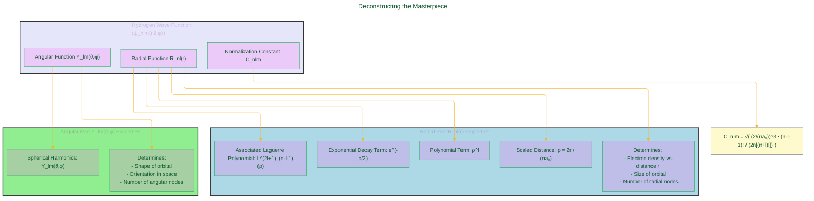

> ⚠️🏗️🚧🦺🧱🪵🪨🪚🛠️👷
> 
> This is a working draft in progress
> 
> ⚠️🏗️🚧🦺🧱🪵🪨🪚🛠️👷

---

## 🌟 The Hydrogen Atom: A Quantum Mechanical Marvel 🌟

The image you've shared showcases solutions to the **Time-Independent Schrödinger Equation** for the Hydrogen atom. This equation is a cornerstone of quantum mechanics. For a single particle in a potential $V(\vec{r})$, it is written as:

$$ \left[-\frac{\hbar^2}{2m} \nabla^2 + V(\vec{r})\right] \psi(\vec{r}) = E \psi(\vec{r}) $$

*(This is the general Time-Independent Schrödinger Equation (TISE). Source: Standard Quantum Mechanics textbooks, e.g., Griffiths, D.J. "Introduction to Quantum Mechanics")* [^1]

Here:
*   $\hbar$ is the reduced Planck constant ($\hbar = h/2\pi$).
*   $m$ is the mass of the particle (in this case, effectively the reduced mass of the electron-proton system, $\mu$).
*   $\nabla^2$ is the Laplacian operator, representing kinetic energy.
*   $V(\vec{r})$ is the potential energy function. For the Hydrogen atom, this is the Coulomb potential: $V(r) = -\frac{e^2}{4\pi\epsilon_0 r}$.
*   $\psi(\vec{r})$ is the **wave function**, which contains information about the particle.
*   $E$ is the total energy of the particle, which is quantized.

The solutions, $\psi_{nlm}(r, \vartheta, \varphi)$, are the **wave functions** or **atomic orbitals** for the Hydrogen atom. They don't tell us the exact position of the electron (Heisenberg's Uncertainty Principle reminds us of that! 🧐), but they do tell us the **probability amplitude** of finding the electron at a particular point in space $(r, \vartheta, \varphi)$ around the nucleus.

Conceptually, the wave function can be separated into two main parts:
1.  A **Radial Part**, $R_{nl}(r)$, which depends only on the distance $r$ from the nucleus.
2.  An **Angular Part**, $Y_{lm}(\vartheta, \varphi)$, which depends on the angles $\vartheta$ (polar) and $\varphi$ (azimuthal).

So, we can write:

$$ \psi_{nlm}(r, \vartheta, \varphi) = R_{nl}(r) Y_{lm}(\vartheta, \varphi) $$

*(Source: Standard Quantum Mechanics textbooks discussing separation of variables for central potentials).* [^1]

----

## 🔬 The Grand Equation Unveiled! 🔬

The complete hydrogen wave function, as shown in your image, is given by:

$$ \psi_{nlm}(r, \vartheta, \varphi) = \sqrt{\left(\frac{2}{na_0}\right)^3 \frac{(n-l-1)!}{2n[(n+l)!]}} e^{-\rho/2} \rho^l L_{n-l-1}^{2l+1}(\rho) \cdot Y_{lm}(\vartheta, \varphi) $$

*(This is the normalized wave function for Hydrogen-like atoms. Source: Standard Quantum Mechanics textbooks, e.g., Liboff, R.L. "Introductory Quantum Mechanics").* [^2]

Where:
*   $\rho = \frac{2r}{na_0}$
*   $a_0$ is the **Bohr radius**. It is defined as:
    $$ a_0 = \frac{4\pi\epsilon_0\hbar^2}{m_e e^2} \approx 5.29 \times 10^{-11} \text{ m} $$
    *(Source: Definition from atomic physics, e.g., Bransden, B.H., & Joachain, C.J. "Physics of Atoms and Molecules").* [^3]
    ($m_e$ is the electron mass, $e$ is the elementary charge, $\epsilon_0$ is the permittivity of free space).
*   $n, l, m_l$ are the quantum numbers.
*   $L_{n-l-1}^{2l+1}(\rho)$ are the **Associated Laguerre Polynomials**.
*   $Y_{lm_l}(\vartheta, \varphi)$ are the **Spherical Harmonics**.

This equation looks a bit daunting, but let's break it down!

-----

## 🧩 Deconstructing the Masterpiece: Components of $\psi_{nlm}$ 🧩 

*   **Normalization Constant**: Ensures $\int |\psi|^2 dV = 1$. The probability of finding the electron *somewhere* in all space is 1.
*   **Radial Part ($R_{nl}(r)$)**: Dictates how probability density changes with distance from the nucleus.
*   **Angular Part ($Y_{lm_l}(\vartheta, \varphi)$)**: Determines the 3D shape and orientation.

----

## ✨ The Magical Ingredients: Quantum Numbers $(n, l, m_l)$ ✨

These numbers arise from solving the Schrödinger equation with appropriate boundary conditions.

*   **Principal Quantum Number $(n)$**:
    *   Symbol: $n$
    *   Allowed values: $1, 2, 3, \dots$
    *   Determines: The electron's **energy level**. For Hydrogen and hydrogen-like atoms, the energy is given by:
        
        $$ E_n = -\frac{\mu e^4}{2(4\pi\epsilon_0)^2\hbar^2} \frac{1}{n^2} = -\frac{E_0}{n^2} $$
        
        where $E_0 \approx 13.6 \text{ eV}$ is the Rydberg energy. *(Source: Derived from solving TISE for Hydrogen atom, e.g., Griffiths, D.J. "Introduction to Quantum Mechanics").* [^1]
*   **Azimuthal or Angular Momentum Quantum Number $(l)$**:
    *   Symbol: $l$
    *   Allowed values: For a given $n$, $l = 0, 1, 2, \dots, n-1$.
    *   Determines: The **shape** of the orbital and the magnitude of the electron's orbital angular momentum, $|L|$:
        
        $$ |L| = \sqrt{l(l+1)}\hbar $$
        
        *(Source: General result from the quantum theory of angular momentum, e.g., Griffiths, D.J. "Introduction to Quantum Mechanics").* [^1]
        *   $l=0$: **s** orbital (spherical)
        *   $l=1$: **p** orbital (dumbbell-shaped)
        *   $l=2$: **d** orbital (more complex shapes)
*   **Magnetic Quantum Number $(m_l)$**:
    *   Symbol: $m_l$ (or $m$ in the main equation)
    *   Allowed values: For a given $l$, $m_l = -l, -l+1, \dots, 0, \dots, l-1, l$. ($2l+1$ values).
    *   Determines: The **orientation** of the orbital in space. Specifically, it quantifies the z-component of the orbital angular momentum, $L_z$:
        
        $$ L_z = m_l\hbar $$
        
        *(Source: General result from the quantum theory of angular momentum, e.g., Griffiths, D.J. "Introduction to Quantum Mechanics").* [^1]

(The Mermaid diagram from the previous response effectively visualizes the relationships between these quantum numbers.)

----

## 🎨 Visualizing the Invisible: Probability Density Plots 🎨

The plots visualize the **probability density**:

$$ P(r, \vartheta, \varphi) = |\psi_{nlm}(r, \vartheta, \varphi)|^2 $$

This gives the probability per unit volume of finding the electron.
*   **Brighter Regions**: Higher probability density.
*   **Darker Regions**: Lower probability density.
*   **Color Bar ($- \leftrightarrow +$)**: Indicates the **phase (sign)** of the wave function $\psi$ itself. This is crucial for understanding chemical bonding.

---

## 🖼️ A Tour Through the Orbital Gallery (Interpreting the Plots) 🖼️

**Nodes**: Regions where $\psi = 0$, so $|\psi|^2 = 0$.
*   **Total Nodes** = $n-1$.
*   **Angular Nodes** (planar/conical) = $l$.
*   **Radial Nodes** (spherical) = $n-l-1$.

(The table from the previous response detailing specific orbitals and their nodes is very informative here.)

---

## 🎭 Mathematical Functions at Play 🎭

*   **Associated Laguerre Polynomials $L_{q}^{p}(x)$**:
    The general definition that gives rise to these polynomials in the context of the radial equation is:
    
    $$ x \frac{d^2u}{dx^2} + (p+1-x)\frac{du}{dx} + q u = 0 $$
    
    Solutions are $L_q^p(x)$. For the hydrogen atom, $q = n-l-1$ and $p = 2l+1$, and the variable is $\rho$.
    One common explicit form is:
    
    $$ L_q^p(x) = (-1)^p \frac{d^p}{dx^p} L_{p+q}(x) $$
    
    where $L_k(x)$ is the $k$-th Laguerre polynomial: $L_k(x) = e^x \frac{d^k}{dx^k}(x^k e^{-x})$.
    *(Source: Mathematical physics texts, e.g., Arfken, G.B., Weber, H.J., Harris, F.E. "Mathematical Methods for Physicists").* [^4]

*   **Spherical Harmonics $Y_{lm_l}(\vartheta, \varphi)$**:
    These are the angular solutions. The previous response correctly provided their definition:
    
    $$ Y_{lm_l}(\vartheta, \varphi) = (-1)^{(m_l+|m_l|)/2} \sqrt{\frac{(2l+1)}{4\pi}\frac{(l-|m_l|)!}{(l+|m_l|)!}} P_l^{|m_l|}(\cos\vartheta) e^{im_l\varphi} $$
    
    where $P_l^{|m_l|}(\cos\vartheta)$ are the **Associated Legendre Polynomials**.
    The Associated Legendre Polynomials are solutions to the Legendre differential equation and are given by:
    
    $$ P_l^m(x) = (-1)^m (1-x^2)^{m/2} \frac{d^m}{dx^m} P_l(x) $$
    
    where $P_l(x)$ is the $l$-th Legendre polynomial: $P_l(x) = \frac{1}{2^l l!} \frac{d^l}{dx^l}(x^2-1)^l$.
    
    *(Source: Mathematical physics texts, e.g., Arfken, G.B., Weber, H.J., Harris, F.E. "Mathematical Methods for Physicists").* [^4]

---

## 🌍 Significance in Chemistry and Physics 🧪🔬

Understanding hydrogen wave functions is fundamental for:
*   Electronic structure of multi-electron atoms (approximations).
*   **Chemical bonding** theory (orbital overlap, molecular orbitals).
*   **Atomic spectroscopy** (selection rules for transitions depend on these quantum numbers).
*   A cornerstone of **quantum mechanics**, showcasing quantization and wave nature. As noted in the DOE Explains article, "quantization is a key part of quantum mechanics. In atoms, this means that electrons can only exist in specific, quantized energy levels." [^5]

---

## 🌠 Conclusion 🌠

The hydrogen wave function, $\psi_{nlm}$, arising as a solution to the Schrödinger equation, is a testament to the predictive power of quantum mechanics. Its mathematical structure, governed by quantum numbers $n, l, m_l$ and built from special functions like Laguerre polynomials and Spherical Harmonics, precisely describes the probabilistic nature and quantized properties (energy, angular momentum) of the electron in a hydrogen atom. The visual representations of these functions as orbitals provide an indispensable tool for chemists and physicists to understand the behavior of matter at the atomic level. So cool! 🤓🌌

---

<!-- 

---
>**Licenses:**
>
>- **MIT License:**   - Full text in [LICENSE](LICENSE) file.
>- **Creative Commons Attribution-ShareAlike 4.0 International**: [CC BY-SA 4.0](https://creativecommons.org/licenses/by-sa/4.0/)  - Legal details in [LICENSE-CC-BY-SA-4.0](LICENSE-CC-BY-SA-4.0) and at [Creative Commons official site](https://creativecommons.org/licenses/by-sa/4.0/).
>

[^1]: Griffiths, D. J. (2018). *Introduction to Quantum Mechanics* (3rd ed.). Cambridge University Press.
[^2]: Liboff, R. L. (2002). *Introductory Quantum Mechanics* (4th ed.). Addison-Wesley.
[^3]: Bransden, B. H., & Joachain, C. J. (2003). *Physics of Atoms and Molecules* (2nd ed.). Prentice Hall.
[^4]: Arfken, G. B., Weber, H. J., & Harris, F. E. (2013). *Mathematical Methods for Physicists* (7th ed.). Academic Press.
[^5]: U.S. Department of Energy. (n.d.). *DOE Explains...Quantum Mechanics*. Energy.gov. Retrieved from [https://www.energy.gov/science/doe-explainsquantum-mechanics](https://www.energy.gov/science/doe-explainsquantum-mechanics)

