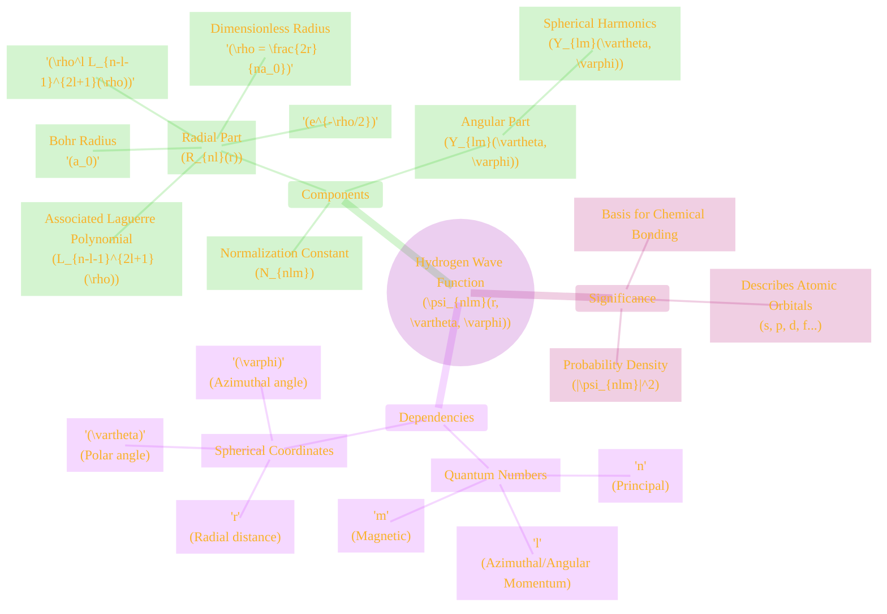
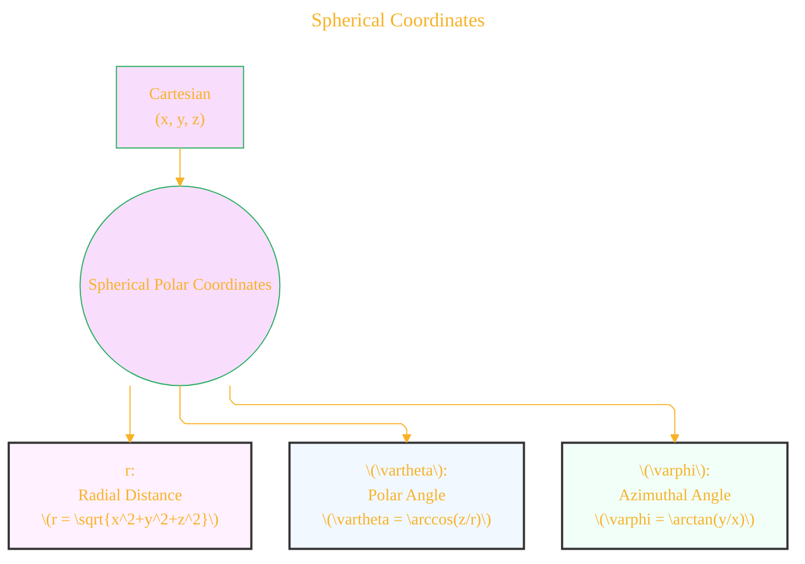
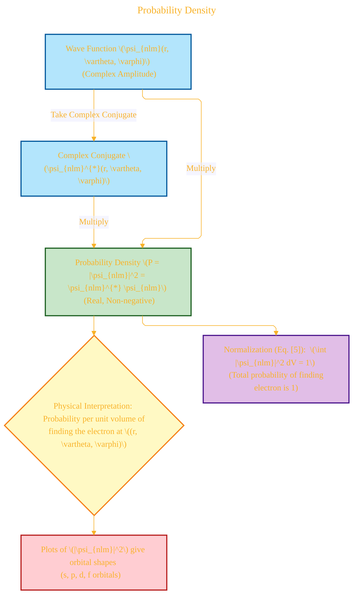

> This is a working draft in progress

# The Hydrogen Wave Function Equation 📜

> **Disclaimer:**
>
> This document contains my personal notes on the topic,
> compiled from publicly available documentation and various cited sources.
> The materials are intended for educational purposes, personal study, and reference.
> The content is dual-licensed:
> 1. **MIT License:** Applies to all code implementations (Swift, Mermaid, and other programming languages).
> 2. **Creative Commons Attribution-ShareAlike 4.0 International License (CC BY-SA 4.0):** Applies to all non-code content, including text, explanations, diagrams, and illustrations.
---

The time-independent Schrödinger equation for the hydrogen atom, when solved, yields the wave functions $\psi_{nlm}(r, \vartheta, \varphi)$. These functions describe the quantum state of the electron. The general form presented is:

$$
\psi_{nlm}(r, \vartheta, \varphi) = \sqrt{\left(\frac{2}{na_0}\right)^3 \frac{(n-l-1)!}{2n[(n+l)!]}} e^{-\rho/2} \rho^l L_{n-l-1}^{2l+1}(\rho) Y_{lm}(\vartheta, \varphi) \quad \text{[1]}
$$

where the dimensionless radius $\rho$ is defined as:
$$
\rho = \frac{2r}{na_0} \quad \text{[2]}
$$

Equation [1] is a cornerstone result from solving the Schrödinger equation for a Coulomb potential, standard in quantum mechanics textbooks[^Griffiths_QM].

Let's break this down component by component. 😊

----

## 1. Overview: Anatomy of the Wave Function 🗺️

----

## 2. The Ingredients: Quantum Numbers & Coordinates 📝

### a. Quantum Numbers

(The table describing quantum numbers from the previous response remains excellent and unchanged.)

| Quantum Number             | Symbol        | LaTeX Symbol | Physical Significance                           | Allowed Values                                                                                                              | Emoji |
| :------------------------- | :------------ | :----------- | :---------------------------------------------- | :-------------------------------------------------------------------------------------------------------------------------- | :---- |
| Principal Quantum Number   | n             | $n$          | Energy level, average distance from nucleus (size of orbital) | $1, 2, 3, \dots$ (positive integers)                                                                                       | 🔋    |
| Azimuthal Quantum Number   | l             | $l$          | Shape of the orbital, magnitude of orbital angular momentum | $0, 1, 2, \dots, n-1$                                                                                                     | 🎨    |
| Magnetic Quantum Number    | m             | $m$          | Orientation of the orbital in space             | $-l, -l+1, \dots, 0, \dots, l-1, l$ (integers from $-l$ to $+l$, total of $2l+1$ values)                                  | 🧭    |
| *(Spin Quantum Number)*    | *(ms)* | *$m_s$*      | *Intrinsic angular momentum (spin) of the electron* | *Not directly in $\psi_{nlm}$ shown, but crucial for full electron state: $+\frac{1}{2}, -\frac{1}{2}$* | *💫*   |

### b. Spherical Coordinates $(r, \vartheta, \varphi)$ 🪐

The hydrogen atom's spherical symmetry makes spherical coordinates $(r, \vartheta, \varphi)$ the natural choice.
*   **$r$**: The **radial distance** from the nucleus (origin). $r \ge 0$.
*   **$\vartheta$ (theta)**: The **polar angle** (or colatitude), angle from the positive z-axis. $0 \le \vartheta \le \pi$.
*   **$\varphi$ (phi)**: The **azimuthal angle**, angle from the positive x-axis in the xy-plane. $0 \le \varphi < 2\pi$.

The relationships to Cartesian coordinates $(x,y,z)$ are [^Stewart_Calculus_Coords]:
$$
x = r \sin\vartheta \cos\varphi \quad \text{[3a]}
$$
$$
y = r \sin\vartheta \sin\varphi \quad \text{[3b]}
$$
$$
z = r \cos\vartheta \quad \text{[3c]}
$$

----

## 3. Deconstructing the Equation: Step-by-Step 🧩

The wave function $\psi_{nlm}$ (Eq. [1]) can be seen as a product:
$$
\psi_{nlm}(r, \vartheta, \varphi) = N_{nlm}' \cdot R_{nl}'(r) \cdot Y_{lm}(\vartheta, \varphi) \quad \text{[4]}
$$
where $N_{nlm}'$ would be a different normalization constant if $R_{nl}'(r)$ and $Y_{lm}(\vartheta, \varphi)$ are individually normalized. The form in Eq. [1] has one overall normalization constant.
The DOT diagram from the previous response effectively illustrates this structure and remains unchanged.

```dot
/*
 * title: Deconstructing the Equation: Step-by-Step
 * author: Cong Le
 * version: 1.0
 * license(s): MIT, CC BY-SA 4.0
 * copyright: Copyright (c) 2025 Cong Le. All Rights Reserved.
 */
digraph G {
    bgcolor="transparent";
    node [shape=box, style="filled,rounded", fontname="Helvetica", fillcolor="#E6E6FA"];
    edge [fontname="Helvetica"];

    psi [label="Hydrogen Wave Function\n\(\psi_{nlm}(r, \vartheta, \varphi)\)", fillcolor="#D1C4E9"];

    subgraph cluster_components {
        label = "Main Components";
        style = "filled";
        color = "#F3E5F5";
        node [fillcolor="#FFF1FF"];

        NormConst [label="Normalization Constant\n(Embedded in Eq. [1])"];
        RadialPart [label="Radial Part\n\(R_{nl}(r)\)"];
        AngularPart [label="Angular Part\n\(Y_{lm}(\vartheta, \varphi)\)"];
    }

    psi -> NormConst [label="contains factor for"];
    psi -> RadialPart [label="contains terms for"];
    psi -> AngularPart [label="contains terms for"];

    subgraph cluster_norm {
        label = "Normalization Constant Details (Leading term in Eq. [1])";
        style = "filled";
        color = "#E1F5FE";
        node [fillcolor="#BBDEFB"];
        NormConst_formula [label="\(\sqrt{\left(\frac{2}{na_0}\right)^3 \frac{(n-l-1)!}{2n[(n+l)!]}}\)"];
        BohrRadius_a0 [label="Bohr Radius\n\(a_0 = \frac{4\pi\epsilon_0\hbar^2}{m_e e^2}\)"];
    }
    NormConst -> NormConst_formula;
    NormConst_formula -> BohrRadius_a0[label="Contains constant"];


    subgraph cluster_radial {
        label = "Radial Part Details (Functions of r or \(\rho\))";
        style = "filled";
        color = "#E8F5E9";
        node [fillcolor="#C8E6C9"];

        Radial_Rho [label="Dimensionless Radius\n\(\rho = \frac{2r}{na_0}\)"];
        Radial_Exp [label="Exponential Decay\n\(e^{-\rho/2}\)"];
        Radial_Poly [label="Polynomial Term\n\(\rho^l L_{n-l-1}^{2l+1}(\rho)\)"];
        Laguerre [label="Associated Laguerre Polynomial\n\(L_{q}^{p}(\rho)\)\nwhere \(q=n-l-1, p=2l+1\)"];
    }
    RadialPart -> Radial_Rho [style=dotted];
    RadialPart -> Radial_Exp;
    RadialPart -> Radial_Poly;
    Radial_Poly -> Laguerre [label="Includes"];
    Radial_Exp -> Radial_Rho [label="Depends on \(\rho\)"];
    Laguerre -> Radial_Rho [label="Argument is \(\rho\)"];


    subgraph cluster_angular {
        label = "Angular Part Details (Functions of \(\vartheta, \varphi\))";
        style = "filled";
        color = "#FFFDE7";
        node [fillcolor="#FFF9C4"];

        SphericalHarmonics [label="Spherical Harmonics\n\(Y_{lm}(\vartheta, \varphi)\)"];
        Legendre [label="Associated Legendre Polynomials\n\(P_l^m(\cos\vartheta)\)"];
        ComplexExp [label="Complex Exponential\n\(e^{im\varphi}\)"];
    }
    AngularPart -> SphericalHarmonics;
    SphericalHarmonics -> Legendre [label="Includes"];
    SphericalHarmonics -> ComplexExp [label="Includes"];

    NormConst_formula -> QuantumNumbers_n [label="Depends on (n, l)"];
    NormConst_formula -> QuantumNumbers_l [label="Depends on (n, l)"];
    Radial_Exp -> QuantumNumbers_n [label="Via \(\rho\)"];
    Radial_Poly -> QuantumNumbers_n [label="Via \(\rho\), (n, l) in \(L\)"];
    Radial_Poly -> QuantumNumbers_l [label="Via \(\rho\), (n, l) in \(L\)"];
    SphericalHarmonics -> QuantumNumbers_l [label="Depends on (l, m)"];
    SphericalHarmonics -> QuantumNumbers_m [label="Depends on (l, m)"];

    QuantumNumbers_n [label="n (Principal)", shape=ellipse, fillcolor="#FFCDD2"];
    QuantumNumbers_l [label="l (Azimuthal)", shape=ellipse, fillcolor="#FFCDD2"];
    QuantumNumbers_m [label="m (Magnetic)", shape=ellipse, fillcolor="#FFCDD2"];
}
```

### a. Normalization Constant (part of Eq. [1]) ⚖️

The term
$$
\sqrt{\left(\frac{2}{na_0}\right)^3 \frac{(n-l-1)!}{2n[(n+l)!]}}
$$
is the normalization factor that ensures the total probability of finding the electron *somewhere* in space is 1. This comes from the Born rule:
$$
\int_{\text{all space}} |\psi_{nlm}(r, \vartheta, \varphi)|^2 dV = 1 \quad \text{[5]}
$$
where $dV$ is the infinitesimal volume element in spherical coordinates:
$$
dV = r^2 \sin\vartheta dr d\vartheta d\varphi \quad \text{[6]}
$$
[^Griffiths_QM_Normalization]

*   **$a_0$** is the **Bohr radius**, a fundamental physical constant representing a characteristic atomic length scale:
    $$
    a_0 = \frac{4\pi\epsilon_0\hbar^2}{m_e e^2} \approx 0.529 \times 10^{-10} \text{ m} \quad \text{[7]}
    $$
    [^CohenTannoudji_BohrRadius] ($m_e$ is electron mass, $e$ its charge, $\hbar$ reduced Planck constant, $\epsilon_0$ vacuum permittivity).

### b. Radial Part $R_{nl}(r)$ (terms in Eq. [1] dependent on $r$) 📏

The radial part describes how the wave function varies with distance $r$ from the nucleus. Key components dependent on $r$ (via $\rho = 2r/na_0$ from Eq. [2]) are:

1.  **Exponential Decay $e^{-\rho/2}$**: Ensures $\psi \rightarrow 0$ as $r \rightarrow \infty$.
2.  **$\rho^l$ Term**: Governs behavior as $r \rightarrow 0$.
3.  **Associated Laguerre Polynomials $L_{n-l-1}^{2l+1}(\rho)$**: Polynomials determining radial nodes. The general definition for an associated Laguerre polynomial $L_k^\alpha(x)$ is [^ArfkenWeberHarris_Laguerre]:
    $$
    L_k^\alpha(x) = \sum_{j=0}^k (-1)^j \frac{\Gamma(k+\alpha+1)}{\Gamma(j+\alpha+1)(k-j)!j!} x^j
    $$
    or, using binomial coefficients for integer $\alpha$:
    $$
    L_k^\alpha(x) = \sum_{j=0}^k (-1)^j \binom{k+\alpha}{k-j} \frac{x^j}{j!} \quad \text{[8]}
    $$
    In our wave function (Eq. [1]), $k = n-l-1$ and $\alpha = 2l+1$. The number of radial nodes (spheres where $\psi=0$, excluding $r=0$ and $r=\infty$) is $n-l-1$.

### c. Angular Part $Y_{lm}(\vartheta, \varphi)$ (terms in Eq. [1] dependent on $\vartheta, \varphi$) 📐

These are the **Spherical Harmonics**, describing the angular shape and orientation of the orbital. The full definition, incorporating normalization and phase conventions, is [^Jackson_EM_SphericalHarmonics]:
$$
Y_{lm}(\vartheta, \varphi) = (-1)^{(m+|m|)/2} \sqrt{\frac{(2l+1)}{4\pi}\frac{(l-|m|)!}{(l+|m|)!}} P_l^{|m|}(\cos\vartheta) e^{im\varphi} \quad \text{[9]}
$$
(Note: The factor $(-1)^{(m+|m|)/2}$ is one common phase convention, which simplifies to $1$ for $m \ge 0$ and $(-1)^m$ for $m < 0$. Other conventions exist; the one in Eq. [1] image, $Y_{lm}(\vartheta, \varphi)$, implies a standard definition is being used.) The simpler commonly cited form, often for $m \ge 0$ and extended for $m<0$ via $Y_{l,-m} = (-1)^m (Y_{lm})^*$, is:
$$
Y_{lm}(\vartheta, \varphi) = K_{lm} P_l^m(\cos\vartheta) e^{im\varphi} \quad \text{(conceptual form)}
$$
where $K_{lm}$ is a normalization constant. The $P_l^m(\cos\vartheta)$ are **Associated Legendre Polynomials**. For $x = \cos\vartheta$ and $m \ge 0$, they are defined from Legendre Polynomials $P_l(x)$ as [^ArfkenWeberHarris_Legendre]:
$$
P_l^m(x) = (-1)^m (1-x^2)^{m/2} \frac{d^m}{dx^m} P_l(x) \quad \text{[10]}
$$
And the Legendre Polynomials $P_l(x)$ are given by Rodrigues' formula:
$$
P_l(x) = \frac{1}{2^l l!} \frac{d^l}{dx^l} (x^2-1)^l \quad \text{[11]}
$$
The number of angular nodes (planes/cones where $\psi=0$) is $l$.

----

## 4. The Payoff: Probability Density $|\psi_{nlm}|^2$ 🎲

The wave function $\psi_{nlm}$ is complex. The **probability density** is its squared magnitude [^BornRule]:
$$
P(r, \vartheta, \varphi) = |\psi_{nlm}(r, \vartheta, \varphi)|^2 = \psi_{nlm}^{*}(r, \vartheta, \varphi) \psi_{nlm}(r, \vartheta, \varphi) \quad \text{[12]}
$$
where $\psi_{nlm}^{*}$ is the complex conjugate. $P(r, \vartheta, \varphi) dV$ (using $dV$ from Eq. [6]) is the probability of finding the electron in an infinitesimal volume $dV$ at $(r, \vartheta, \varphi)$. This gives rise to the shapes of atomic orbitals.

----

## Summary ✨

The Hydrogen Wave Function (Eq. [1]) is a sophisticated mathematical expression that precisely describes the quantum state of an electron in a hydrogen atom. It elegantly combines:
*   **Constants of Nature**: $a_0, \hbar, e, m_e, \epsilon_0$.
*   **Quantum Numbers**: $n, l, m$ dictating energy, shape, and orientation.
*   **Special Functions**: Associated Laguerre polynomials for radial behavior and Spherical Harmonics (built from Associated Legendre polynomials) for angular distribution.
*   **Probabilistic Interpretation**: Leading to the concept of electron orbitals.

This equation is a testament to the power of quantum mechanics in explaining the structure of matter. 💡🔬📚

---

**References:**

[^Griffiths_QM]: Griffiths, D. J. (2018). *Introduction to Quantum Mechanics*. Cambridge University Press. (Typically covers derivation of the hydrogen atom wave functions).
[^Stewart_Calculus_Coords]: Standard coordinate transformations found in calculus textbooks, e.g., Stewart, J. *Calculus*.
[^Griffiths_QM_Normalization]: Born's rule and normalization condition are fundamental concepts in quantum mechanics texts like Griffiths.
[^CohenTannoudji_BohrRadius]: Cohen-Tannoudji, C., Diu, B., & Laloë, F. (1977). *Quantum Mechanics*. Wiley. (A comprehensive text that would detail constants like $a_0$).
[^ArfkenWeberHarris_Laguerre]: Arfken, G. B., Weber, H. J., & Harris, F. E. (2013). *Mathematical Methods for Physicists*. Academic Press. (Standard reference for special functions like Laguerre polynomials).
[^Jackson_EM_SphericalHarmonics]: Jackson, J. D. (1999). *Classical Electrodynamics*. Wiley. (While an EM text, it extensively covers spherical harmonics).
[^ArfkenWeberHarris_Legendre]: Arfken, G. B., et al. (2013) also cover Legendre polynomials.
[^BornRule]: Max Born's original papers or any standard QM textbook explain the probabilistic interpretation of $|\psi|^2$.

---

<!-- 

---
>**Licenses:**
>
>- **MIT License:**   - Full text in [LICENSE](LICENSE) file.
>- **Creative Commons Attribution-ShareAlike 4.0 International**: [CC BY-SA 4.0](https://creativecommons.org/licenses/by-sa/4.0/)  - Legal details in [LICENSE-CC-BY-SA-4.0](LICENSE-CC-BY-SA-4.0) and at [Creative Commons official site](https://creativecommons.org/licenses/by-sa/4.0/).
>
---