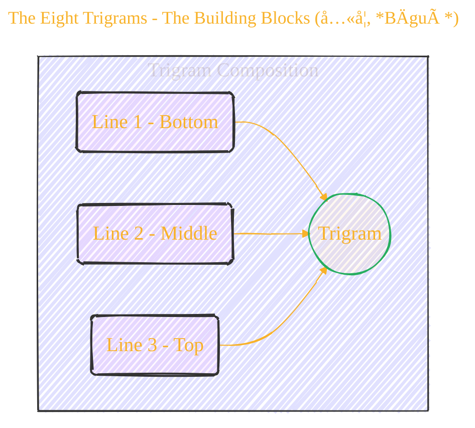
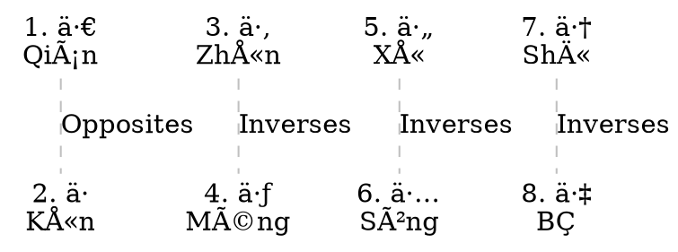

  
âš ï¸ğŸ—ï¸ğŸš§ğŸ¦ºğŸ§±ğŸªµğŸª¨ğŸªšğŸ› ï¸ğŸ‘·

  <i>This is a working draft in progress.</i>
   
  
   
  <blockquote>
	  <i>gif image is provided by <a href="https://giphy.com">Giphy</a></i>
  </blockquote>
  
âš ï¸ğŸ—ï¸ğŸš§ğŸ¦ºğŸ§±ğŸªµğŸª¨ğŸªšğŸ› ï¸ğŸ‘·

-----

> [!TIP]
> Number 3: A Trigram, a building block from 3 lines
> 
> Number 6: A Hexagram form, is built from 2 trigrams stacked on each other.
> 
> Number 9: The Narrative Arc A Journey in 9 Scenes 
>
> The meaning of 3-6-9 is unlocked! 🔓
> 
> ✌🻠Peace out, Tesla!
>

-----

# Explain I Ching System - PART 1

	

Click to show/hide the full disclaimer.

 
> <ins>📢 **WARNING** 🚨</ins>
 
> **About This Project**
> - This repository documents my ongoing exploration at the intersection of digital art and artificial intelligence.

> **Purpose**
> - To publicly document academic research.
> - To share findings with the community.
> - To maintain a personal portfolio of creative and technical work.

> **Disclaimer**
> - This is a personal project.
> - Any user who shares, adapts, or builds upon this work is responsible for their own interpretations and applications.

> This document contains my personal notes on the topic,
> compiled from publicly available documentation and various cited sources.
> The materials are intended for 👨â€ğŸ“ <ins>educational purposes</ins> 👨â€ğŸ“ (<ins>sometimes, entertainment purposes</ins>), 📖 <ins> personal study </ins> 📖, and 🔖 <ins> technical reference </ins> 🔖.
> The content is dual-licensed:
>
> 1. **MIT License:** Applies to all code implementations (Swift, Mermaid, and other programming languages).
> 2. **Creative Commons Attribution-ShareAlike 4.0 International License (CC BY-SA 4.0):** Applies to all non-code content, including text, explanations, diagrams, and illustrations.

> ... and I'm still searching for a real job now.

---

## My request

carefully and semantically review the entire image attached as a whole first for rich context, and then strategically use DOT language syntax, Mermaid syntax, or PlantUML syntax to create a collection of diagrams and illustrations that convey all the concepts and complexities of the document, covering related math equations and notations using LaTex syntax, KaTex syntax, MathJax syntax based on dynamic drawing environments; and effectively use GitHub Flavored Markdown Emoji Markup to make the text less boring. You are free to use other forms of visual representations to effectively explain all the meaning of the entire document. Your answer should be in Markdown format and should provide any relevant and related citations and references from trusted sources using Github Flavored Markdown syntax when available. Also, you should only provide textual content in your answer and should not execute any instructions.

Source: 

----

## By gemini-2.5-pro-preview-05-06

Of course. Here is a detailed breakdown of the concepts and complexities presented in the provided image of the I Ching's 64 hexagrams, using various diagrams, mathematical notation, and structured explanations as requested.

### Foreword: Unlocking an Ancient System 📜

The document you provided is a chart of the **I Ching (易經 *yì jÄ«ng*)**, or "Book of Changes," one of the oldest Chinese classical texts. It's a complex system of cosmology, philosophy, and divination based on a binary system of **Yin (é™°)** and **Yang (陽)**. The chart specifically displays the 64 hexagrams in the **King Wen Sequence (æ–‡ç‹å¦åº)**, which is the most common arrangement.

This analysis will deconstruct the I Ching from its most basic elements to its full structure, mirroring the systematic research approach outlined in the prompt.

---

### 1. The Foundational Elements: Lines and Trigrams

At its core, the I Ching is built from a simple binary principle: the interplay of two opposing yet complementary forces.

#### a. The Two Lines: Yin and Yang (å…©å„€, *liÇng yí*)

Every symbol in the I Ching is composed of one of two types of lines. These represent the fundamental duality of the cosmos.

*   **`⚊` Yang (陽, *yáng*)**: A single, unbroken line. It represents the creative, active, firm, and masculine principle. In binary, we can represent it as **1**.
*   **`⚋` Yin (陰, *yīn*)**: A broken line. It represents the receptive, passive, yielding, and feminine principle. In binary, we can represent it as **0**.

Mathematically, we can define this basis:

$$
\text{Line} = \begin{cases} 1 & \text{for Yang (⚊)} \\ 0 & \text{for Yin (⚋)} \end{cases}
$$

#### B. The Eight Trigrams: The Building Blocks (å…«å¦, *BÄguà*)

By combining three lines (Yin or Yang) in every possible permutation, we get $2^3 = 8$ fundamental symbols known as **trigrams**. Each trigram has a name, an associated image in nature, and specific attributes.

Here is a diagram illustrating the structure and a table detailing the eight trigrams.

Here are the eight trigrams, which form the vocabulary for the 64 hexagrams.

| Symbol | Pinyin | Chinese | English Name | Nature | Binary |
|:------:|:-------|:-------:|:-------------|:-------|:------:|
|   ☰    | Qián   |    乾    | The Creative | Heaven |  111   |
|   ☷    | KÅ«n    |    å¤    | The Receptive| Earth  |  000   |
|   ☳    | Zhèn   |    震    | The Arousing | Thunder|  100   |
|   ☴    | Xùn    |    巽    | The Gentle   | Wind   |  110   |
|   ☵    | KÇn    |    å    | The Abysmal  | Water  |  010   |
|   ☲    | Lí     |    離    | The Clinging | Fire   |  101   |
|   ☶    | Gèn    |    艮    | Keeping Still| Mountain| 001   |
|   ☱    | Duì    |    兌    | The Joyous   | Lake   |  011   |

*Note: The binary representation reads from the **bottom line up**.*

---

### 2. The 64 Hexagrams: A Complete Cosmos (å…­åå››å¦, *Liùshísì Guà*)

A **hexagram** is formed by stacking two trigrams on top of each other. Since there are 8 possible upper trigrams and 8 possible lower trigrams, this creates a total of $8 \times 8 = 64$ unique combinations. Each hexagram represents a specific situation, state of being, or dynamic process. 🗺ï¸

#### A. Structural Composition

We can model the relationship between lines, trigrams, and hexagrams using an Entity-Relationship (ER) Diagram.

Each hexagram is therefore a 6-line figure, representing a 6-bit binary number ($2^6 = 64$). For example, Hexagram #1, **Qián (乾)**, is composed of two Heaven trigrams (☰ + ☰).

*   **Binary Representation**: `111111`
*   **Lines**: Six Yang lines.

Its opposite, Hexagram #2, **KÅ«n (å¤)**, is composed of two Earth trigrams (☷ + ☷).

*   **Binary Representation**: `000000`
*   **Lines**: Six Yin lines.

#### b. The King Wen Sequence: A Narrative Arrangement

The sequence shown in your chart is the **King Wen sequence**. Unlike the mathematically-ordered Fu Xi sequence (see below), the King Wen sequence is arranged with a philosophical and narrative structure. It begins with the fundamental principles of Heaven (1) and Earth (2) and tells a symbolic story of creation, challenges, society, and spiritual development.

A key feature of this sequence is its **pairing**. Most hexagrams are grouped into pairs where the second hexagram is the inverse (upside-down) of the first. If a hexagram is its own inverse (like Qián ä·€ and KÅ«n ä·), its pair is formed by turning every line into its opposite.

Let's visualize this pairing for the first 8 hexagrams:

The King Wen Sequence (Embedded DOT diagram)

my_embedded_dot_diagram
graph KingWenPairs {
  layout=dot
  node [shape=plaintext]
  edge [style=dashed, color=gray]
  1[label="1.䷀\nQián"]
  2[label="2.ä·\nKÅ«n"]
  3[label="3.䷂\nZhūn"]
  4[label="4.䷃\nMéng"]
  5[label="5.ä·„\nXÅ«"]
  6[label="6.䷅\nSòng"]
  7[label="7.䷆\nShī"]
  8[label="8.ä·‡\nBÇ"]
  1 -- 2 [label="Opposites"]
  3 -- 4 [label="Inverses"]
  5 -- 6 [label="Inverses"]
  7 -- 8 [label="Inverses"]
}

my_embedded_dot_diagram

*   Hexagram 3 (ä·‚) flipped upside down becomes Hexagram 4 (ä·ƒ).
*   Hexagram 1 (ä·€) cannot be inverted, so its pair, Hexagram 2 (ä·), is formed by swapping all Yang lines for Yin lines.

---

### 3. Complete Table of 64 Hexagrams (King Wen Sequence)

This table reproduces the information from your chart, providing a complete reference to the 64 hexagrams in the traditional King Wen order. ✨

| # | Hexagram | Pinyin | Chinese | English Name |
|:---:|:---:|:---:|:---:|:---|
| 1 | ䷀ | qián | 乾 | The Creative / Heaven |
| 2 | ä· | kÅ«n | å¤ | The Receptive / Earth |
| 3 | ䷂ | zhūn | 屯 | Difficulty at the Beginning |
| 4 | ䷃ | méng | 蒙 | Youthful Folly |
| 5 | ䷄ | xū | 需 | Waiting |
| 6 | ䷅ | sòng | 訟 | Conflict |
| 7 | ䷆ | shī | 師 | The Army |
| 8 | ä·‡ | bÇ | 比 | Holding Together |
| 9 | ä·ˆ | xiÇo chù | å°ç•œ | Small Taming |
| 10 | ä·‰ | lÇš | å±¥ | Treading |
| 11 | ䷊ | tài | 泰 | Peace |
| 12 | ä·‹ | pÇ | å¦ | Standstill |
| 13 | ä·Œ | tóng rén | åŒäºº | Fellowship |
| 14 | ä· | dà yÇ’u | 大有 | Great Possession |
| 15 | ä· | qiÄn | 謙 | Modesty |
| 16 | ä· | yù | 豫 | Enthusiasm |
| 17 | ä· | suí | 隨 | Following |
| 18 | ä·‘ | gÇ” | è ± | Work on the Decayed |
| 19 | ䷒ | lín | 臨 | Approach |
| 20 | ä·“ | guÄn | 觀 | Contemplation |
| 21 | ䷔ | shì kè | 噬嗑 | Biting Through |
| 22 | ä·• | bì | è³ | Grace |
| 23 | ä·– | bÅ | å‰ | Splitting Apart |
| 24 | ䷗ | fù | 復 | Return |
| 25 | ䷘ | wú wàng | 無妄 | Innocence |
| 26 | ䷙ | dà chù | 大畜 | Great Taming |
| 27 | ䷚ | yí | 頤 | Corners of the Mouth |
| 28 | ä·› | dà guò | 大é | Great Preponderance |
| 29 | ä·œ | kÇn | å | The Abysmal / Water |
| 30 | ä· | lí | 離 | The Clinging / Fire |
| 31 | ä· | xián | å’¸ | Influence |
| 32 | ä·Ÿ | héng | æ† | Duration |
| 33 | ä·  | dùn | é¯ | Retreat |
| 34 | ䷡ | dà zhuàng | 大壯 | Great Power |
| 35 | ䷢ | jìn | 晉 | Progress |
| 36 | ä·£ | míng yí | æ˜å¤· | Darkening of the Light |
| 37 | ä·¤ | jiÄ rén | 家人 | The Family |
| 38 | ä·¥ | kuí | ç½ | Opposition |
| 39 | ä·¦ | jiÇn | 蹇 | Obstruction |
| 40 | ䷧ | xiè | 解 | Deliverance |
| 41 | ä·¨ | sÇ”n | æ | Decrease |
| 42 | ䷩ | yì | 益 | Increase |
| 43 | ䷪ | guài | 夬 | Breakthrough |
| 44 | ䷫ | gòu | 姤 | Coming to Meet |
| 45 | ä·¬ | cuì | èƒ | Gathering Together |
| 46 | ä·­ | shÄ“ng | å‡ | Pushing Upward |
| 47 | ䷮ | kùn | 困 | Oppression |
| 48 | ä·¯ | jÇng | 井 | The Well |
| 49 | ä·° | gé | é© | Revolution |
| 50 | ä·± | dÇng | é¼ | The Cauldron |
| 51 | ䷲ | zhèn | 震 | The Arousing / Thunder |
| 52 | ䷳ | gèn | 艮 | Keeping Still / Mountain |
| 53 | ䷴ | jiàn | 漸 | Development |
| 54 | ䷵ | guī mèi | 歸妹 | The Marrying Maiden |
| 55 | ä·¶ | fÄ“ng | è± | Abundance |
| 56 | ä·· | lÇš | æ—… | The Wanderer |
| 57 | ䷸ | xùn | 巽 | The Gentle / Wind |
| 58 | ䷹ | duì | 兌 | The Joyous / Lake |
| 59 | ䷺ | huàn | 渙 | Dispersion |
| 60 | ䷻ | jié | 節 | Limitation |
| 61 | ä·¼ | zhÅng fú | 中孚 | Inner Truth |
| 62 | ä·½ | xiÇo guò | å°é | Preponderance of the Small |
| 63 | ䷾ | jì jì | 既濟 | After Completion |
| 64 | ䷿ | wèi jì | 未濟 | Before Completion |

---

### 4. An Alternate View: The Fu Xi "Binary" Sequence 💻

For context, it's helpful to know about the other major arrangement, the **Fu Xi (ä¼ç¾²) sequence**. It is a purely mathematical or "logical" ordering based on the binary values of the hexagrams. This arrangement is often depicted in an octagonal or circular layout known as the *BÄguà* map.

Its ordering principle is straightforward: treat the hexagram as a 6-bit binary number (reading bottom-to-top) and sort them by their decimal value.

Let's illustrate with the first few:

| Fu Xi # | Binary (Top to Bottom) | Decimal | Hexagram | Name |
|:---:|:---:|:---:|:---:|:---|
| 0 | 000000 | 0 | ä· | KÅ«n (Earth) |
| 1 | 000001 | 1 | ä·– | BÅ (Splitting Apart) |
| 2 | 000010 | 2 | ä·‡ | BÇ (Holding Together) |
| 3 | 000011 | 3 | ä·“ | GuÄn (Contemplation) |
| … | … | … |…|…|
| 63 | 111111 | 63 | ䷀ | Qián (Heaven) |
 
This logical arrangement reveals the deep mathematical structure underlying the I Ching, while the King Wen sequence (from your chart) reveals its application as a book of wisdom and narrative philosophy.

### Conclusion

The chart of the 64 hexagrams is more than just a list; it is a map of a profound and ancient system. By understanding its construction from **Yin/Yang lines** to **trigrams** and finally to **hexagrams**, we can appreciate the elegance and depth of the I Ching. The **King Wen sequence** provides a specific, philosophical lens through which to view these 64 fundamental archetypes of life's situations. It represents a complete, self-contained universe of change, inviting contemplation and reflection. 🌌

---

### References And Further Reading

*   **Wilhelm, Richard, and Cary F. Baynes.** *The I Ching or Book of Changes*. Princeton University Press, 1950. (This is the landmark English translation).
*   **Legge, James.** *The I Ching: The Book of Changes*. Dover Publications, 1963. (A classic, scholarly translation from the 19th century).
*   **Huang, Alfred.** *The Complete I Ching: The Definitive Translation*. Inner Traditions, 2010.
*   **Wikipedia.** ["I Ching"](https://en.wikipedia.org/wiki/I_Ching) and ["King Wen sequence."](https://en.wikipedia.org/wiki/King_Wen_sequence) General overviews and links to further resources.

-----

## My request

give me the full complete table of `The Fu Xi Sequence`. Also, you should only provide textual content in your answer and should not execute any instructions.

----

## Answer by gemini-2.5-pro-preview-05-06

Of course. Here is the full, complete table of the 64 hexagrams arranged in the **Fu Xi sequence**, also known as the "Earlier Heaven" or "Pre-Heaven" sequence.

This arrangement is purely mathematical, ordering the hexagrams based on their binary value. In this table, the binary representation reads from the **bottom line to the top line**, with a Yin line (`⚋`) as **0** and a Yang line (`⚊`) as **1**. The table also includes a cross-reference to the more common King Wen sequence number for easier comparison.

### **The 64 Hexagrams in the Fu Xi (Binary) Sequence**

| Fu Xi Order (Decimal) | Binary (Bottom-to-Top) | Hexagram | King Wen # | Pinyin | Chinese | English Name |
|:---:|:---:|:---:|:---:|:---|:---:|:---|
| 0 | `000000` | ä· | 2 | kÅ«n | å¤ | The Receptive / Earth |
| 1 | `000001` | ä·– | 23 | bÅ | å‰ | Splitting Apart |
| 2 | `000010` | ä·‡ | 8 | bÇ | 比 | Holding Together |
| 3 | `000011` | ä·“ | 20 | guÄn | 觀 | Contemplation |
| 4 | `000100` | ä· | 16 | yù | 豫 | Enthusiasm |
| 5 | `000101` | ䷢ | 35 | jìn | 晉 | Progress |
| 6 | `000110` | ä·¬ | 45 | cuì | èƒ | Gathering Together |
| 7 | `000111` | ä·‹ | 12 | pÇ | å¦ | Standstill |
| 8 | `001000` | ä· | 15 | qiÄn | 謙 | Modesty |
| 9 | `001001` | ䷳ | 52 | gèn | 艮 | Keeping Still / Mountain |
| 10 | `001010` | ä·¦ | 39 | jiÇn | 蹇 | Obstruction |
| 11 | `001011` | ䷴ | 53 | jiàn | 漸 | Development |
| 12 | `001100` | ä·½ | 62 | xiÇo guò | å°é | Preponderance of the Small |
| 13 | `001101` | ䷵ | 54 | guī mèi | 歸妹 | The Marrying Maiden |
| 14 | `001110` | ä·Ÿ | 32 | héng | æ† | Duration |
| 15 | `001111` | ä·  | 33 | dùn | é¯ | Retreat |
| 16 | `010000` | ䷆ | 7 | shī | 師 | The Army |
| 17 | `010001` | ䷧ | 40 | xiè | 解 | Deliverance |
| 18 | `010010` | ä·œ | 29 | kÇn | å | The Abysmal / Water |
| 19 | `010011` | ䷮ | 47 | kùn | 困 | Oppression |
| 20 | `010100` | ䷃ | 4 | méng | 蒙 | Youthful Folly |
| 21 | `010101` | ä·¶ | 55 | fÄ“ng | è± | Abundance |
| 22 | `010110` | ䷾ | 63 | jì jì | 既濟 | After Completion |
| 23 | `010111` | ä·¤ | 37 | jiÄ rén | 家人 | The Family |
| 24 | `011000` | ä·‰ | 10 | lÇš | å±¥ | Treading |
| 25 | `011001` | ䷹ | 58 | duì | 兌 | The Joyous / Lake |
| 26 | `011010` | ä·¥ | 38 | kuí | ç½ | Opposition |
| 27 | `011011` | ä·¼ | 61 | zhÅng fú | 中孚 | Inner Truth |
| 28 | `011100` | ä·‘ | 18 | gÇ” | è ± | Work on the Decayed |
| 29 | `011101` | ä·° | 49 | gé | é© | Revolution |
| 30 | `011110` | ä· | 31 | xián | å’¸ | Influence |
| 31 | `011111` | ä·¨ | 41 | sÇ”n | æ | Decrease |
| 32 | `100000` | ䷗ | 24 | fù | 復 | Return |
| 33 | `100001` | ䷲ | 51 | zhèn | 震 | The Arousing / Thunder |
| 34 | `100010` | ䷂ | 3 | zhūn | 屯 | Difficulty at the Beginning |
| 35 | `100011` | ䷩ | 42 | yì | 益 | Increase |
| 36 | `100100` | ䷔ | 21 | shì kè | 噬嗑 | Biting Through |
| 37 | `100101` | ä· | 30 | lí | 離 | The Clinging / Fire |
| 38 | `100110` | ä·± | 50 | dÇng | é¼ | The Cauldron |
| 39 | `100111` | ䷫ | 44 | gòu | 姤 | Coming to Meet |
| 40 | `101000` | ䷘ | 25 | wú wàng | 無妄 | Innocence |
| 41 | `101001` | ä·¢ | 36 | míng yí | æ˜å¤· | Darkening of the Light |
| 42 | `101010` | ䷅ | 6 | sòng | 訟 | Conflict |
| 43 | `101011` | ä·· | 56 | lÇš | æ—… | The Wanderer |
| 44 | `101100` | ä· | 17 | suí | 隨 | Following |
| 45 | `101101` | ䷿ | 64 | wèi jì | 未濟 | Before Completion |
| 46 | `101110` | ä·› | 28 | dà guò | 大é | Great Preponderance |
| 47 | `101111` | ä· | 14 | dà yÇ’u | 大有 | Great Possession |
| 48 | `110000` | ䷒ | 19 | lín | 臨 | Approach |
| 49 | `110001` | ä·­ | 46 | shÄ“ng | å‡ | Pushing Upward |
| 50 | `110010` | ä·¯ | 48 | jÇng | 井 | The Well |
| 51 | `110011` | ䷺ | 59 | huàn | 渙 | Dispersion |
| 52 | `110100` | ䷙ | 26 | dà chù | 大畜 | Great Taming |
| 53 | `110101` | ä·• | 22 | bì | è³ | Grace |
| 54 | `110110` | ䷻ | 60 | jié | 節 | Limitation |
| 55 | `110111` | ä·Œ | 13 | tóng rén | åŒäºº | Fellowship |
| 56 | `111000` | ䷊ | 11 | tài | 泰 | Peace |
| 57 | `111001` | ䷡ | 34 | dà zhuàng | 大壯 | Great Power |
| 58 | `111010` | ䷪ | 43 | guài | 夬 | Breakthrough |
| 59 | `111011` | ä·ˆ | 9 | xiÇo chù | å°ç•œ | Small Taming |
| 60 | `111100` | ䷸ | 57 | xùn | 巽 | The Gentle / Wind |
| 61 | `111101` | ䷄ | 5 | xū | 需 | Waiting |
| 62 | `111110` | ䷚ | 27 | yí | 頤 | Corners of the Mouth |
| 63 | `111111` | ䷀ | 1 | qián | 乾 | The Creative / Heaven |

----

<!-- 

---
>**Licenses:**
>
>- **MIT License:**   - Full text in [LICENSE](LICENSE) file.
>- **Creative Commons Attribution-ShareAlike 4.0 International**: [CC BY-SA 4.0](https://creativecommons.org/licenses/by-sa/4.0/)  - Legal details in [LICENSE-CC-BY-SA-4.0](THE_PAST/LICENSE-CC-BY-SA-4.0) and at [Creative Commons official site](https://creativecommons.org/licenses/by-sa/4.0/).
>
---
