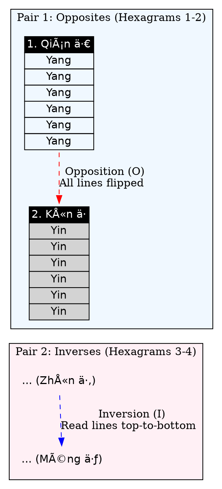
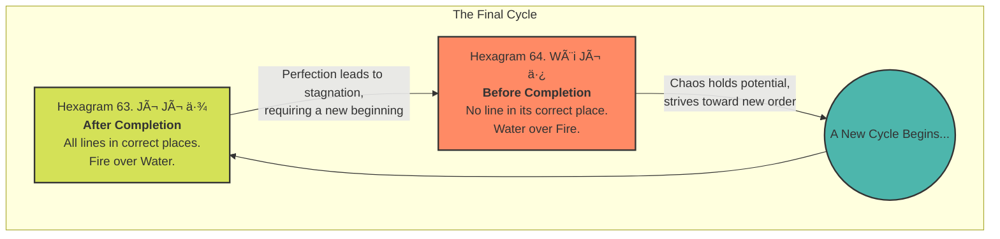

<div align="center">
  <p>âš ï¸ğŸ—ï¸ğŸš§ğŸ¦ºğŸ§±ğŸªµğŸª¨ğŸªšğŸ› ï¸ğŸ‘·</p>
  <i>This is a working draft in progress.</i>
  <br/>
  
  <br/>
  <blockquote>
	  <i>gif image is provided by <a href="https://giphy.com">Giphy</a></i>
  </blockquote>
  <p>âš ï¸ğŸ—ï¸ğŸš§ğŸ¦ºğŸ§±ğŸªµğŸª¨ğŸªšğŸ› ï¸ğŸ‘·</p>

</div>

----


# Explain I Ching System - PART 2
<details open>
	
<summary>Click to show/hide the full disclaimer.</summary>
 
> <ins>📢 **WARNING** 🚨</ins>
 
> **About This Project**
> - This repository documents my ongoing exploration at the intersection of digital art and artificial intelligence.

> **Purpose**
> - To publicly document academic research.
> - To share findings with the community.
> - To maintain a personal portfolio of creative and technical work.

> **Disclaimer**
> - This is a personal project.
> - Any user who shares, adapts, or builds upon this work is responsible for their own interpretations and applications.

> This document contains my personal notes on the topic,
> compiled from publicly available documentation and various cited sources.
> The materials are intended for 👨â€ğŸ“ <ins>educational purposes</ins> 👨â€ğŸ“ (<ins>sometimes, entertainment purposes</ins>), 📖 <ins> personal study </ins> 📖, and 🔖 <ins> technical reference </ins> 🔖.
> The content is dual-licensed:
>
> 1. **MIT License:** Applies to all code implementations (Swift, Mermaid, and other programming languages).
> 2. **Creative Commons Attribution-ShareAlike 4.0 International License (CC BY-SA 4.0):** Applies to all non-code content, including text, explanations, diagrams, and illustrations.

> ... and I'm still searching for a real job now.

</details>


----


---

## My request

carefully and semantically review the entire documentation in the previous response as a whole first for rich context and background on the topics, then strategically pick out all the significant scenes in the entire original document, then effectively list them out in chronologically orders or based on the logical nature of the events. and then strategically use DOT language syntax, Mermaid syntax, or PlantUML syntax to create a collection of diagrams and illustrations that convey all the concepts and complexities of the document, covering related math equations and notations using LaTex syntax, KaTex syntax, MathJax syntax based on dynamic drawing environments; and effectively use GitHub Flavored Markdown Emoji Markup to make the text less boring. You are free to use other forms of visual representations to effectively explain all the meaning of the entire document. Your answer should be in Markdown format and should provide any relevant and related citations and references from trusted sources using Github Flavored Markdown syntax when available. Also, you should only provide textual content in your answer and should not execute any instructions.


----


## Answer by gemini-2.5-pro-preview-05-06

Of course. Based on the previous analysis of the I Ching's structure, we can now delve deeper into the *narrative journey* embedded within the **King Wen Sequence**. This sequence is not random; it's a carefully constructed story depicting the cycles of life, society, and spiritual development. ğŸ§

Here is a chronological and thematic exploration of the significant "scenes" within the I Ching's 64 steps, illustrated with diagrams to convey the concepts and complexities.

### **The Narrative Arc: A Journey in 9 Scenes**

The 64 hexagrams of the King Wen sequence can be logically grouped into thematic stages that tell a grand story. Here are the nine major "scenes" of this journey:

1.  **Scene 1: The Genesis (Hexagrams 1-2)** 🌌
	*   The story begins with the two fundamental, primal forces: **The Creative (Heaven ä·€)** and **The Receptive (Earth ä·)**. This pair establishes the cosmic canvas of Yang and Yin upon which everything else unfolds.

2.  **Scene 2: Birth Pangs of Civilization (Hexagrams 3-8)** 🌱
	*   Following creation comes the struggle. This scene describes the initial **Difficulty (ä·‚)**, the need for guidance through **Youthful Folly (ä·ƒ)**, the wisdom of **Waiting (ä·„)**, the inevitability of **Conflict (ä·…)**, and the necessity of organizing into **The Army (ä·†)** to achieve unity through **Holding Together (ä·‡)**.

3.  **Scene 3: The Rise of Society (Hexagrams 9-14)** ğŸ›ï¸
	*   With basic order established, society begins to flourish. This involves **Small Taming (ä·ˆ)**, learning to walk the right path through **Treading (ä·‰)**, achieving **Peace (ä·Š)**, but also facing periods of **Standstill (ä·‹)**. Ultimately, this leads to **Fellowship (ä·Œ)** and **Great Possession (ä·)**.

4.  **Scene 4: Cultivating Virtue & Enduring Hardship (Hexagrams 15-24)** âš–ï¸
	*   A prosperous society must cultivate virtue. This scene emphasizes **Modesty (ä·)** and the need to address moral decay in **Work on the Decayed (ä·‘)**. It shows the cycle of decline (**Splitting Apart ä·–**) and the inevitable promise of **Return (ä·—)**, where a single Yang line reappears at the bottom.

5.  **Scene 5: Mastery Over Self and Nature (Hexagrams 25-30)** 🔥💧
	*   This is a period of intense trial and maturation. It involves acting with **Innocence (ä·˜)**, harnessing great inner power through **Great Taming (ä·™)**, and facing the two most fundamental dangers/principles: the abyss of **Water (KÇn ä·œ)** and the clarity of **Fire (Lí ä·)**.

6.  **Scene 6: The Web of Human Relationships (Hexagrams 31-40)** 👨â€ğŸ‘©â€ğŸ‘§â€ğŸ‘¦
	*   This scene focuses on the core of human experience: **Influence (ä·)** and courtship, **Duration (ä·Ÿ)** in relationships, **The Family (ä·¤)** structure, but also **Opposition (ä·¥)**, **Obstruction (ä·¦)**, and eventual **Deliverance (ä·§)**.

7.  **Scene 7: Governance and Societal Mechanics (Hexagrams 41-50)** 📈
	*   The focus shifts to a higher level of social organization. It explores the dynamics of **Decrease (ä·¨)** for the sake of **Increase (ä·©)**, making a decisive **Breakthrough (ä·ª)**, managing resources by **Gathering Together (ä·¬)**, and building lasting structures like **The Well (ä·¯)** and **The Cauldron (ä·±)**.

8.  **Scene 8: Introspection and Inner Transformation (Hexagrams 51-58)** 🧘
	*   The journey turns inward. This is about experiencing life's shocks (**The Arousing/Thunder ä·²**), finding peace in **Keeping Still/Mountain (ä·³)**, embracing **Development (ä·´)**, and cultivating internal **Joy (The Joyous/Lake ä·¹)**.

9.  **Scene 9: The Grand Finale & The Cycle Renewed (Hexagrams 59-64)** 🔄
	*   The story concludes with profound philosophical concepts. It deals with **Dispersion (ä·º)** of old forms, the wisdom of **Limitation (ä·»)**, and the attainment of **Inner Truth (ä·¼)**. The final two hexagrams present a paradox: **After Completion (ä·¾)**, a state of perfect but static order, and **Before Completion (ä·¿)**, a state of dynamic chaos full of potential, which hints at the beginning of a new cycle.

---

### **Visualizing The King Wen Journey**

This Mermaid `journey` diagram maps out the major scenes of the narrative arc, providing a high-level overview of the entire story.

```mermaid
journey
    title The Narrative Journey of the I Ching
    section "Scene 1: The Genesis"
      The Creative (1) & The Receptive (2): 5: Me
    section "Scene 2: Birth Pangs"
      Difficulty at the Beginning (3): 4: Me
      Holding Together (8): 5: Me
    section "Scene 3: Rise of Society"
      Peace (11) & Standstill (12): 5: Me
      Great Possession (14): 4: Me
    section "Scene 4: Virtue & Hardship"
      Modesty (15): 3: Me
      Return (24): 5: Me
    section "Scene 5: Mastery"
      The Abysmal/Water (29): 5: Me
      The Clinging/Fire (30): 5: Me
    section "Scene 6: Relationships"
      The Family (37): 4: Me
      Deliverance (40): 5: Me
    section "Scene 7: Governance"
      Increase (42): 4: Me
      The Cauldron (50): 5: Me
    section "Scene 8: Introspection"
      The Arousing/Thunder (51): 5: Me
      The Joyous/Lake (58): 4: Me
    section "Scene 9: The Cycle"
      Inner Truth (61): 3: Me
      After Completion (63): 5: Me
      Before Completion (64): 5: Me
```

*Note: The scores (e.g., `: 5: Me`) in the journey diagram are used for visual emphasis.*

---

### **A Deeper Dive into Key Scenes 💡**

Let's use more detailed diagrams to explore the structure and meaning of a few crucial moments in the journey.

#### **1. The Foundational Pairing Structure (Scenes 1 & 2)**

The King Wen sequence pairs hexagrams. Most pairs are **inverses** (one is the other flipped upside down). If a hexagram is its own inverse, its pair is its **opposite** (all lines are flipped). This illustrates duality and change.



*   **Mathematical Notation**:
	Let $H$ be a hexagram as a sequence of 6 bits, $H = (l_6, l_5, l_4, l_3, l_2, l_1)$.
	*   The **Inverse** is $I(H) = (l_1, l_2, l_3, l_4, l_5, l_6)$.
	*   The **Opposite** is $O(H) = (\neg l_6, \neg l_5, \neg l_4, \neg l_3, \neg l_2, \neg l_1)$.
	*   For the first pair: Hexagram 2 = $O(\text{Hexagram 1})$.
	*   For the second pair: Hexagram 4 = $I(\text{Hexagram 3})$.

#### **2. The Paradox of Completion (Scene 9)**

The final two hexagrams are philosophically profound. **After Completion (ä·¾)** depicts perfect order, but its symmetry makes it static and prone to decay. **Before Completion (ä·¿)** shows disorder, but its dynamic nature holds the seeds of all future possibilities. This creates a cycle.



Hexagram 63 (Jì Jì ䷾) is made of Fire ☲ over Water ☵. Fire naturally rises and water descends, so everything is in its proper place—a stable, but rigid, state. Hexagram 64 (Wèi Jì ䷿) is Water ☵ over Fire ☲. This is an unstable, dynamic state of conflict that drives change, thus leading back toward a new state of completion.

### **Conclusion: From Structure to Story**

By viewing the I Ching's King Wen sequence not just as a static table but as a **chronological narrative**, its wisdom becomes more accessible and profound. The journey from the primal forces of creation to the paradox of completion provides a complete model of existence—a story that begins, develops, faces crises, and ultimately finds meaning in the perpetual cycle of change. It transforms from a divination tool into a map of the human condition itself. 🗺ï¸

---
### **References And Further Reading**

*   **Wilhelm, Richard, and Cary F. Baynes.** *The I Ching or Book of Changes*. Princeton University Press, 1950. (The introduction by Carl Jung and Wilhelm's own commentary delve deeply into the psychological and philosophical aspects of the sequence).
*   **Schoen, David.** *The War of the Pairs: The Patterns of Change in the I Ching*. 2007. (An analysis focusing specifically on the pairing structure of the King Wen sequence).
*   **Anthony, Carol K.** *A Guide to the I Ching*. Anthony Publishing Company, 1988. (Offers a practical and psychological interpretation of the hexagrams and their sequence).


----


<!-- 


---
>**Licenses:**
>
>- **MIT License:**  [](LICENSE) - Full text in [LICENSE](LICENSE) file.
>- **Creative Commons Attribution-ShareAlike 4.0 International**: [CC BY-SA 4.0](https://creativecommons.org/licenses/by-sa/4.0/) [](https://creativecommons.org/licenses/by-sa/4.0/) - Legal details in [LICENSE-CC-BY-SA-4.0](THE_PAST/LICENSE-CC-BY-SA-4.0) and at [Creative Commons official site](https://creativecommons.org/licenses/by-sa/4.0/).
>
---
