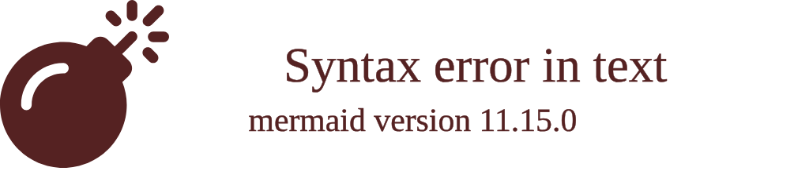

  
⚠️🏗️🚧🦺🧱🪵🪨🪚🛠️👷

  <i>This is a working draft in progress.</i>
   
  
   
  <blockquote>
	  <i>gif image is provided by <a href="https://giphy.com">Giphy</a></i>
  </blockquote>
  
⚠️🏗️🚧🦺🧱🪵🪨🪚🛠️👷

----

> [!TIP]
> Number 3: A Trigram, a building block from 3 lines
> Number 6: A Hexagram form, is built from 2 trigrams stacked on each other  
> Number 9: The Narrative Arc A Journey in 9 Scenes 
>
> The meaning of 3-6-9 is unlocked! 
> Peace out, Tesla!
>

----

# Explain I Ching System - PART 3

	

Click to show/hide the full disclaimer.

 
> <ins>📢 **WARNING** 🚨</ins>
 
> **About This Project**
> - This repository documents my ongoing exploration at the intersection of digital art and artificial intelligence.

> **Purpose**
> - To publicly document academic research.
> - To share findings with the community.
> - To maintain a personal portfolio of creative and technical work.

> **Disclaimer**
> - This is a personal project.
> - Any user who shares, adapts, or builds upon this work is responsible for their own interpretations and applications.

> This document contains my personal notes on the topic,
> compiled from publicly available documentation and various cited sources.
> The materials are intended for 👨‍🎓 <ins>educational purposes</ins> 👨‍🎓 (<ins>sometimes, entertainment purposes</ins>), 📖 <ins> personal study </ins> 📖, and 🔖 <ins> technical reference </ins> 🔖.
> The content is dual-licensed:
>
> 1. **MIT License:** Applies to all code implementations (Swift, Mermaid, and other programming languages).
> 2. **Creative Commons Attribution-ShareAlike 4.0 International License (CC BY-SA 4.0):** Applies to all non-code content, including text, explanations, diagrams, and illustrations.

> ... and I'm still searching for a real job now.

---

## My request

based on the extensive researches and insights from the previous responses, then strategically pick out the most significant scenes from the section `**Hexagram 1: Qián ䷀ — The Creative**` from the `Scene 1: The Genesis (Hexagrams 1 & 2)` into a imagery and vivid descriptions. I will use that list as instruction to ask other agent bot to draw out images in the next round

----

## Answer by gemini-2.5-pro-preview-05-06

Of course. Based on our previous exploration, here is a list of vivid descriptions for the most significant scenes within **Hexagram 1: Qián ䷀ — The Creative**.

This list is designed to be used as a set of instructions for a visual AI agent, providing core concepts, vivid imagery, and specific artistic direction for each of the six stages in the dragon's journey.

---

### **Imagery And Scenes for Hexagram 1: The Creative (Qián ䷀)**

**Overall Theme:** The archetype of pure, active, celestial power. The central visual symbol is the **Dragon (龍, *lóng*)**, representing divine and natural force. The artistic style should evoke mythic power, grandeur, and elemental energy.

---

### **Scene 1: The Hidden Dragon (Line 1)**
*   **Core Concept:** Immense power that is latent and currently held in reserve. It is a time of patience and potential, not action.
*   **Vivid Imagery:** In the silent, murky depths of a vast, dark lake or a deep sea abyss, a magnificent dragon lies coiled. Its body is immense, but its posture is one of rest, not aggression. Its luminous scales occasionally catch faint, ethereal beams of light filtering down from the unseen surface far above. The water around it is still, charged with a palpable, dormant energy. The scene is about the power *contained*, not yet expressed.
*   **Visual Elements & Artistic Style:**
	*   **Environment:** Deep, dark blue and black water, with subtle gradients showing immense depth. Wisps of silt or deep-sea flora can add texture.
	*   **The Dragon:** A single, powerful dragon, coiled peacefully. Its eyes might be closed or half-open, conveying wisdom and patience. Its form is mostly shadowed, with only hints of its brilliant scales.
	*   **Lighting:** Muted, ethereal,神圣 (shénshèng - sacred/divine) light from a distant, unseen surface. Think crepuscular rays piercing the gloom.
	*   **Mood:** Stillness, immense potential, patience, a sacred silence.

---

### **Scene 2: The Dragon Appearing in the Field (Line 2)**
*   **Core Concept:** Potential is emerging and becoming visible. This is the moment to connect with benevolent forces and seek guidance.
*   **Vivid Imagery:** A young but powerful dragon emerges from the earth into a vast, lush green field or a golden rice paddy at dawn. Its head and powerful shoulders are visible, and the damp soil still clings to its scales. It is not menacing; it looks around with curiosity and rising strength. Nearby, a wise and humble sage or a simple farmer dressed in traditional robes looks upon the dragon with reverence and understanding, extending a hand not in fear, but in fellowship.
*   **Visual Elements & Artistic Style:**
	*   **Environment:** A vibrant, healthy landscape—rolling green hills or expansive golden fields. A small, simple temple or hut could be in the distance.
	*   **The Dragon & Sage:** The dragon is powerful but not fully revealed. The sage figure is calm and serene. The focus is on their respectful, non-verbal interaction.
	*   **Lighting:** Warm, hopeful morning light. Long shadows cast by the rising sun. Dew or mist rising from the ground.
	*   **Mood:** Hope, emergence, mentorship, the sacred connection between heaven and earth.

---

### **Scene 3: The Tireless Dragon at the Crossroads (Line 3)**
*   **Core Concept:** A dangerous but pivotal stage of immense activity and responsibility. Power is now public, requiring constant vigilance to avoid mistakes.
*   **Vivid Imagery:** A powerful dragon is positioned at a dusty crossroads in a stark, rocky landscape. The scene is dramatic and tense. The dragon is not resting; it is alert, its head turning as if watching all directions at once. One side of the scene is bathed in the harsh light of midday, representing endless work, while the other side is shadowed by the approaching dusk, symbolizing the need for vigilance even at night. Energy crackles visibly around the dragon's form.
*   **Visual Elements & Artistic Style:**
	*   **Environment:** A stark, dramatic landscape (canyon, mountain pass) with a clear crossroads.
	*   **The Dragon:** The dragon is in a dynamic, vigilant pose. It looks focused, perhaps even strained by the constant effort. It is fully visible and exposed.
	*   **Lighting:** High-contrast, dual lighting. Half the scene is in bright, harsh daylight; the other half is in cool, dark moonlight or twilight.
	*   **Mood:** Tense, focused, determined, a feeling of being on a knife's edge.

---

### **Scene 4: The Dragon's Leap Across the Abyss (Line 4)**
*   **Core Concept:** A critical moment of decision and transition. A leap of faith is required to ascend to a new level of being.
*   **Vivid Imagery:** A colossal, deep canyon splits the world in two. On one side is the solid ground of past experience; on the other, the celestial realm of the sky. A dragon is captured in mid-air, having just launched itself across the vast, empty space. Its body is a powerful arc of muscle and scale, its wings just beginning to unfurl to catch the updraft. Below, swirling mists fill the abyss. Above, the sky is clear and open. This is the moment of pure, unadulterated will.
*   **Visual Elements & Artistic Style:**
	*   **Environment:** A massive, breathtaking chasm or abyss. The composition should be vertically oriented to emphasize the depth and the height of the leap.
	*   **The Dragon:** The dragon is the absolute focus, captured in a dynamic leap. Its pose conveys both uncertainty and immense power.
	*   **Lighting:** Clear, bright light from above, casting the canyon below into deep shadow.
	*   **Mood:** Suspense, decision, exhilarating freedom, the raw power of a pivotal choice.

---

### **Scene 5: The Dragon Soaring in the Heavens (Line 5)**
*   **Core Concept:** The zenith of power, influence, and success. The creative force is now perfectly aligned with the cosmos, acting as a benevolent and wise ruler.
*   **Vivid Imagery:** A magnificent, fully-grown golden dragon soars gracefully high above a sea of brilliant white clouds. The sun is behind it, creating a radiant halo around its form. Its movement is effortless and majestic. It looks down upon the world not with arrogance, but with a serene, protective gaze. It is in its element, a symbol of ultimate achievement and rightly-held power.
*   **Visual Elements & Artistic Style:**
	*   **Environment:** An expansive celestial sky, filled with beautiful, photorealistic clouds. The world below might be hinted at, far beneath the cloud layer.
	*   **The Dragon:** An imperial, golden dragon. Its form is elegant and powerful, its expression wise and benevolent.
	*   **Lighting:** Brilliant, divine, "god-ray" sunlight. Strong lens flare effects are appropriate.
	*   **Color Palette:** Dominated by gold, white, and brilliant cerulean blue.
	*   **Mood:** Majesty, benevolent power, success, freedom, spiritual attainment.

---

### **Scene 6: The Arrogant Dragon at the Limit (Line 6)**
*   **Core Concept:** Hubris. Power has been pushed too far, leading to isolation and inevitable regret. This is a warning against exceeding one's natural limits.
*   **Vivid Imagery:** The dragon has flown too high. It is now in the cold, thin air at the edge of space, beyond the highest, wispiest clouds. The sky above is no longer blue but a dark, terrifying indigo filled with cold, distant stars. The dragon is alone, its flight now a strained effort rather than a graceful soar. It looks back and down, a dawning realization of its error and isolation on its face. Dark, stormy clouds gather ominously below it, cutting it off from the world it once benevolently ruled.
*   **Visual Elements & Artistic Style:**
	*   **Environment:** The upper stratosphere or the edge of space. The curve of the earth might be visible far below.
	*   **The Dragon:** The same dragon from the previous scene, but now it looks strained, regretful, and utterly alone. Its position at the very top of the frame emphasizes its isolation.
	*   **Lighting:** Cold and harsh, casting sharp shadows. The only light comes from the cold stars and a distant, setting sun.
	*   **Mood:** Isolation, regret, downfall, the chilling consequence of hubris.

----

<!-- 

---
>**Licenses:**
>
>- **MIT License:**   - Full text in [LICENSE](LICENSE) file.
>- **Creative Commons Attribution-ShareAlike 4.0 International**: [CC BY-SA 4.0](https://creativecommons.org/licenses/by-sa/4.0/)  - Legal details in [LICENSE-CC-BY-SA-4.0](THE_PAST/LICENSE-CC-BY-SA-4.0) and at [Creative Commons official site](https://creativecommons.org/licenses/by-sa/4.0/).
>
---
