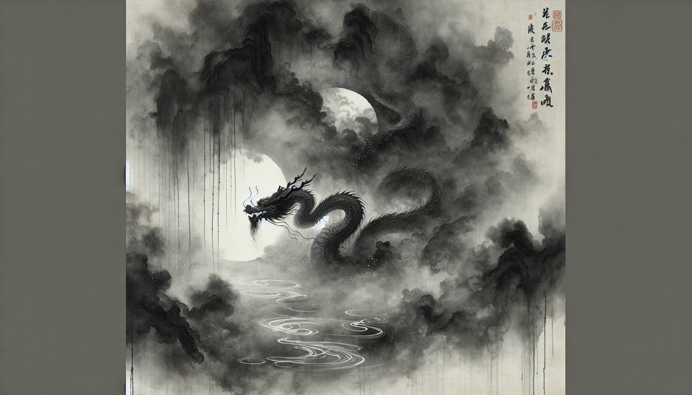

  
âš ï¸ğŸ—ï¸ğŸš§ğŸ¦ºğŸ§±ğŸªµğŸª¨ğŸªšğŸ› ï¸ğŸ‘·

  <i>This is a working draft in progress.</i>
   
  
   
  <blockquote>
	  <i>gif image is provided by <a href="https://giphy.com">Giphy</a></i>
  </blockquote>
  
âš ï¸ğŸ—ï¸ğŸš§ğŸ¦ºğŸ§±ğŸªµğŸª¨ğŸªšğŸ› ï¸ğŸ‘·

-----

# Explain I Ching System - PART 4

	

Click to show/hide the full disclaimer.

 
> <ins>📢 **WARNING** 🚨</ins>
 
> **About This Project**
> - This repository documents my ongoing exploration at the intersection of digital art and artificial intelligence.

> **Purpose**
> - To publicly document academic research.
> - To share findings with the community.
> - To maintain a personal portfolio of creative and technical work.

> **Disclaimer**
> - This is a personal project.
> - Any user who shares, adapts, or builds upon this work is responsible for their own interpretations and applications.

> This document contains my personal notes on the topic,
> compiled from publicly available documentation and various cited sources.
> The materials are intended for 👨â€ğŸ“ <ins>educational purposes</ins> 👨â€ğŸ“ (<ins>sometimes, entertainment purposes</ins>), 📖 <ins> personal study </ins> 📖, and 🔖 <ins> technical reference </ins> 🔖.
> The content is dual-licensed:
>
> 1. **MIT License:** Applies to all code implementations (Swift, Mermaid, and other programming languages).
> 2. **Creative Commons Attribution-ShareAlike 4.0 International License (CC BY-SA 4.0):** Applies to all non-code content, including text, explanations, diagrams, and illustrations.

> ... and I'm still searching for a real job now.

----

## My request

First, thoroughly review all previous responses to build comprehensive context around `Scene 1: The Hidden Dragon (Line 1)` in the last response. Then, strategically use DALL-E 3 to generate a series of 1792x1024 images that:
- Depict `Scene 1: The Hidden Dragon (Line 1)` from multiple angles, ensuring a complete visual overview of all its facets.
- Employ artistic styles carefully selected to authentically reflect the subject's core nature and essence.

-----

## Answer by both gpt-4.1 and DALLE-3

> Photo-realistic underwater scene, 1792x1024. In the silent, dark blue depths of a vast abyss, a colossal dragon lies coiled and at rest. Its immense body is mostly shadowed, with only a few brilliant, iridescent scales catching faint beams of light filtering down from far above. The water around the dragon is perfectly still, filled with a sense of latent power and mystical silence. Lush underwater flora and floating silt suggest ancient seclusion.

> Traditional Chinese ink painting (shui-mo), 1792x1024. A majestic dragon is faintly visible, entwined in murky waters, its form emerging subtly from swirling strokes of black and grey. Only hints of white on its scales and faded bubbles indicate its presence. Above, minimal light filters down, emphasizing the dragon's concealment and the tranquility of the scene. The composition expresses patience, wisdom, and enormous power held in reserve.

 
----

<!-- 

---
>**Licenses:**
>
>- **MIT License:**   - Full text in [LICENSE](LICENSE) file.
>- **Creative Commons Attribution-ShareAlike 4.0 International**: [CC BY-SA 4.0](https://creativecommons.org/licenses/by-sa/4.0/)  - Legal details in [LICENSE-CC-BY-SA-4.0](THE_PAST/LICENSE-CC-BY-SA-4.0) and at [Creative Commons official site](https://creativecommons.org/licenses/by-sa/4.0/).
>
---
