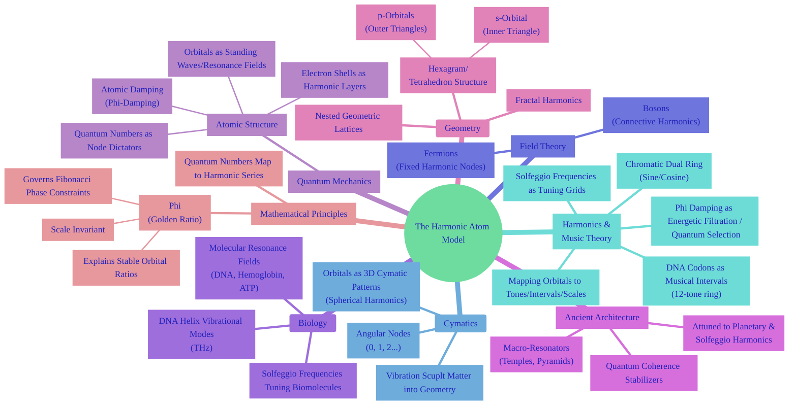
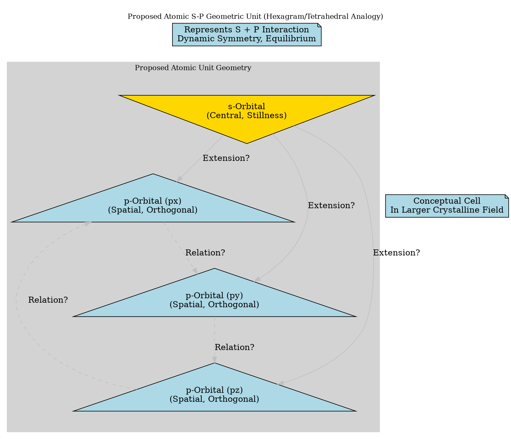
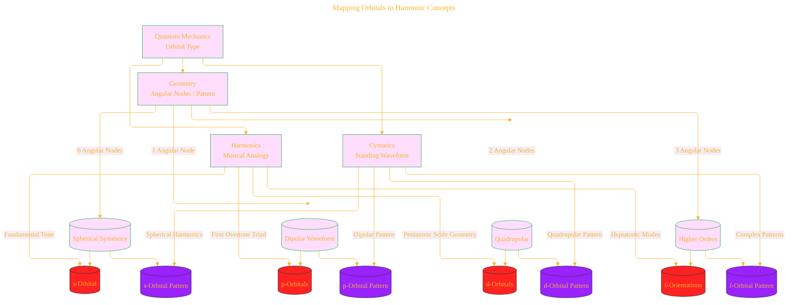
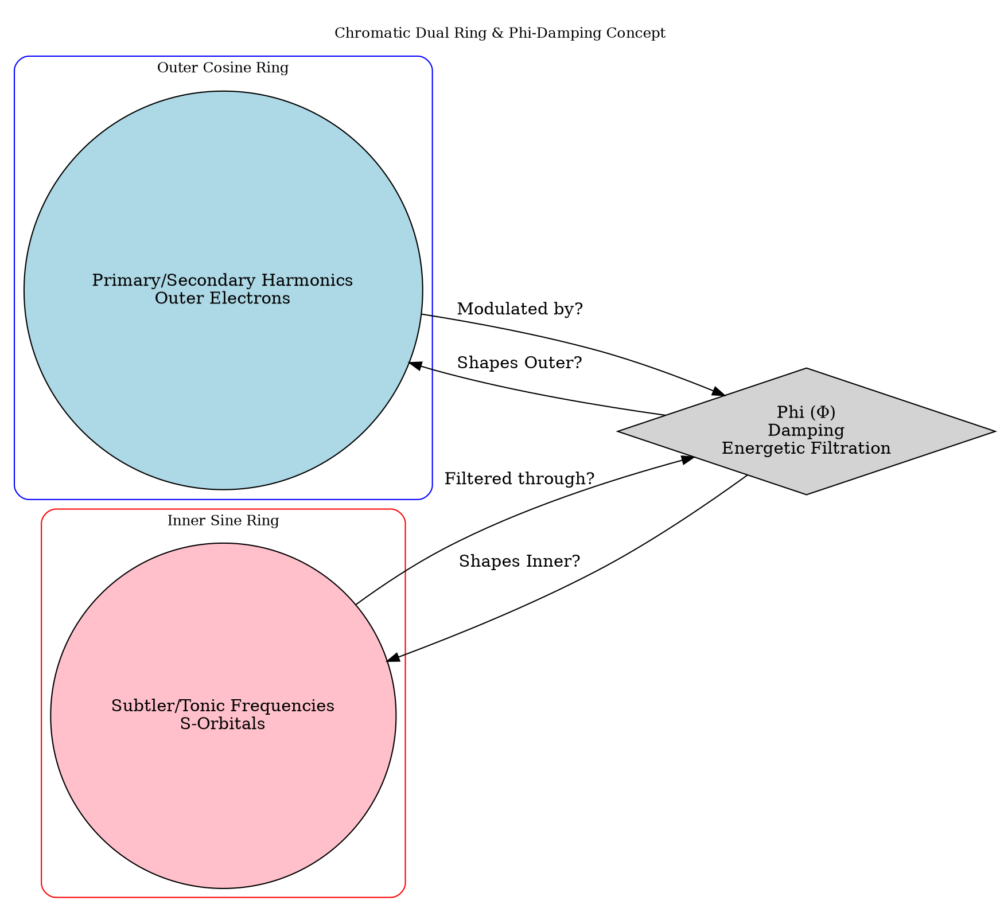
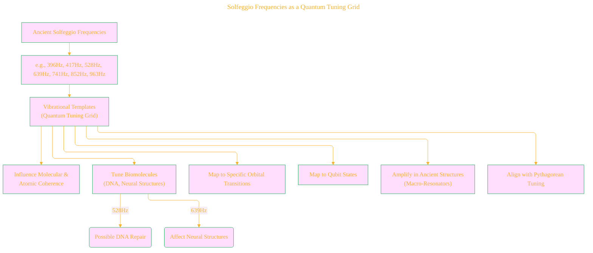
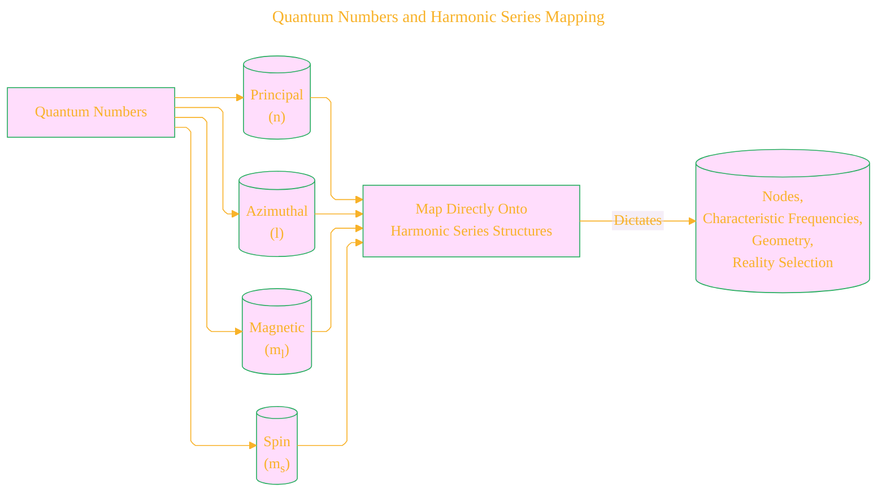
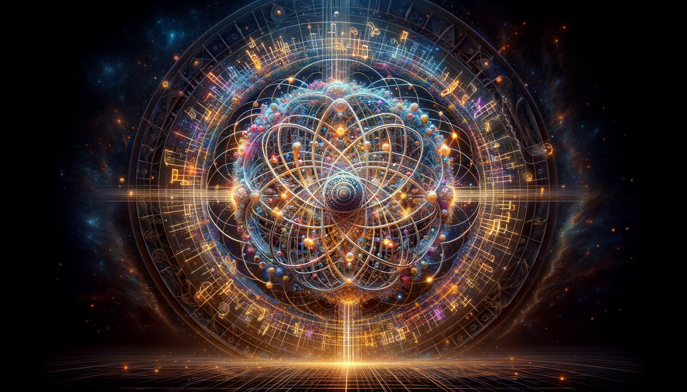

# Quantum Harmonic Atomic Model - Draft 4
> **Disclaimer:**
>
> This document contains my personal notes on the topic,
> compiled from publicly available documentation and various cited sources.
> The materials are intended for educational purposes, personal study, and reference.
> The content is dual-licensed:
> 1. **MIT License:** Applies to all code implementations (Swift, Mermaid, and other programming languages).
> 2. **Creative Commons Attribution 4.0 International License (CC BY 4.0):** Applies to all non-code content, including text, explanations, diagrams, and illustrations.
---

## 1. Core Conceptual Map: The Harmonic Atom Model

This diagram outlines the central idea and the interconnected domains it draws upon.

**Explanation:** This mindmap serves as a high-level overview, demonstrating how the central concept of the "Harmonic Atom" connects diverse fields like quantum mechanics, geometry, music, and biology, highlighting the core components within each domain as described in the text.

---

## 2. Atomic Geometric Structure: The S-P Hexagram Unit

This diagram illustrates the proposed geometric representation of the s and p subshells as a hexagram or tetrahedral unit.

**Explanation:** This Graphviz diagram attempts to visualize the core geometric idea. The downward triangle represents the s-orbital, and the three upward triangles conceptually represent the 3 p-orbitals structured together. The dashed lines indicate the conceptual formation of the hexagram/tetrahedral unit. Labels and notes emphasize that this is a proposed geometric mapping and a potential "basic cell" in a larger structure. Position (`pos`) attributes are used to attempt a hexagram-like layout, though precise geometric fidelity in DOT is limited.

---

### Atomic Geometric Structure: The S-P Hexagram Unit

View Graphviz DOT Source (Embedded DOT 2)

my_embedded_dot_2
digraph HexagramAtom {
  rankdir=TB
  graph [fontsize=12]
  node [shape=triangle, style=filled, fillcolor=lightblue, width=1]
  edge [color=gray]

  subgraph cluster_Structure {
    style=filled
    color=lightgrey
    label="Proposed Atomic Unit Geometry"

    s_orbital [label="s-Orbital\n(Central, Stillness)", shape=invtriangle, fillcolor=gold, pos="0,0!"]

    p_px [label="p-Orbital (px)\n(Spatial, Orthogonal)", pos="-1,-1.5!"]
    p_py [label="p-Orbital (py)\n(Spatial, Orthogonal)", pos="1,-1.5!"]
    p_pz [label="p-Orbital (pz)\n(Spatial, Orthogonal)", pos="0,1.5!"] // Using z conceptually here for 3D hint

    s_orbital -> p_px [label="Extension?"]
    s_orbital -> p_py [label="Extension?"]
    s_orbital -> p_pz [label="Extension?"]

    p_px -> p_py [style=dashed, label="Relation?"]
    p_py -> p_pz [style=dashed, label="Relation?"]
    p_pz -> p_px [style=dashed, label="Relation?"]
  }

   note_hex [shape=note, label="Represents S + P Interaction\nDynamic Symmetry, Equilibrium", pos="2,0!"]
   note_lattice [shape=note, label="Conceptual Cell\nIn Larger Crystalline Field", pos="-2,0!"]

   s_orbital -> note_lattice [style=invis]; // Invisible edge for layout
   note_hex -> s_orbital [style=invis]; // Invisible edge for layout

  label = "\nProposed Atomic S-P Geometric Unit (Hexagram/Tetrahedral Analogy)"
  labelloc = "t"
  labeljust = "c"
}
my_embedded_dot_2

<!-- 

 -->

----

## 3. Mapping Orbitals to Harmonic Concepts

This flowchart illustrates the proposed correspondence between orbital types and musical/cymatic harmonic concepts.

**Explanation:** This flowchart shows the proposed mapping from standard quantum orbital types (s, p, d, f) to their geometric/nodal characteristics, their musical analogies (tones, scales), and their corresponding cymatic standing wave patterns, as described in the text.

---

## 4. The Chromatic Dual Ring and Phi-Damping Concept

This diagram depicts the abstract model of two nested rings governed by Phi-damping, related to frequency and energy.

**Explanation:** Using nested subgraphs and styled nodes/edges in Graphviz, this diagram attempts to represent the abstract idea of the Chromatic Dual Ring. It shows an "Outer Cosine Ring" associated with primary harmonics and outer electrons, and an "Inner Sine Ring" linked to tonic frequencies and s-orbitals. The diamond node labeled "Phi Damping" is placed between and connected to the rings, illustrating its role as an "energetic filtration" mechanism shaping the frequencies and structures.

---

### The Chromatic Dual Ring and Phi-Damping Concept

View Graphviz DOT Source (Embedded DOT 4)

my_embedded_dot_4
digraph ChromaticDualRing {
  graph [fontsize=12]
  rankdir=LR

  node [shape=circle, style=filled]

  // Outer Cosine Ring
  subgraph cluster_CosineRing {
    style=rounded
    color=blue
    label="Outer Cosine Ring"
    oc [label="Primary/Secondary Harmonics\nOuter Electrons", fillcolor=lightblue]
  }

  // Inner Sine Ring
  subgraph cluster_SineRing {
    style=rounded
    color=red
    label="Inner Sine Ring"
    is [label="Subtler/Tonic Frequencies\nS-Orbitals", fillcolor=pink]
  }

  // Damping/Filtration mechanism
  phi [shape=diamond, label="Phi (Φ)\nDamping\nEnergetic Filtration"]

  // Connections illustrating the relationship and filtration
  oc -> phi [label="Modulated by?"]
  is -> phi [label="Filtered through?"]
  phi -> oc [label="Shapes Outer?"]
  phi -> is [label="Shapes Inner?"] // Conceptual flow

  // Add a general title
  label = "\nChromatic Dual Ring & Phi-Damping Concept"
  labelloc = "t"
  labeljust = "c"
}
my_embedded_dot_4

---

## 5. Solfeggio Frequencies as a Quantum Tuning Grid

This diagram explores the proposed role of Solfeggio frequencies.

**Explanation:** This flowchart visualizes the proposed role of specific Solfeggio frequencies as a "quantum tuning grid." It shows them potentially influencing atomic/molecular coherence, directly tuning biomolecules like DNA, corresponding to standard quantum events like orbital transitions or qubit states, and being amplified by ancient structures that act as resonators.

---

## 6. Quantum Numbers and Harmonic Series Mapping

A simple representation of the connection between quantum numbers and harmonic series concepts.

**Explanation:** This simple flowchart illustrates the stated connection where the fundamental quantum numbers (principal, azimuthal, magnetic, spin) are proposed to map directly onto harmonic series structures, which in turn are claimed to dictate the nodes, frequencies, geometry, and selection of reality within this model.

---

### Closing Image  
The atom is reframed as a **musical mandala**: harmonic lattices, animated by quantum numbers, sifting frequencies through sacred ratios, manifesting as the beauty of both a DNA helix and a cathedral dome. Physics, music, and geometry are revealed as facets of the same universal resonance.

<!--  -->

---

## References

1. Cohen-Tannoudji, C. et al. (Quantum Mechanics)  
2. Shankar, R. (Principles of Quantum Mechanics)  
3. Weyl, H. (The Theory of Groups...)  
4. Billam & Gardiner, Quantum Resonances (arXiv:0809.4373)  
5. Tymoczko, D. (A Geometry of Music)  
6. Gardner, M. (Ambidextrous Universe)  
7. Lincoln Xavier N. N. (2025). SACRED GEOMETRY - BEYOND THE EYES.

>
>**Licenses:**
>
>- **MIT License:**   - Full text in [LICENSE](LICENSE) file.
>- **Creative Commons Attribution 4.0 International:**  - Legal details in [LICENSE-CC-BY](LICENSE-CC-BY) and at [Creative Commons official site](http://creativecommons.org/licenses/by/4.0/).

---
