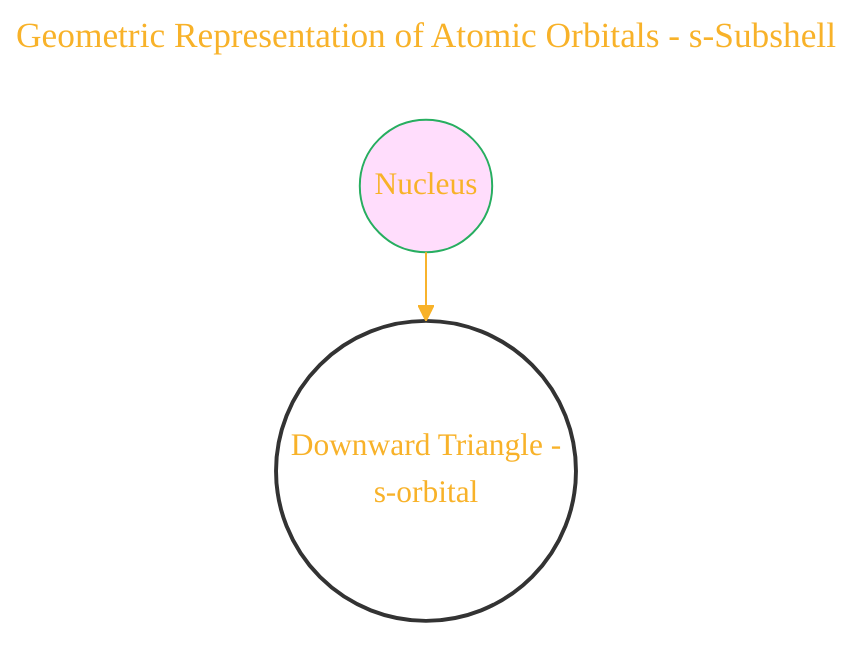
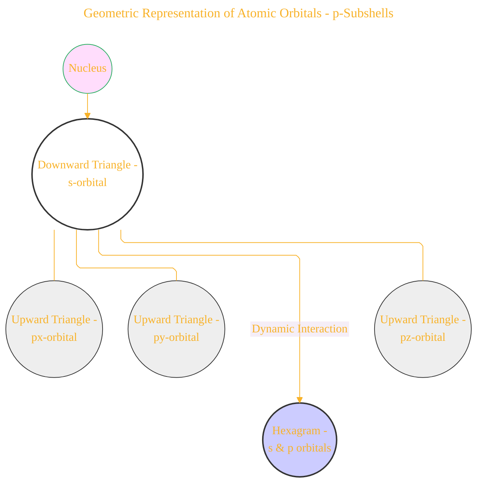
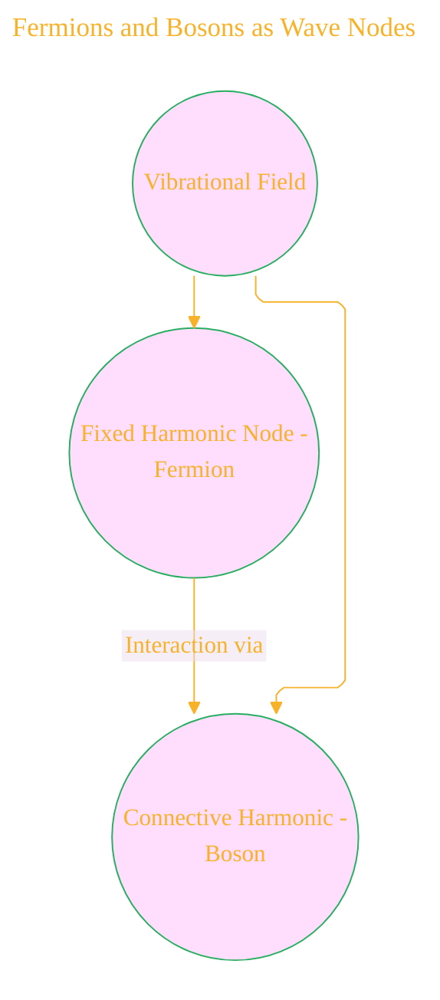
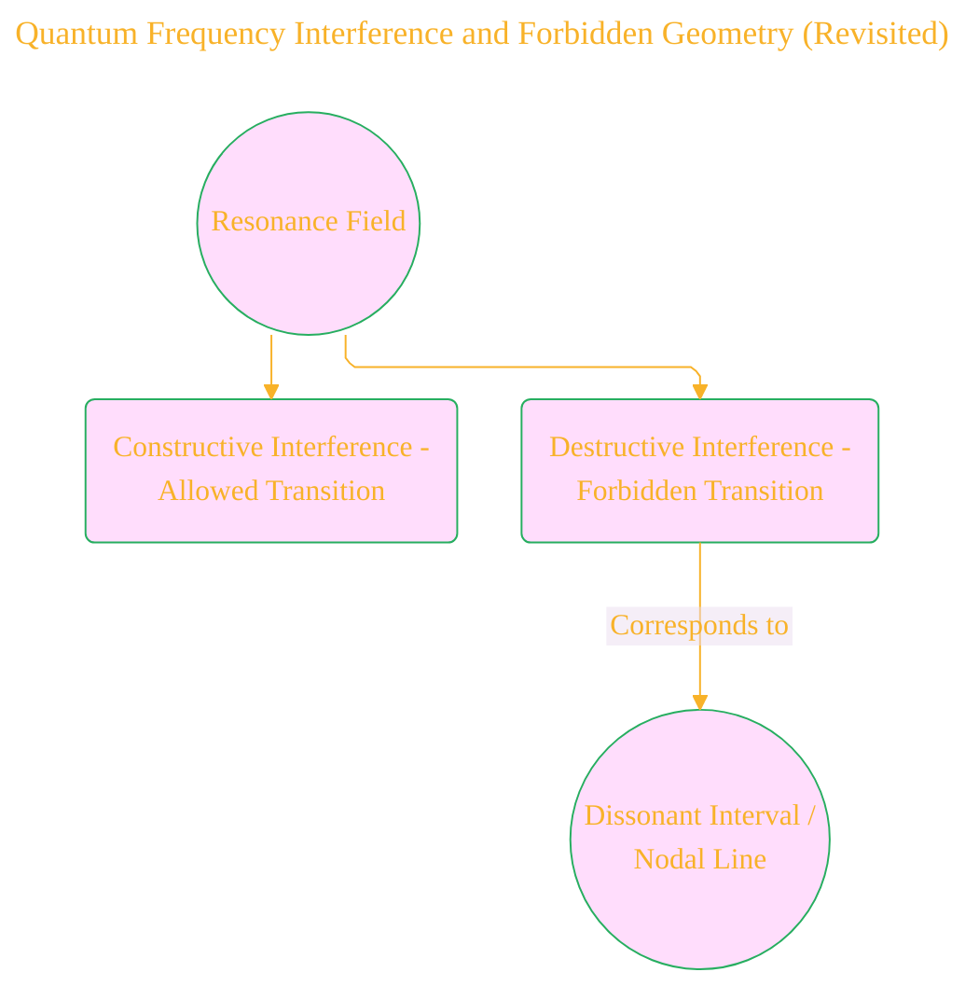
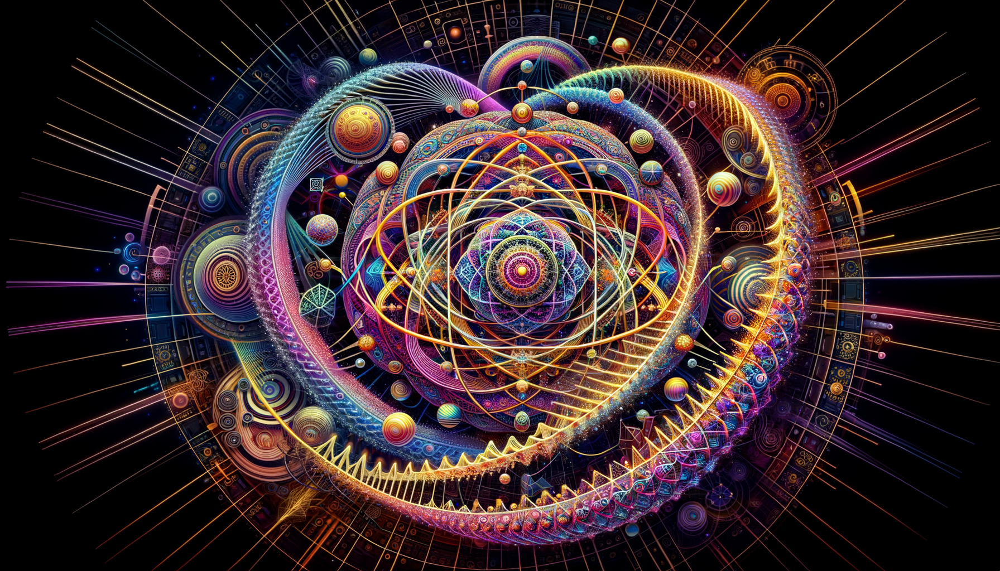

# Quantum Harmonic Atomic Model - Draft 5
> **Disclaimer:**
>
> This document contains my personal notes on the topic,
> compiled from publicly available documentation and various cited sources.
> The materials are intended for educational purposes, personal study, and reference.
> The content is dual-licensed:
> 1. **MIT License:** Applies to all code implementations (Swift, Mermaid, and other programming languages).
> 2. **Creative Commons Attribution 4.0 International License (CC BY 4.0):** Applies to all non-code content, including text, explanations, diagrams, and illustrations.
---

## 1. Geometric Representation of Atomic Orbitals

The document posits that electron orbitals are not merely probability distributions but can be visualized as geometric forms arising from resonant vibrations.

*   **s-Subshell:** Represented by an **inner downward triangle**, symbolizing centricity and radial symmetry.
    *   **Mermaid Diagram:**

*   **p-Subshells:** Represented by **three outer upward triangles**, aligned orthogonally and phase-oriented, forming a **hexagram** with the central s-triangle. This hexagram symbolizes the dynamic equilibrium between the central s-orbital and the spatially oriented p-orbitals.
    *   **Mermaid Diagram:**

*   **Quantum Hexagram as a Harmonic Lattice:** The hexagram is seen as a fundamental unit in a larger "crystalline field of quantum geometry," akin to a honeycomb. Electrons occupy triangular segments based on quantum numbers, and electron shells are like layers of resonance, similar to cymatic patterns.
    *   **Illustration Concept:** A tessellated plane of interconnected hexagrams, each divided into triangular segments with annotations for quantum numbers (n, l, ml, ms) influencing the "vibration" within each segment. Concentric hexagonal rings could represent electron shells.

---

## 2. Mapping Orbitals to Musical Harmonics

The document proposes a correspondence between orbital types and musical intervals, where the number of nodes relates to harmonic complexity.

*   **s-orbital (1 node):** Fundamental tone.
    *   **Analogy:** A single vibrating string producing its fundamental frequency.
*   **p-orbitals (3 nodes):** First overtone triad.
    *   **Analogy:** The first set of overtones produced by a musical instrument, forming a basic chord.
*   **d-orbitals (5 orientations):** Pentatonic scale geometry.
    *   **Analogy:** The five notes of a pentatonic scale and their inherent geometric relationships on a musical staff or circle of fifths.
*   **f-orbitals (7 orientations):** Heptatonic modes or planetary harmonics.
    *   **Analogy:** The seven modes of the diatonic scale or the frequencies associated with celestial bodies in some esoteric systems.
    *   **Table Representation:**

| Orbital | Number of Nodes/Orientations | Musical Analogy                      |
| :------ | :--------------------------- | :----------------------------------- |
| s       | 1                            | Fundamental Tone                     |
| p       | 3                            | First Overtone Triad                 |
| d       | 5                            | Pentatonic Scale Geometry            |
| f       | 7                            | Heptatonic Modes/Planetary Harmonics |

---

## 3. Cymatics and Atomic Structure

The document draws a direct analogy between cymatic patterns formed by vibrations on a surface and the shapes of atomic orbitals as standing waves.

*   **s-orbitals:** Spherical harmonics = 0 angular nodes, analogous to circular cymatic patterns at certain frequencies.
    *   **Illustration Concept:** Side-by-side images of a spherical harmonic function (l=0) and a circular Chladni plate pattern.
*   **p-orbitals:** Dipolar waveforms = 1 angular node, analogous to two-lobed cymatic patterns.
    *   **Illustration Concept:** Side-by-side images of a p-orbital shape and a dipolar Chladni pattern.
*   **d-orbitals:** Quadrupolar = 2 angular nodes, analogous to four-lobed cymatic patterns.
    *   **Illustration Concept:** Side-by-side images of a d-orbital shape and a quadrupolar Chladni pattern.

---

## 4. Fermions and Bosons as Wave Nodes

The model extends to field theory, suggesting that both matter particles (fermions) and force carriers (bosons) are manifestations of vibrations in a field.

*   **Fermions:** Fixed harmonic nodes (localized vibrations).
    *   **Analogy:** Stable standing waves with well-defined nodes.
*   **Bosons:** Connective harmonics (propagating vibrations facilitating interaction).
    *   **Analogy:** Traveling waves or the resonant frequencies that allow different standing waves to interact.
    *   **Mermaid Diagram:**

---

## 5. DNA Codons and Chromatic Frequencies

The document proposes a mapping between DNA codons (triplet base pairs) and musical intervals within a 12-tone ring, suggesting the genome might be "tuned" to specific frequencies.

*   **Illustration Concept:** A circular diagram representing the 12-tone chromatic scale, with each tone (or interval) corresponding to a permutation or property of DNA codons. This ring could visually mirror the "Chromatic Dual Ring" mentioned later.

---

## 6. Atomic Damping and Forbidden Geometry

The concept of "Phi-damping" is introduced, suggesting that certain vibrational modes (and thus geometric configurations) are suppressed, similar to destructive interference in waves or dissonance in music. This implies a selective process in atomic structure formation.

*   **Illustration Concept:** A Venn diagram where one circle represents all possible geometric vibrations and another represents stable, allowed vibrations. The overlapping region is governed by "Phi-damping" or "Golden Resonance Decay." Regions of forbidden geometry (dissonance) would lie outside the stable vibration circle.

----

## 7. Tetrahedral Electrons and Subshell Architecture

An alternative geometric framework is proposed where electron orbitals form a tetrahedral lattice.

*   **s-orbital:** The inner downward triangle as the seed of symmetry at the center.
*   **p-orbitals:** Three radiating triangles acting as vibrational antennae along triaxial harmonics.
    *   **3D Model Concept:** A central tetrahedron with its vertices pointing downwards, representing the s-orbital influence. Three additional tetrahedra could radiate outwards from the faces of the central one, aligned with Cartesian axes, representing the p-orbitals.

----

## 8. Phi-Symmetry and the Non-Local Octave

The importance of the golden ratio (Phi) is highlighted as a scaling principle potentially governing quantum coherence. "Phi damping" could act as a natural filter, favoring frequency geometries with golden ratio relationships.

*   **Illustration Concept:** A spiral based on the golden ratio (Fibonacci spiral) superimposed on a representation of nested electron shells, suggesting a scaling relationship governed by Phi.

---

## 9. Solfeggio Spectrum as a Quantum Tuning Grid

The ancient Solfeggio frequencies are proposed as vibrational templates influencing atomic and molecular coherence, with potential links to orbital transitions or qubit states.

*   **Table Representation:**

| Solfeggio Frequency (Hz) | Potential Quantum Correlation                                  | Scientific Support (Mentioned) |
| :----------------------- | :------------------------------------------------------------- | :----------------------------- |
| 396                      | (Hypothetical orbital transition/molecular vibration)          |                                |
| 417                      | (Hypothetical orbital transition/molecular vibration)          |                                |
| 528                      | Resonates with cytosine-guanine bonding? DNA repair influence? | Dr. Glen Rein's DNA research   |
| 639                      | Affects oxytocin-mediated neural structures?                   |                                |
| 741                      | (Hypothetical orbital transition/molecular vibration)          |                                |
| 852                      | (Hypothetical orbital transition/molecular vibration)          |                                |
| 963                      | (Hypothetical orbital transition/molecular vibration)          |                                |

----

## 10. Cymatic Atoms and Chladni Orbitals (Revisited)

Emphasizes the standing wave nature of orbitals and the direct correspondence to cymatic patterns and the solutions of the Schrödinger equation in spherical coordinates.

*   **Illustration Concept:** A visual montage showing mathematical representations of spherical harmonics (for s, p, and d orbitals) alongside corresponding 3D rendered cymatic patterns that exhibit similar nodal structures and symmetries.

---

## 11. Quantum Frequency Interference and Forbidden Geometry (Revisited)

Links the concept of dissonant musical intervals (destructive interference) to forbidden quantum transitions governed by selection rules (nodal line interferences).

*   **Mermaid Diagram:**

---

## 12. Resonance Fields in Molecular Biology

Extends the resonance concept to biomolecules like DNA and porphyrins, suggesting they are "tuned" to quantum geometry and may respond to specific frequencies (e.g., Solfeggio frequencies).

*   **Illustration Concept:** A diagram of a DNA double helix with superimposed wave patterns representing vibrational modes, possibly highlighting specific base pairings (e.g., C-G) resonating at 528Hz. A similar diagram for a porphyrin ring system showing cyclic resonance.

---

## 13. Quantum Temple Architectures

Proposes that ancient structures were designed as "macro-resonators" attuned to planetary harmonics and possibly amplifying Solfeggio frequencies to influence consciousness.

*   **Illustration Concept:** A stylized cross-section of an ancient temple (e.g., pyramid or Gothic cathedral) with overlaid lines or patterns representing resonant frequencies and their interaction with the structure's geometry. Arrows could indicate the amplification or focusing of these fields.

---

## 14. Harmonic Numbers and Quantum Numbers

Suggests a direct mapping between the principal (n), azimuthal (l), magnetic (ml), and spin (ms) quantum numbers and structures found in harmonic series (though the document does not explicitly detail this mapping).

*   **Conceptual Diagram:** A visual comparison of the mathematical relationships within a harmonic series (e.g., ratios of frequencies) and the allowed values and relationships between quantum numbers.

---

## 15. Phi-Symmetry and the Non-Local Octave (Revisited)

Further emphasizes the role of the golden ratio in stabilizing frequency geometries and potentially explaining quantum phenomena like jumps and tunneling.

*   **Illustration Concept:** A diagram illustrating a quantum jump or tunneling event with an underlying Phi-based geometric progression or wave interference pattern influencing the probability or pathway of the event.

---

## 16. Fractal Harmonics and Nested Shell Geometry

Proposes a model of nested polyhedral fields (e.g., icosahedra, dodecahedra) based on fractal harmonics, replacing linear orbital stacking.

*   **3D Model Concept:** A series of nested polyhedra, with increasing complexity and number of vertices as you move outwards from the nucleus, representing the s, p, d, and f subshells as fractal harmonic envelopes. This could be inspired by Fuller's synergetic geometry or visualizations of spherical harmonics.

---

## Overall Visual Theme

The collection of diagrams and illustrations would ideally maintain a consistent visual style, perhaps incorporating elements of sacred geometry, wave patterns (sine waves, cymatic forms), and nested structures to reinforce the interconnectedness of the concepts. Color could be used to differentiate energy levels or types of vibrations. The overall aesthetic should evoke a sense of harmony and underlying order within the apparent complexity of the quantum world.

---

### Closing Image  
The atom is reframed as a **musical mandala**: harmonic lattices, animated by quantum numbers, sifting frequencies through sacred ratios, manifesting as the beauty of both a DNA helix and a cathedral dome. Physics, music, and geometry are revealed as facets of the same universal resonance.

<!--  -->

---

## References

1. Cohen-Tannoudji, C. et al. (Quantum Mechanics)  
2. Shankar, R. (Principles of Quantum Mechanics)  
3. Weyl, H. (The Theory of Groups...)  
4. Billam & Gardiner, Quantum Resonances (arXiv:0809.4373)  
5. Tymoczko, D. (A Geometry of Music)  
6. Gardner, M. (Ambidextrous Universe)  
7. Lincoln Xavier N. N. (2025). SACRED GEOMETRY - BEYOND THE EYES.

>
>**Licenses:**
>
>- **MIT License:**   - Full text in [LICENSE](LICENSE) file.
>- **Creative Commons Attribution 4.0 International:**  - Legal details in [LICENSE-CC-BY](LICENSE-CC-BY) and at [Creative Commons official site](http://creativecommons.org/licenses/by/4.0/).

---
