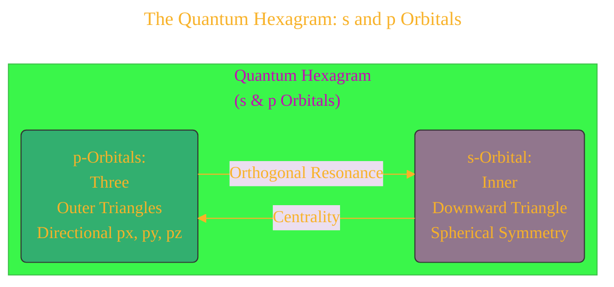
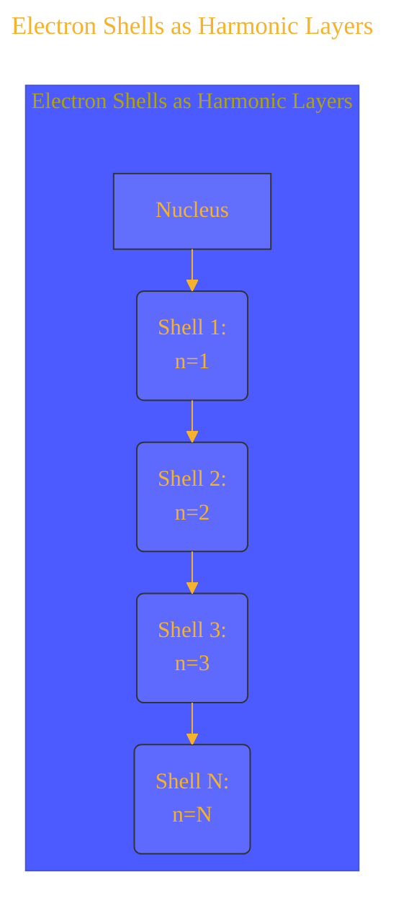
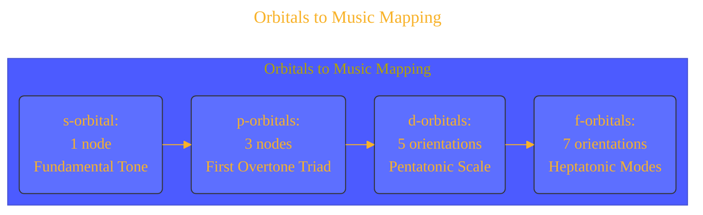
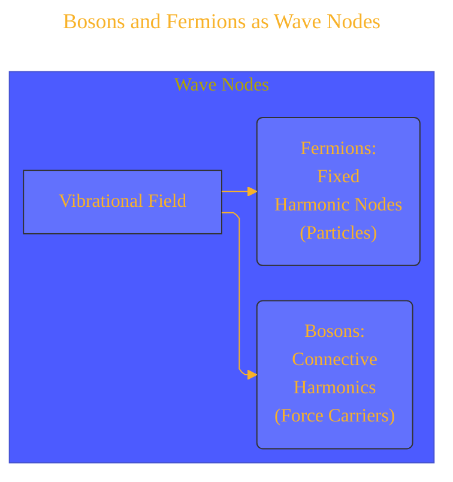
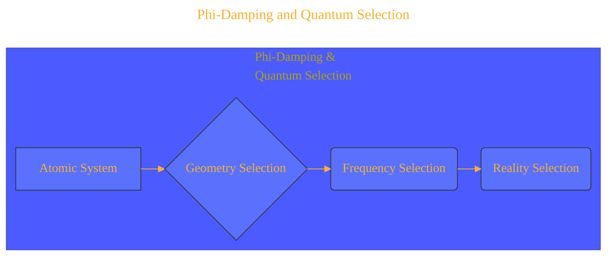
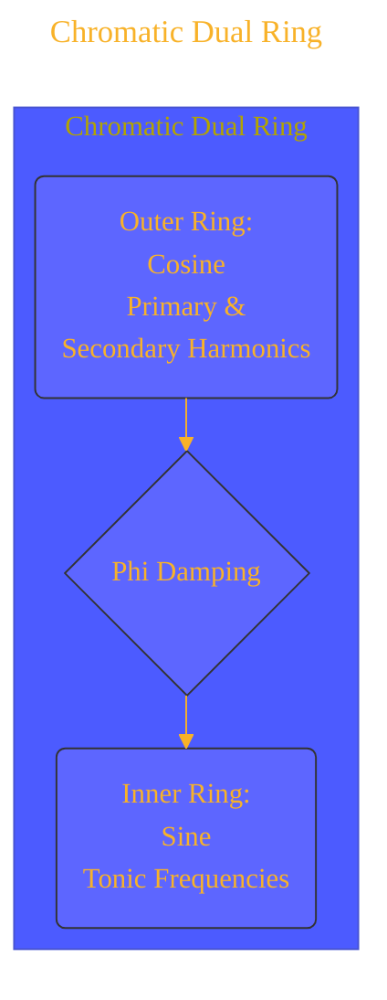
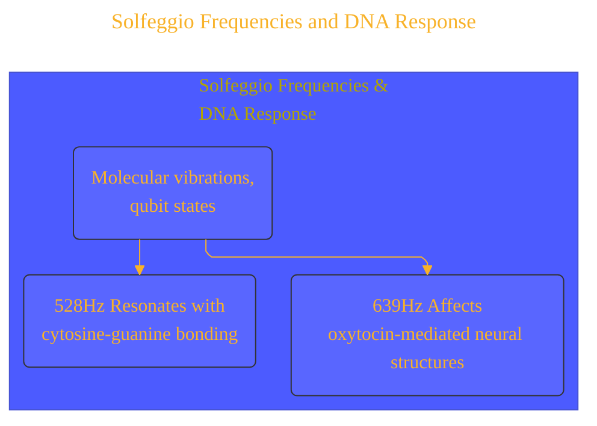
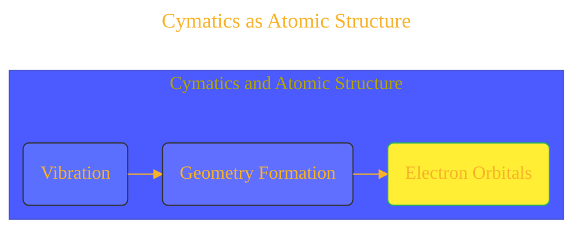
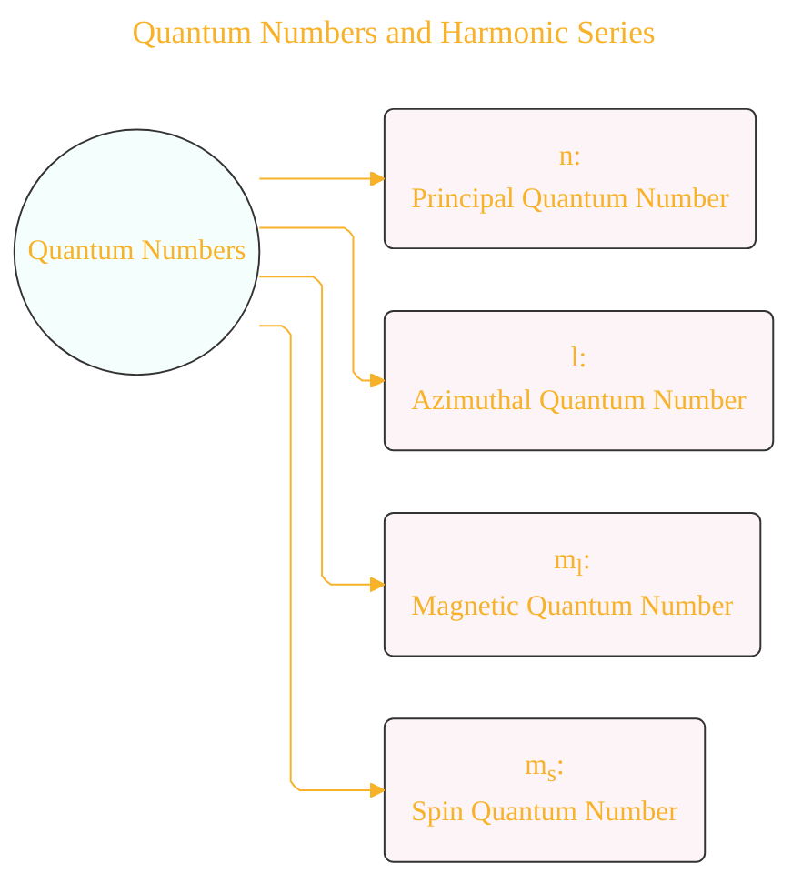
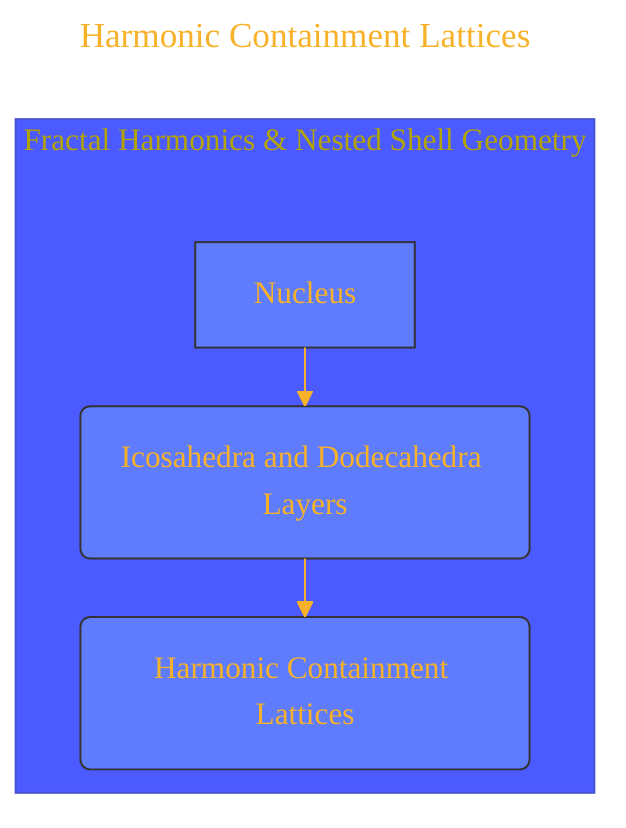

# Quantum Harmonic Atomic Model - Draft 6
> **Disclaimer:**
>
> This document contains my personal notes on the topic,
> compiled from publicly available documentation and various cited sources.
> The materials are intended for educational purposes, personal study, and reference.
> The content is dual-licensed:
> 1. **MIT License:** Applies to all code implementations (Swift, Mermaid, and other programming languages).
> 2. **Creative Commons Attribution 4.0 International License (CC BY 4.0):** Applies to all non-code content, including text, explanations, diagrams, and illustrations.
---

## 1. The Quantum Hexagram: s and p Orbitals

*   **Explanation:** This diagram visualizes the core concept of the hexagram representing the s and p orbitals. The `s-Orbital` (inner downward triangle) is contrasted with with three `p-Orbitals` (outer triangles).

-----

## 2. Electron Shells as Harmonic Layers

*   **Explanation:** Visualizes the electron shells around the nucleus as harmonic layers.

----

## 3. Orbitals to Music Mapping

*   **Explanation:** Diagrams the correlation between electron orbitals (s, p, d, f) and corresponding musical harmonics (fundamental tone, overtone triad, pentatonic scale, heptatonic modes).

---

## 4. Bosons and Fermions as Wave Nodes

*   **Explanation:** This diagram showcases the conceptualization of Fermions and Bosons with wave nodes in a vibrational field.

---

## 5. Phi-Damping and Quantum Selection

*   **Explanation:** Describes the phi-damping filter and quantum selection in 4 parts.

-----

## 6. Chromatic Dual Ring

*   **Explanation:** Chromatic dual rings illustrates how tones and charges align.

---

## 7. Solfeggio Frequencies and DNA Response

*   **Explanation:** Illustrates how DNA responds to certain frequency bands.

----

## 8. Cymatics as Atomic Structure

*   **Explanation:** Illustrates Chladni patterns and the relationship it has with electronic orbitals.

-----

## 9. Quantum Numbers and Harmonic Series

*Explanation:* The diagram maps how the relationships between the quantum numbers are not arbitrary and lead to a harmonic series.

---

## 10. Harmonic Containment Lattices

*Explanation:* Shows the non-linear orbital stacking and how atomonica looks into layering the icosahedra and dodecahedra to the atomic nucleus.

---

## References

1. Cohen-Tannoudji, C. et al. (Quantum Mechanics)  
2. Shankar, R. (Principles of Quantum Mechanics)  
3. Weyl, H. (The Theory of Groups...)  
4. Billam & Gardiner, Quantum Resonances (arXiv:0809.4373)  
5. Tymoczko, D. (A Geometry of Music)  
6. Gardner, M. (Ambidextrous Universe)  
7. Lincoln Xavier N. N. (2025). SACRED GEOMETRY - BEYOND THE EYES.

---
**Licenses:**

- **MIT License:**   - Full text in [LICENSE](LICENSE) file.
- **Creative Commons Attribution 4.0 International:**  - Legal details in [LICENSE-CC-BY](LICENSE-CC-BY) and at [Creative Commons official site](http://creativecommons.org/licenses/by/4.0/).

---