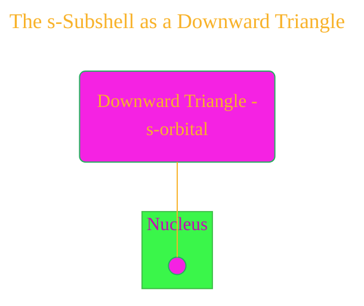
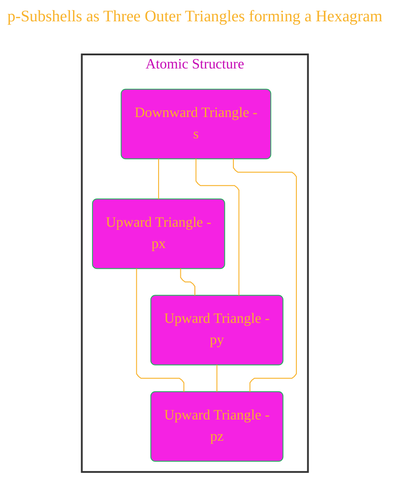
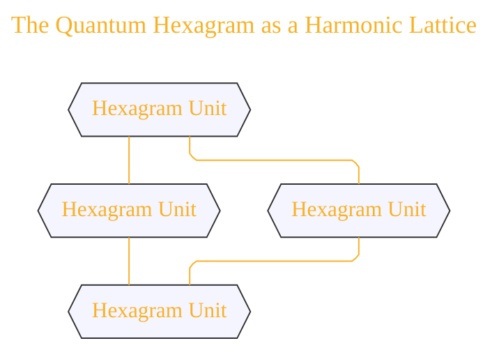
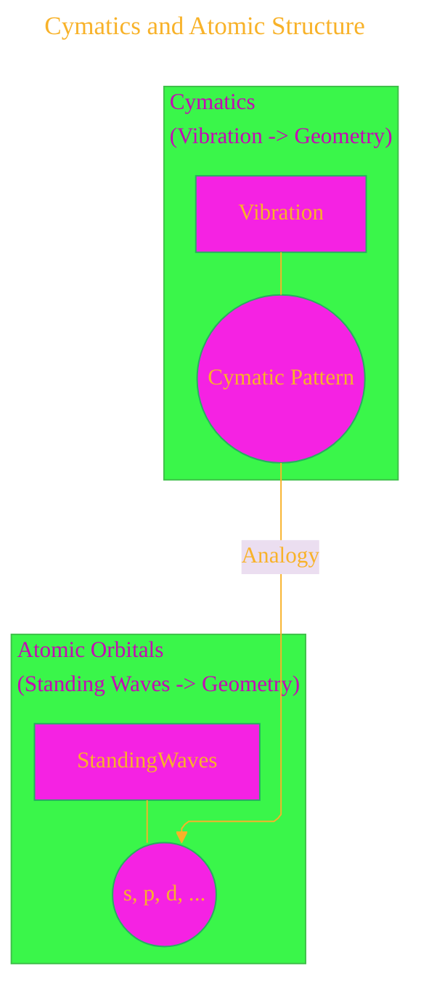
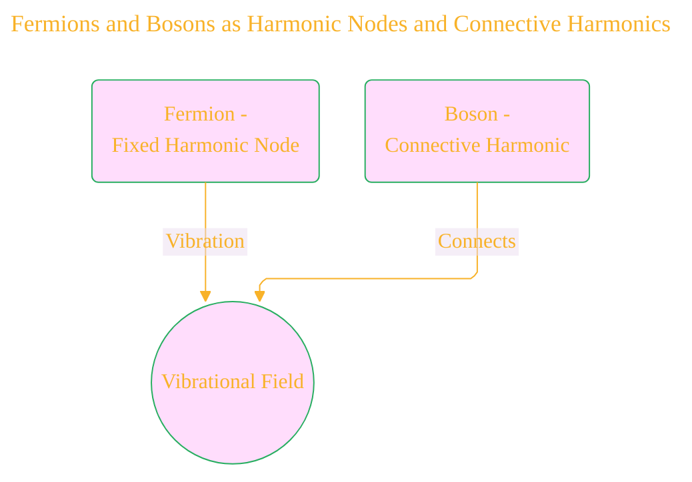
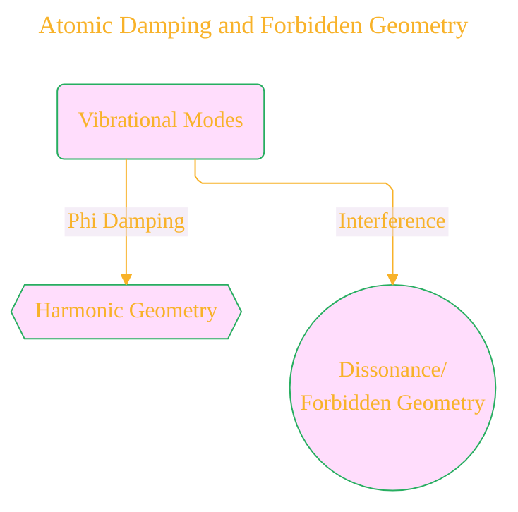
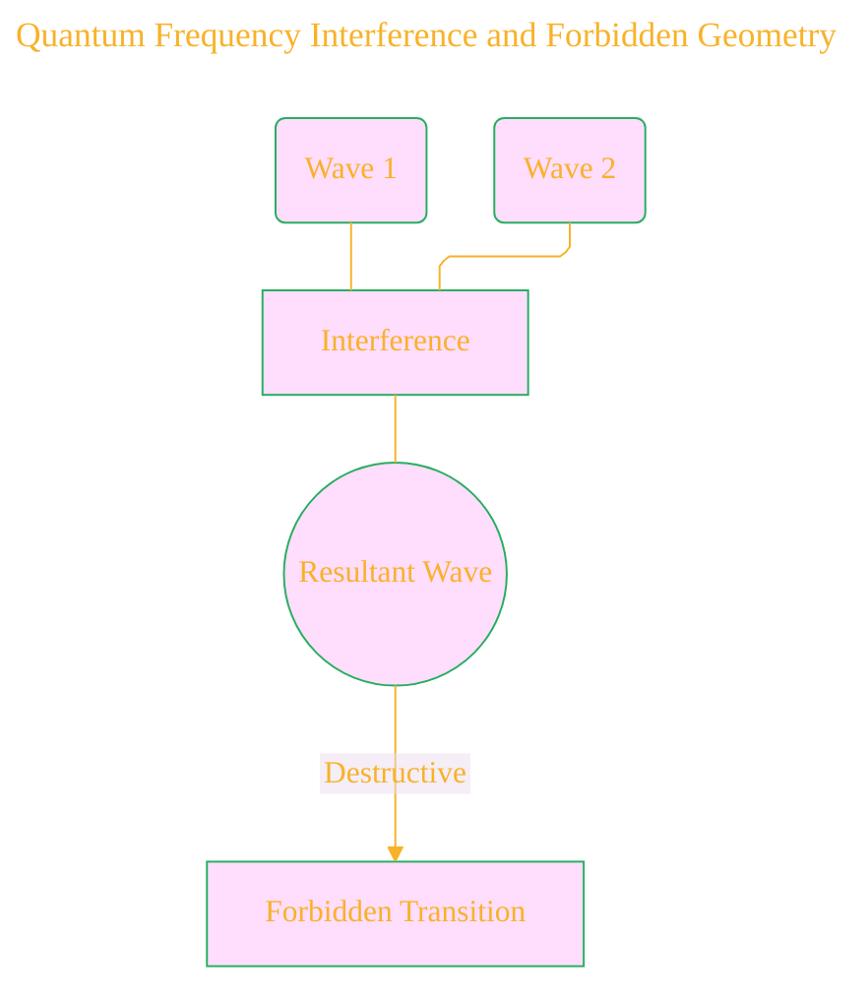
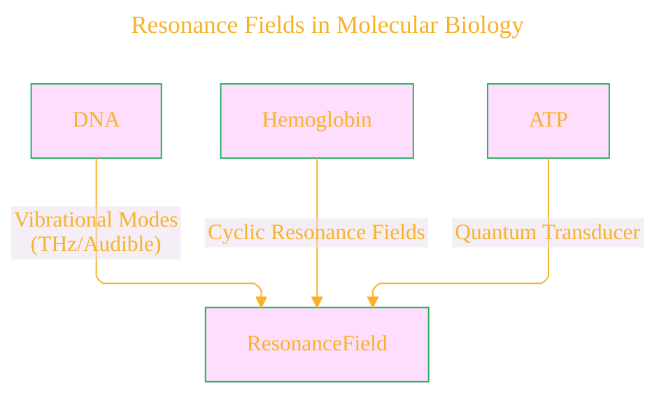
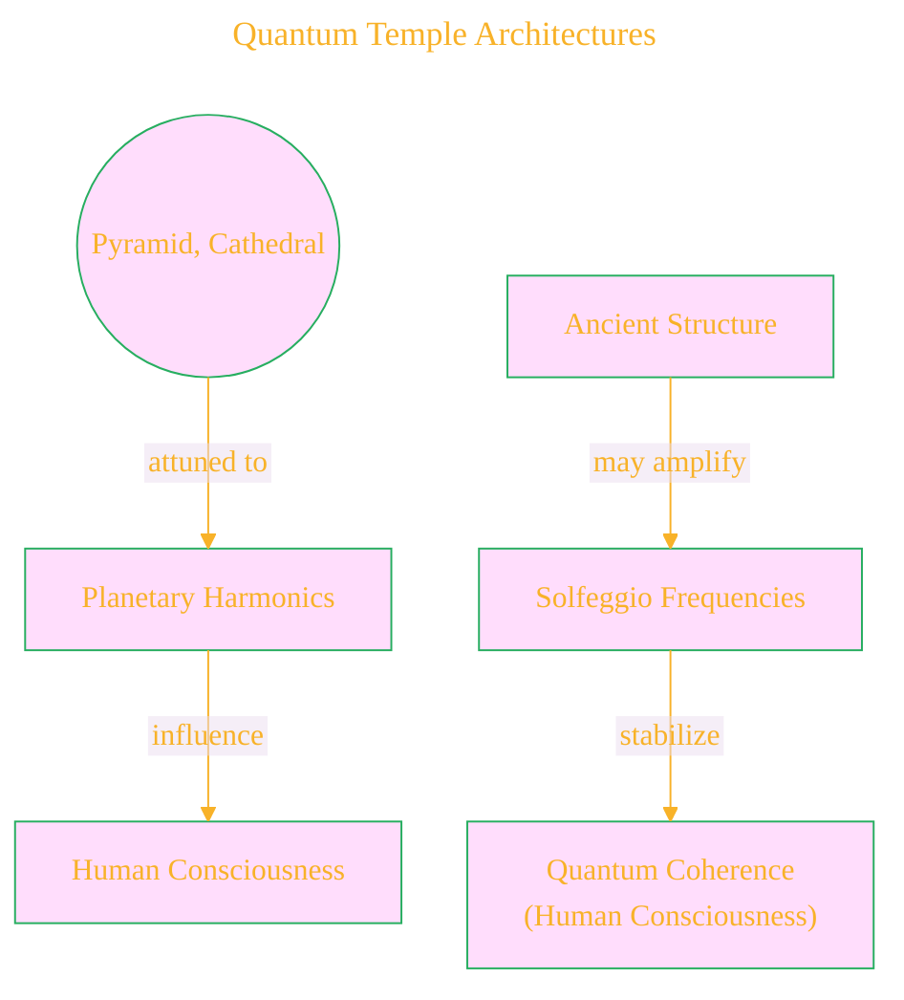
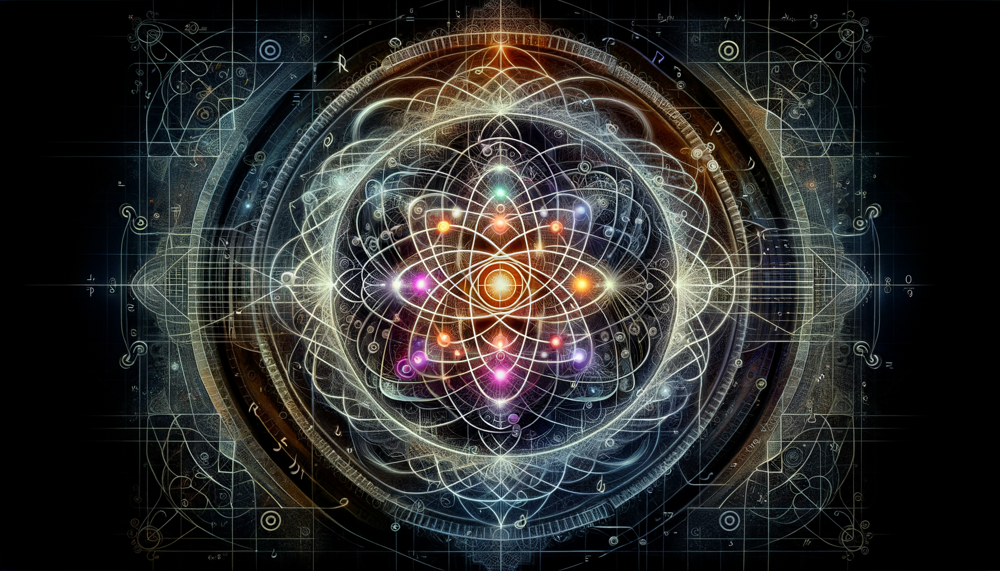

# Quantum Harmonic Atomic Model - Draft 7

	

Click to show/hide the full disclaimer.

   
> <ins>📢 **Disclaimer** 🚨</ins>
> 
> This project is born from my fascination with blending digital art and artificial intelligence. 
> It's where I document my academic explorations, 
> share my findings with anyone interested, 
> and maintain a personal vault of my creative and technical journey. 
> I'm not sure the link for this repo being shared in the back by others, 
> since I havent planned for any analytics for this project yet. 
> ...and I'm actively looking for a job... 
>
> This document contains my personal notes on the topic,
> compiled from publicly available documentation and various cited sources.
> The materials are intended for 👨‍🎓 <ins>educational purposes</ins> 👨‍🎓 (<ins>:trollface:sometimes, entertainment purposes:trollface:</ins>), 📖 <ins> personal study </ins> 📖, and 🔖 <ins> technical reference </ins> 🔖.
> The content is dual-licensed:
> 1. **MIT License:** Applies to all code implementations (Swift, Mermaid, and other programming languages).
> 2. **Creative Commons Attribution-ShareAlike 4.0 International License (CC BY-SA 4.0):** Applies to all non-code content, including text, explanations, diagrams, and illustrations.

----

## 1. The s-Subshell as a Downward Triangle

The central concept of the s-orbital being represented by a downward triangle due to its symmetry and centricity can be illustrated with a simple graph:

**Graph Representation:**

Title: s-Orbital as Central Symmetry
x-axis: Spatial Extent
y-axis: Probability Density

Plot a symmetrical bell curve centered at the origin, reflecting the spherical probability distribution of the s-orbital. Below the curve, place a downward-pointing triangle.

**Mermaid Diagram (Conceptual):**

---

## 2. p-Subshells as Three Outer Triangles forming a Hexagram

The three p-orbitals, directionally aligned and forming a hexagram with the central s-orbital, can be shown as:

**Mermaid Diagram:**

**Textual Illustration:**

Imagine a central downward triangle. Three upward-pointing triangles are placed around it, such that their bases align with the sides of the central triangle, forming a six-pointed star (hexagram).

---

## 3. The Quantum Hexagram as a Harmonic Lattice

The hexagram as a repeating unit in a larger "crystalline field" can be visualized as:

**Mermaid Diagram:**

**Textual Description:**

Envision a tiling of hexagrams, representing the repeating units of electron shells, similar to a honeycomb structure. Each segment within a hexagram can be associated with an electron, its position and "vibration" dictated by quantum numbers.

----

## 4. Mapping Orbitals to Musical Harmonics

The correspondence between orbital types and musical harmonics can be represented as a table:

**Table Representation:**

| Orbital Type | Number of Nodes | Musical Analogy                        |
| ------------ | --------------- | -------------------------------------- |
| s            | 1               | Fundamental Tone                       |
| p            | 3               | First Overtone Triad                   |
| d            | 5               | Pentatonic Scale                       |
| f            | 7               | Heptatonic Modes / Planetary Harmonics |

---

## 5. Cymatics and Atomic Structure

The idea of electron orbitals as standing waves creating cymatic patterns can be illustrated conceptually:

**Mermaid Diagram:**

**Textual Description:**

Imagine a square plate covered with sand. When vibrated at different frequencies, the sand forms distinct geometric patterns (Chladni figures). Similarly, electrons within an atom can be visualized as standing waves in 3D space, creating the shapes of atomic orbitals.

---

## 6. Fermions and Bosons as Harmonic Nodes and Connective Harmonics

The extension to field theory can be represented as:

**Mermaid Diagram:**

----

## 7. DNA Codons and the Chromatic Ring

The mapping of DNA codons to musical intervals and their arrangement in a 12-tone ring can be visualized:

**Circular Layout (Conceptual):**

Imagine a circle with 12 segments. Each segment represents a musical полутон. Groups of three adjacent segments can be colored or labeled to represent the DNA codons and their corresponding musical "notes," forming a "Chromatic Dual Ring."

---

## 8. Atomic Damping and Forbidden Geometry

Phi-damping as a selective force in atomic geometry can be illustrated:

**Mermaid Diagram:**

---

## 9. Tetrahedral Electrons and Subshell Architecture

The tetrahedral lattice representing electron shells:

**Textual Description:**

Envision a central downward triangle (s-orbital). Three upward triangles (p-orbitals) radiate outwards from the vertices of the central triangle, forming a three-dimensional, somewhat tetrahedral arrangement, emphasizing the spatial and vibrational nature of the subshells.

---

## 10. Solfeggio Spectrum as a Quantum Tuning Grid

The Solfeggio frequencies influencing atomic coherence:

**Table Representation:**

| Solfeggio Frequency (Hz) | Potential Quantum Correlation                                   |
|--------------------------|-----------------------------------------------------------------|
| 396                      | (Hypothetical) Specific orbital transitions                        |
| 417                      | (Hypothetical) Molecular vibrations                               |
| 528                      | (Hypothetical) DNA bonding resonance, qubit states               |
| 639                      | (Hypothetical) Neural structure resonance                         |
| 741                      | (Hypothetical) ...                                              |
| 852                      | (Hypothetical) ...                                              |
| 963                      | (Hypothetical) ...                                              |

---

## 11. Quantum Frequency Interference and Forbidden Geometry

Destructive interference leading to forbidden transitions:

**Mermaid Diagram:**

---

## 12. Resonance Fields in Molecular Biology

Biomolecules as resonant instruments:

**Mermaid Diagram:**

---

## 13. Quantum Temple Architectures

Ancient structures as macro-resonators:

**Mermaid Diagram:**

---

## 14. Harmonic Numbers and Quantum Numbers

**Textual Description:**

The principal quantum number (n) relates to the overtone series. The azimuthal quantum number (l) relates to the number of angular nodes, analogous to different modes of vibration. The magnetic quantum number (ml) corresponds to spatial orientations of these vibrations. Spin (ms) could relate to intrinsic vibrational polarity.

---

## 15. Phi-Symmetry and the Non-Local Octave

The golden ratio as a fundamental organizing principle:

**Textual Description:**

Imagine the allowed vibrational frequencies and geometric forms being filtered through a "Phi-filter," where only those exhibiting golden ratio proportions or relationships are stable. This could explain the prevalence of certain structures in nature and quantum phenomena.

---

## 16. Fractal Harmonics and Nested Shell Geometry

**Textual Description:**

Instead of simple concentric shells, picture nested geometric solids (e.g., an octahedron within a cube, within an icosahedron), with each face or vertex representing a harmonic node. These nested structures exhibit fractal properties, with similar patterns repeating at different scales within the atom. Electron density plots can be seen as visualizations of these complex, fractal harmonic fields.

---

### Closing Image  
The atom is reframed as a **musical mandala**: harmonic lattices, animated by quantum numbers, sifting frequencies through sacred ratios, manifesting as the beauty of both a DNA helix and a cathedral dome. Physics, music, and geometry are revealed as facets of the same universal resonance.

<!--  -->

---

## References

1. Cohen-Tannoudji, C. et al. (Quantum Mechanics)  
2. Shankar, R. (Principles of Quantum Mechanics)  
3. Weyl, H. (The Theory of Groups...)  
4. Billam & Gardiner, Quantum Resonances (arXiv:0809.4373)  
5. Tymoczko, D. (A Geometry of Music)  
6. Gardner, M. (Ambidextrous Universe)  
7. Lincoln Xavier N. N. (2025). SACRED GEOMETRY - BEYOND THE EYES.

---

>
>**Licenses:**
>
>- **MIT License:**   - Full text in [LICENSE](LICENSE) file.
>- **Creative Commons Attribution 4.0 International:**  - Legal details in [LICENSE-CC-BY](LICENSE-CC-BY) and at [Creative Commons official site](http://creativecommons.org/licenses/by/4.0/).

---
