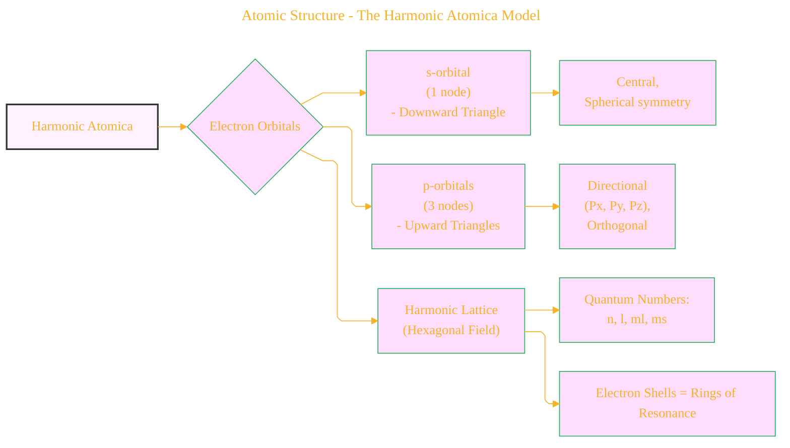
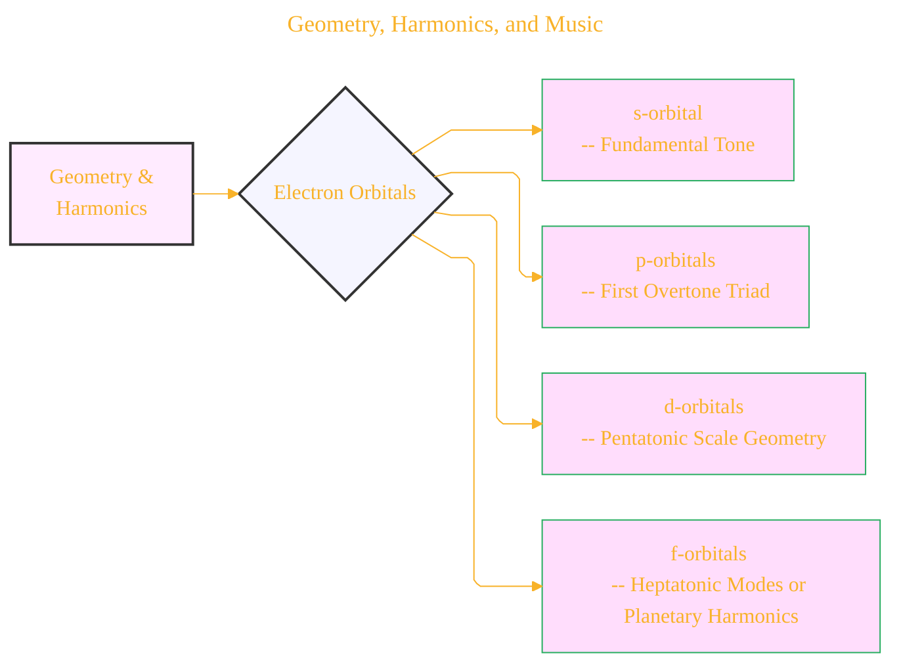
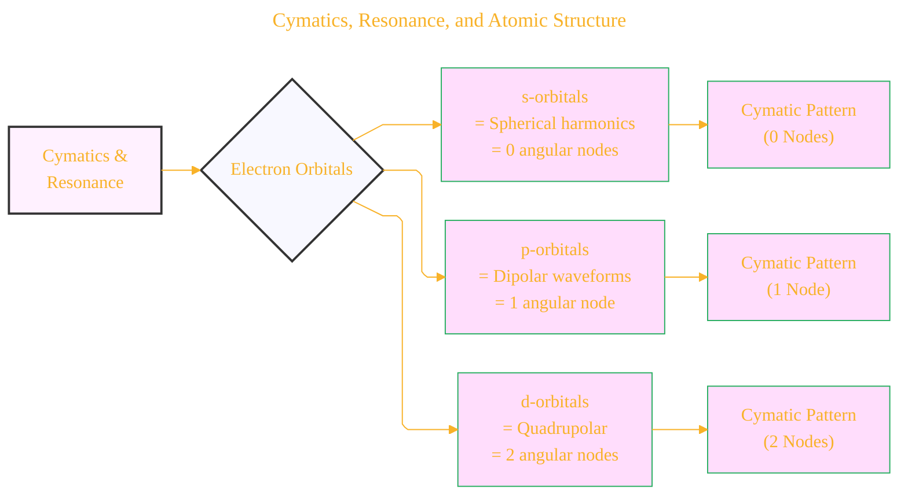
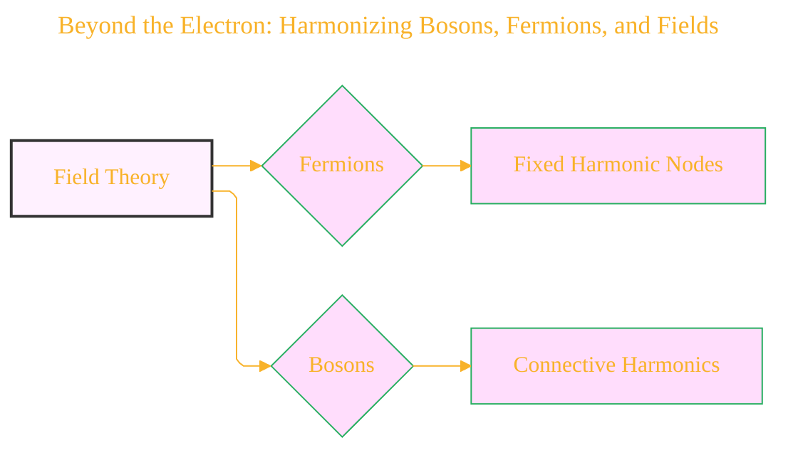
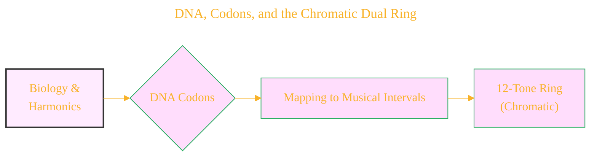
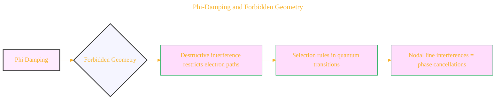
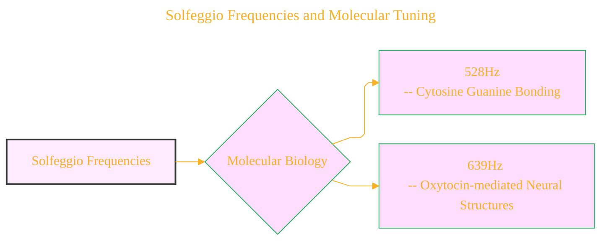
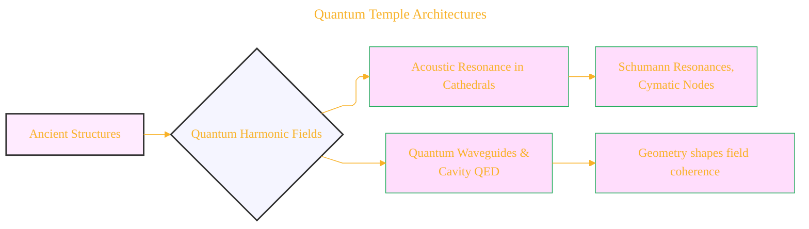
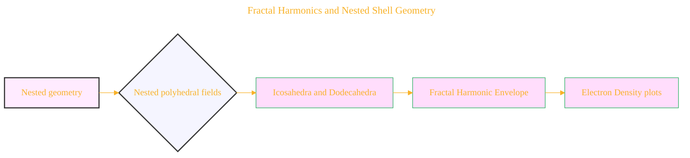
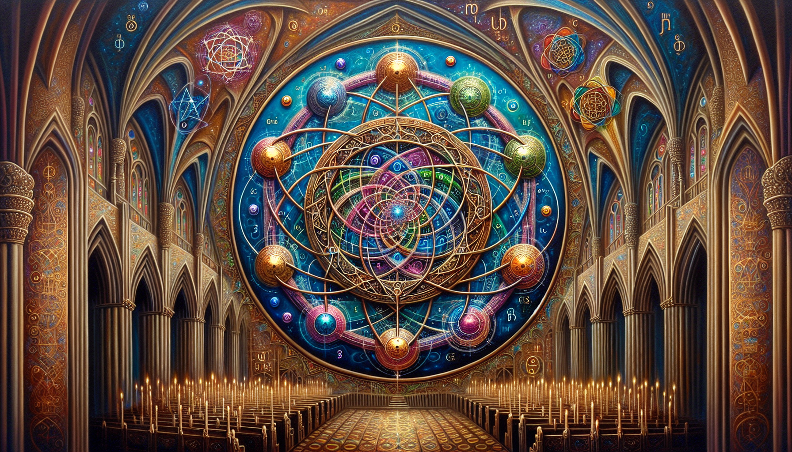

# Quantum Harmonic Atomic Model - Draft 8
> **Disclaimer:**
>
> This document contains my personal notes on the topic,
> compiled from publicly available documentation and various cited sources.
> The materials are intended for educational purposes, personal study, and reference.
> The content is dual-licensed:
> 1. **MIT License:** Applies to all code implementations (Swift, Mermaid, and other programming languages).
> 2. **Creative Commons Attribution 4.0 International License (CC BY 4.0):** Applies to all non-code content, including text, explanations, diagrams, and illustrations.
---

----

# Overall Concept and Structure

The document proposes an alternative view of atomic structure and its relationship to geometry, harmonics, and consciousness. It presents a model called "Harmonic Atomica," which integrates quantum mechanics with musical theory, sacred geometry, and cymatics. The document progresses through several layers of explanation, moving from atomic structure to molecular biology, and finally, to ancient architecture and potential implications for consciousness. It draws on resources, including a YouTube video, research papers, and books to support its theories.

## Key Concepts

*   **Harmonic Atomica:** This is the core model, viewing the atom as a geometric resonance field. Electrons are not just probability clouds but occupy discrete harmonic nodes.
*   **Geometric Representation of Orbitals:**
    *   **s-orbital:** Represented by a downward-pointing triangle (centric, spherical).
    *   **p-orbitals:** Represented by three upward-pointing triangles (aligned with Cartesian axes, for the hexagram of "Star of David")
    *   **Hexagram:** A representation of the whole atom/electron-orbitals, that symbolizes dynamic symmetry and equilibrium between polarities.
*   **Mapping Electrons to Music:** Electron orbitals can correspond to musical intervals and modal expansions. (s-orbital = fundamental, p-orbitals = first overtone triad).
*   **Cymatics and Standing Waves:** Electron orbitals are standing waves, which can be visualized through cymatic patterns.
*   **Beyond Electrons:** Extending the model to Bosons and Fermions where both are seen as wave nodes within a vibrational field.
*   **DNA Codons and Musical Intervals:** DNA base pairs can be mapped to musical intervals, leading to a 12-tone ring mirroring the Chromatic Dual Ring.
*   **Phi-Damping and Forbidden Geometry:** The golden ratio (Phi) and the concept of "forbidden" geometries.
*   **Solfeggio Frequencies:** The use of Solfeggio frequencies (396Hz, 417Hz, 528Hz, etc.) as potential templates for molecular and atomic coherence. They align with different research to induce measurable cymatic deformation.
*   **Quantum Temple Architectures:** The idea that ancient structures (pyramids, cathedrals) may have been designed to amplify harmonic fields.
*   **Harmonic Numbers and Quantum Numbers:** A direct mapping of quantum numbers to harmonic series structures.
*   **Fractal Harmonics:** The concept of nested polyhedral fields around the nucleus, with fractal harmonic envelopes.

---

# Mermaid Diagrams Representation

## 1. Atomic Structure - The Harmonic Atomica Model

**Explanation:**

*   This diagram provides a visual overview of the Harmonic Atomica model.
*   The central concept (Harmonic Atomica) is linked to the geometric representations of s and p orbitals, and the whole hexagonal field for an atomic structure.
*   It highlights the role of quantum numbers and the concept of electron shells as layers of resonance.

----

## 2. Geometry, Harmonics, and Music

**Explanation:**

*   Expresses the connection between electron orbitals and musical concepts.
*   Links each orbital type to a specific musical element(tones, triads, scales, or modes).

---

## 3. Cymatics, Resonance, and Atomic Structure

**Explanation:**

*   Visualizes the relation between Cymatics and electron orbitals.
*   It highlights how each orbital, depending on its node count, will generate a unique cymatic pattern, with the same geometry.

----

## 4. Beyond the Electron: Harmonizing Bosons, Fermions, and Fields

**Explanation:**

*   This diagram extends the core model to the concept of bosons and fermions.
*   It represents the key distinctions of bosons and fermions which can be seen also as wave nodes.

---

## 5. DNA, Codons, and the Chromatic Dual Ring

**Explanation:**

*   Illustrates the connection between DNA, musical intervals, and the Chromatic Dual Ring.
*   It shows a connection between the molecular and the audible/harmonic world.

---

## 6. Phi-Damping and Forbidden Geometry

**Explanation:**

*   Highlights the role of Phi-damping and forbidden geometries.
*   Explains how these concepts relate to electron path restriction and quantum transitions.

---

## 7. Solfeggio Frequencies and Molecular Tuning

**Explanation:**

*   Highlights the potential influence of Solfeggio frequencies on molecular and biological processes.
*   It shows specific examples of how these frequencies might interact with biological compounds, linking them with the human body.

---

## 8. Quantum Temple Architectures

**Explanation:**

*   Explores the concept that ancient structures might have been designed as macro-resonators.
*   Illustrates how these structures could have been used to amplify or channel harmonic fields.

---

## 9. Fractal Harmonics and Nested Shell Geometry

**Explanation:**

*   Illustrates the idea of nested polyhedral fields.
*   Shows the idea of fractal harmonics related to the nested geometries.

**Overall Approach**

The diagrams aim to:

*   Present the core "Harmonic Atomica" model effectively.
*   Show the interconnections between geometry, harmonics, and quantum mechanics.
*   Illustrate how these concepts extend to molecular biology, architecture, and consciousness.
*   Provide clear visualizations of complex concepts.

-----

### Closing Image  
The atom is reframed as a **musical mandala**: harmonic lattices, animated by quantum numbers, sifting frequencies through sacred ratios, manifesting as the beauty of both a DNA helix and a cathedral dome. Physics, music, and geometry are revealed as facets of the same universal resonance.

---

## References

1. Cohen-Tannoudji, C. et al. (Quantum Mechanics)  
2. Shankar, R. (Principles of Quantum Mechanics)  
3. Weyl, H. (The Theory of Groups...)  
4. Billam & Gardiner, Quantum Resonances (arXiv:0809.4373)  
5. Tymoczko, D. (A Geometry of Music)  
6. Gardner, M. (Ambidextrous Universe)  
7. Lincoln Xavier N. N. (2025). SACRED GEOMETRY - BEYOND THE EYES.

---

>
>**Licenses:**
>
>- **MIT License:**   - Full text in [LICENSE](LICENSE) file.
>- **Creative Commons Attribution 4.0 International:**  - Legal details in [LICENSE-CC-BY](LICENSE-CC-BY) and at [Creative Commons official site](http://creativecommons.org/licenses/by/4.0/).

---
