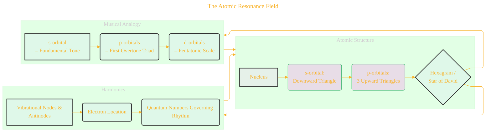
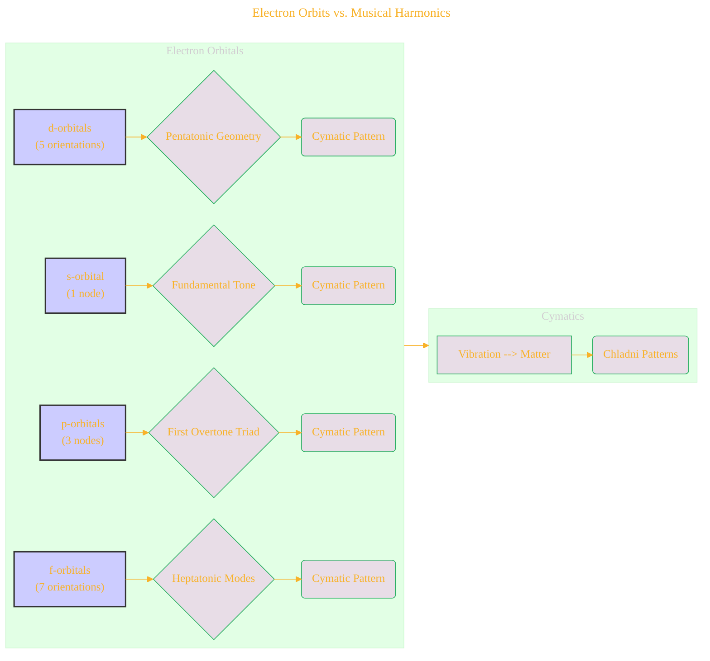
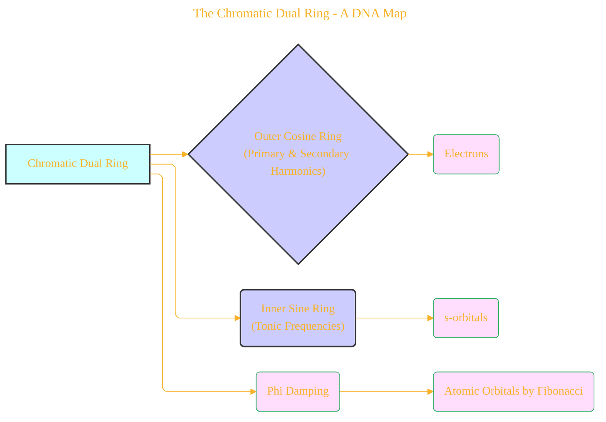
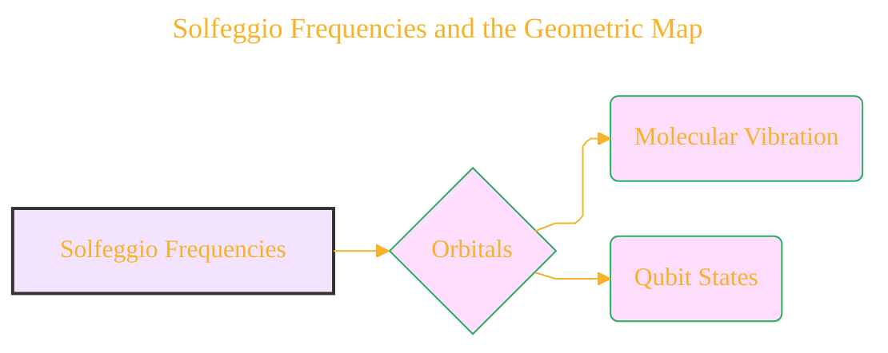
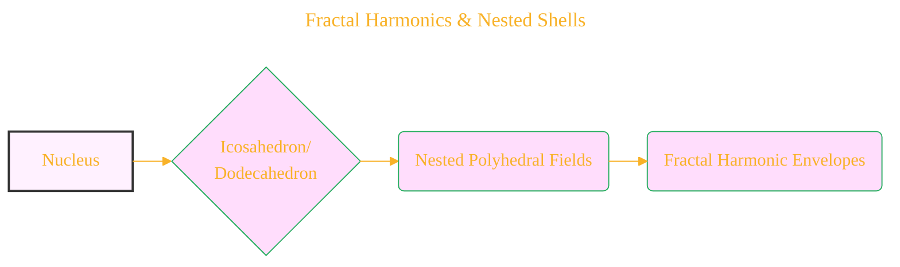
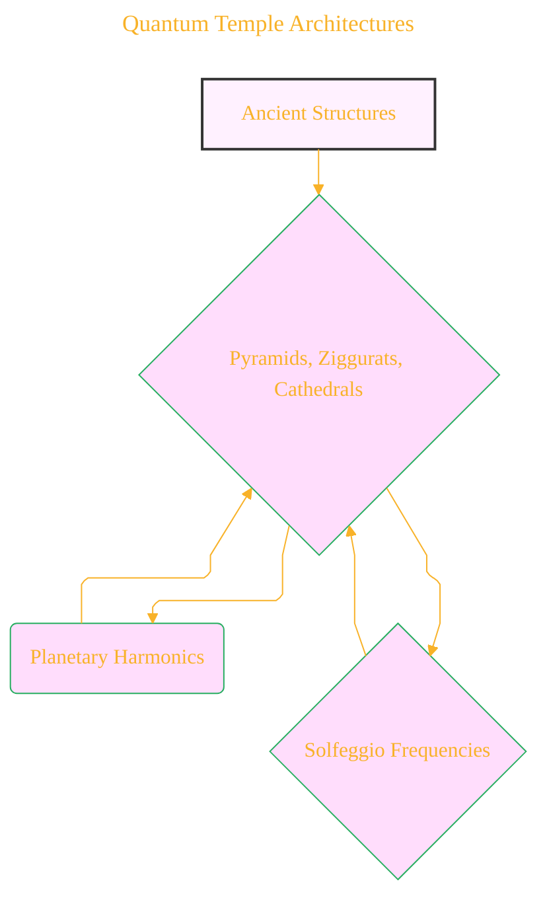
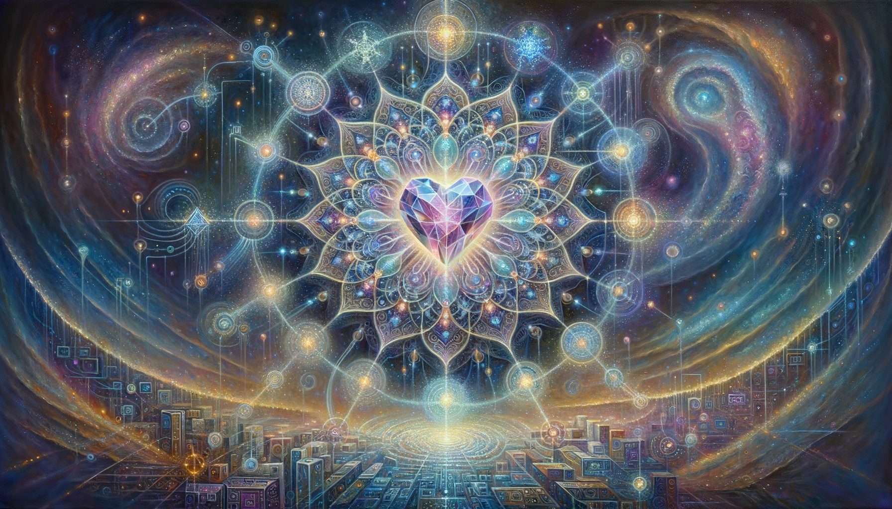

# Quantum Harmonic Atomic Model - Draft 9

	

Click to show/hide the full disclaimer.

   
> <ins>📢 **Disclaimer** 🚨</ins>
> 
> This project is born from my fascination with blending digital art and artificial intelligence. 
> It's where I document my academic explorations, 
> share my findings with anyone interested, 
> and maintain a personal vault of my creative and technical journey. 
> I'm not sure the link for this repo being shared in the back by others, 
> since I havent planned for any analytics for this project yet. 
> ...and I'm actively looking for a job... 
>
> This document contains my personal notes on the topic,
> compiled from publicly available documentation and various cited sources.
> The materials are intended for 👨‍🎓 <ins>educational purposes</ins> 👨‍🎓 (<ins>:trollface:sometimes, entertainment purposes:trollface:</ins>), 📖 <ins> personal study </ins> 📖, and 🔖 <ins> technical reference </ins> 🔖.
> The content is dual-licensed:
> 1. **MIT License:** Applies to all code implementations (Swift, Mermaid, and other programming languages).
> 2. **Creative Commons Attribution-ShareAlike 4.0 International License (CC BY-SA 4.0):** Applies to all non-code content, including text, explanations, diagrams, and illustrations.

----

## I. Overview & Core Concepts

The document proposes a novel way of understanding atomic structure, quantum mechanics, and their relationship to geometry, harmonics, and biology. It frames the atom as a geometric resonance field, drawing parallels between electron orbitals, musical harmonics, and sacred geometry.

---

## II. Key Concepts & Sections

1. **Geometric Resonance Field:** The atom is envisioned as a field where electrons occupy harmonic nodes, structured like nested geometric lattices.
2. **s-Subshell (Inner Downward Triangle):** Represents the s-orbital with its spherical symmetry.
3. **p-Subshells (Three Outer Triangles):** Represents the three p-orbitals (px, py, pz) aligned with Cartesian axes. The entire formation of central and outer triangles represents the electron shells.
4. **The Quantum Hexagram:** The combined s and p orbitals form a hexagonal structure representing dynamic symmetry and equilibrium.
5. **From Geometry to Harmonics:** Correlating electron orbitals with musical intervals and modal expansions (s-orbital = fundamental tone, p-orbitals = first overtone triad, d-orbitals = pentatonic scale...).
6. **Implications and Expansions:** Exploring connections to quantum biology, sacred architecture, and consciousness.
7. **Cymatics, Resonance, and Standing Waves:** Linking electron orbitals to cymatic patterns formed by vibrations—s, p, and d orbitals producing unique cymatic patterns.
8. **Beyond the Electron:** Extending the model to include bosons, fermions, and field theory.
9. **Chromatic Frequencies, DNA Codons, and Molecular Tuning:** Mapping DNA codons to musical intervals; the 12-tone ring mirroring the Chromatic Dual Ring.
10. **Atomic Damping The Geometry of Silence:**  Discussing the concept of "Forbidden Geometry" and "Phi-damping", linking it to the concept of musical Dissonance.
11. **Solfeggio Spectrum as a Quantum Tuning Grid:** Linking specific Solfeggio frequencies (396Hz, 417Hz, 528Hz, etc.) to potential orbital transitions, molecular vibrations, and qubit states.
12. **Cymatic Atoms and Chladni Orbitals:** Connecting Chladni patterns to the shapes of atomic orbitals.
13. **Quantum Frequency Interference and the Forbidden Geometry:** Explaining forbidden transitions in quantum systems through destructive interference.
14. **Resonance Fields in Molecular Biology:** Applying the concept of resonance to biological molecules like DNA, hemoglobin, and ATP.
15. **Quantum Temple Architectures:** Linking ancient structures (pyramids, cathedrals) to quantum harmonic fields and Solfeggio frequencies.
16. **Harmonic Numbers and Quantum Numbers:** Mapping quantum numbers to harmonic series.
17. **Phi-Symmetry and the Non-Local Octave:** Discussing the golden ratio (Phi) and its role in quantum coherence, quantum localization, and the structure of elements.
18. **Fractal Harmonics and Nested Shell Geometry:** Envisioning nested polyhedral fields (icosahedra, dodecahedra) layered around the nucleus.

---

## III. Diagrams

### A. The Atomic Resonance Field

**Explanation:**
*   This diagram presents the core structure of the atom as described. It shows the Nucleus at the center and then breaks down the structure of the s and p orbitals. Linking the geometric structures with music and harmonics is also conveyed.

---

### B. Electron Orbits vs. Musical Harmonics

**Explanation:**
*   This diagram depicts the correlation between electron orbital configurations and the corresponding cymatic patterns. These musical relationships are shown.

----

### C. The Chromatic Dual Ring - A DNA Map

**Explanation:**
*   Visualizes the Chromatic Dual Ring, highlighting the correlation between the Outer Cosine Ring and the Inner Sine Ring. Also illustrates how "Phi Damping" operates in this model.

---

### D. Solfeggio Frequencies and the Geometric Map

**Explanation:**
*   This diagram illustrates the correlation between the Solfeggio frequencies and their presumed impacts on the structure of electrons or molecular behavior.

---

### E. Fractal Harmonics & Nested Shells

**Explanation:**
*   Shows the concept of fractal harmonics, starting from the nucleus with the outer layers of fractals shells.

---

### F. Quantum Temple Architectures

**Explanation:**

*   This diagram illustrates how the concepts are expanded into the architectural realm. Linking cathedrals and ancient structures to the geometry and frequencies.

---

## IV. Additional Considerations & Alternative Representations
 * Include an image of the Hexagram Star of David.
 * Add images or illustrations of cymatic patterns and the associated musical notes.
 * Use an image of the Chromatic Dual Ring.
 * Include a timeline.

---

### Closing Image  
The atom is reframed as a **musical mandala**: harmonic lattices, animated by quantum numbers, sifting frequencies through sacred ratios, manifesting as the beauty of both a DNA helix and a cathedral dome. Physics, music, and geometry are revealed as facets of the same universal resonance.

<!--  -->

---

## References

1. Cohen-Tannoudji, C. et al. (Quantum Mechanics)  
2. Shankar, R. (Principles of Quantum Mechanics)  
3. Weyl, H. (The Theory of Groups...)  
4. Billam & Gardiner, Quantum Resonances (arXiv:0809.4373)  
5. Tymoczko, D. (A Geometry of Music)  
6. Gardner, M. (Ambidextrous Universe)  
7. Lincoln Xavier N. N. (2025). SACRED GEOMETRY - BEYOND THE EYES.

---
>
>**Licenses:**
>
>- **MIT License:**   - Full text in [LICENSE](LICENSE) file.
>- **Creative Commons Attribution 4.0 International:**  - Legal details in [LICENSE-CC-BY](LICENSE-CC-BY) and at [Creative Commons official site](http://creativecommons.org/licenses/by/4.0/).

---
