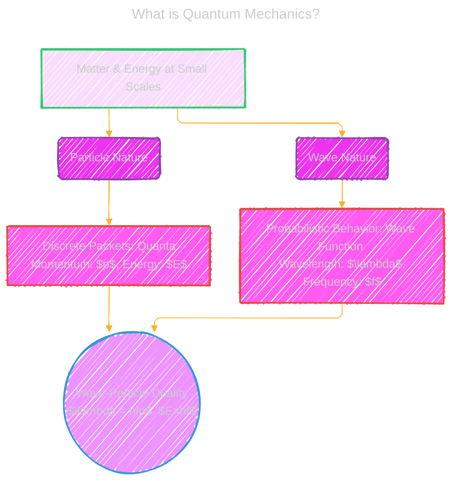

> ⚠️🏗️🚧🦺🧱🪵🪨🪚🛠️👷
> 
> This is a working draft in progress
> 
> ⚠️🏗️🚧🦺🧱🪵🪨🪚🛠️👷

# 🌌 What is Quantum Mechanics?

	

Click to show/hide the full disclaimer.

   
> <ins>📢 **Disclaimer** 🚨</ins>
> 
> This project is born from my fascination with blending digital art and artificial intelligence. 
> It's where I document my academic explorations, 
> share my findings with anyone interested, 
> and maintain a personal vault of my creative and technical journey. 
> I'm not sure the link for this repo being shared in the back by others, 
> since I havent planned for any analytics for this project yet. 
> ...and I'm actively looking for a job... 
>
> This document contains my personal notes on the topic,
> compiled from publicly available documentation and various cited sources.
> The materials are intended for 👨‍🎓 <ins>educational purposes</ins> 👨‍🎓 (<ins>:trollface:sometimes, entertainment purposes:trollface:</ins>), 📖 <ins> personal study </ins> 📖, and 🔖 <ins> technical reference </ins> 🔖.
> The content is dual-licensed:
> 1. **MIT License:** Applies to all code implementations (Swift, Mermaid, and other programming languages).
> 2. **Creative Commons Attribution-ShareAlike 4.0 International License (CC BY-SA 4.0):** Applies to all non-code content, including text, explanations, diagrams, and illustrations.

----

Quantum mechanics is the theory that explains the dual nature of extremely small objects – they behave as both **particles** (discrete bits of matter) and **waves** (disturbances transferring energy). Physicists call this intriguing phenomenon **wave-particle duality**.

This duality is beautifully captured by a couple of key equations:

1. **De Broglie Wavelength:** Louis de Broglie proposed that all matter exhibits wave-like properties. The wavelength ($\lambda$) of a particle is inversely proportional to its momentum ($p$):

$$
\lambda = \frac{h}{p}
$$

where $h$ is Planck's constant (approximately $6.626 \times 10^{-34} \text{ J} \cdot \text{s}$) [^DeBroglie1924]. This equation links a wave property ($\lambda$) to a particle property ($p$).

2. **Photon Energy and Momentum:** For light, which can behave as a particle (photon), its energy ($E$) is related to its frequency ($f$) or wavelength ($\lambda$):

$$
E = hf = \frac{hc}{\lambda}
$$

And its momentum ($p$) is:

$$
p = \frac{E}{c} = \frac{h}{\lambda}
$$

where $c$ is the speed of light (approximately $3.00 \times 10^8 \text{ m/s}$) [^Planck1900][^Einstein1905a].

Let's visualize this core idea:

---
## 🤏 Quanta: The Smallest Pieces

The "particle" aspect involves **quanta**. A quantum is the smallest discrete unit of a physical property in a system where these units are in a **bound state**.
* **Example:** A **photon** is a quantum of electromagnetic radiation (light). 💡
* **Bound State:** Particles are "trapped." For instance, electrons, neutrons, and protons are bound within an atom.

```mermaid
---
title: "Quanta: The Smallest Pieces"
author: "Cong Le"
version: "1.0"
license(s): "MIT, CC BY-SA 4.0"
copyright: "Copyright (c) 2025 Cong Le. All Rights Reserved."
config:
  layout: elk
  theme: base
---
%%%%%%%% Mermaid version v11.4.1-b.14
%%%%%%%% Available curve styles include the following keywords:
%% basis, bumpX, bumpY, cardinal, catmullRom, linear, monotoneX, monotoneY, natural, step, stepAfter, stepBefore.
%%{
  init: {
    'securityLevel': 'loose',
    'flowchart': { 'htmlLabels': true, 'curve': 'linear' },
    'fontFamily': 'Comic Sans MS, cursive, sans-serif',
    'themeVariables': {
      'primaryColor': '#F522E3',
      'primaryTextColor': '#145A32',
      'lineColor': '#F8B229',
      'primaryBorderColor': '#27AE60',
      'secondaryColor': '#EBDEF0',
      'secondaryTextColor': '#6C3483',
      'secondaryBorderColor': '#A569BD',
      'fontSize': '15px'
    }
  }
}%%
flowchart LR

subgraph Atom["Bound State:<br/>Atom ⚛️"]

direction LR

Nucleus --> Proton(" Proton (+) ")

Nucleus --> Neutron(" Neutron (0) ")

Electron(" Electron (-) ") --- Nucleus

end

style Atom fill:#f9f2,stroke:#333,stroke-width:2px

Photon["Photon:<br/>A Quantum of Light ⚡ <br/> Energy: $E=hf$"]

style Photon fill:#FFD700,stroke:#FFA500,stroke-width:2px

```

----
## 📶 Quantization: Discrete Values Only!

To be **quantized** means that particles in a bound state can only possess specific, discrete values for properties like energy or momentum. Think of it like a staircase 🪜 rather than a ramp.
* **Example:** An electron in an atom can only occupy certain energy levels. For a hydrogen atom, these energy levels ($E_n$) are given by:

$$
E_n = -\frac{m_e e^4}{8 \epsilon_0^2 h^2 n^2} = -\frac{13.6 \text{ eV}}{n^2}
$$

where $m_e$ is the electron mass, $e$ is the elementary charge, $\epsilon_0$ is the permittivity of free space, $h$ is Planck's constant, and $n$ is the principal quantum number ($n=1, 2, 3, \dots$) [^Bohr1913].

This contrasts sharply with our macroscopic world (classical mechanics), where properties like the energy of a thrown baseball can vary continuously.

-----

## 🌊 The Wave Function: Probability Waves

Simultaneously, these tiny quantized particles (like electrons) also exhibit wave-like behavior. A particle's **wave function**, denoted by the Greek letter psi ($\psi$), is a mathematical description. The evolution and properties of this wave function are governed by the **Schrödinger equation**. For a single non-relativistic particle, the time-independent Schrödinger equation is:

$$
\hat{H}\psi(\mathbf{r}) = E\psi(\mathbf{r})
$$

where $\hat{H}$ is the Hamiltonian operator (representing the total energy of the system), $E$ is the energy eigenvalue (one of the quantized energy values), and $\psi(\mathbf{r})$ is the wave function at position $\mathbf{r}$ [^Schrodinger1926]. The Hamiltonian operator is often written as:

$$
\hat{H} = -\frac{\hbar^2}{2m}\nabla^2 + V(\mathbf{r})
$$

Here, $\hbar = h/(2\pi)$ is the reduced Planck's constant, $m$ is the mass of the particle, $\nabla^2$ is the Laplacian operator (representing kinetic energy), and $V(\mathbf{r})$ is the potential energy function.

The wave function itself isn't directly observable. However, the square of its magnitude, $|\psi(\mathbf{r})|^2$, gives the **probability density** of finding the particle at position $\mathbf{r}$:

$$
P(\mathbf{r}) = |\psi(\mathbf{r})|^2
$$

So, $\int P(\mathbf{r}) dV$ over a small volume $dV$ gives the probability of finding the particle in that volume [^Born1926].
The world of quantum mechanics is probabilistic, not deterministic like the classical mechanics governing larger objects.

---
# ⚛️ The Hydrogen Atom Wave Function & Electron Clouds

*(Image source: https://en.m.wikipedia.org/wiki/File:Hydrogen_Density_Plots.png)*

The Hydrogen Density Plots above beautifully illustrates the concept of the wave function through probability density plots for an electron in a hydrogen atom. Electrons don't orbit the nucleus like planets; instead, their locations are described by probabilities, often visualized as "electron clouds." ☁️

The mathematical equation for the hydrogen atom's wave function (which is a solution to the Schrödinger equation for the hydrogen atom potential) is:

$$
\psi_{nlm}(r, \vartheta, \varphi) = \sqrt{\left(\frac{2}{na_0}\right)^3 \frac{(n-l-1)!}{2n[(n+l)!]}} e^{-\rho/2} \rho^l L_{n-l-1}^{2l+1}(\rho) \cdot Y_{lm}(\vartheta, \varphi)
$$

*(The equation on the image used by the website [DOE Explains](https://www.energy.gov/science/doe-explainsquantum-mechanics), implicitly a solution to the Schrödinger equation for Hydrogen [^BetheSalpeter1957])*

Let's break down these symbols:

| Symbol                              | Meaning                                                                                                                                                                          |
| :---------------------------------- | :------------------------------------------------------------------------------------------------------------------------------------------------------------------------------- |
| $\psi_{nlm}(r, \vartheta, \varphi)$ | The wave function, dependent on quantum numbers $n, l, m$ and spherical coordinates.                                                                                             |
| $n$                                 | **Principal Quantum Number**: Defines the electron's energy level (e.g., 1, 2, 3...). Higher $n$ means higher energy.                                                            |
| $l$                                 | **Azimuthal (Angular Momentum) Quantum Number**: Defines the shape of the orbital (e.g., $l=0$ is 's', $l=1$ is 'p', $l=2$ is 'd'). Runs from $0$ to $n-1$.                      |
| $m$                                 | **Magnetic Quantum Number**: Defines the orientation of the orbital in space. Runs from $-l$ to $+l$.                                                                            |
| $(r, \vartheta, \varphi)$           | Spherical coordinates: $r$ (distance from nucleus), $\vartheta$ (polar angle), $\varphi$ (azimuthal angle).                                                                      |
| $a_0$                               | **Bohr Radius**: A physical constant, approximately $0.529 \times 10^{-10}$ meters. The most probable distance of the electron from the nucleus in the ground state of hydrogen. |
| $\rho$                              | A scaled radial coordinate, $\rho = \frac{2r}{na_0}$.                                                                                                                            |
| $L_{n-l-1}^{2l+1}(\rho)$            | **Associated Laguerre Polynomial**: A mathematical function that describes the radial part of the wave function.                                                                 |
| $Y_{lm}(\vartheta, \varphi)$        | **Spherical Harmonic**: A mathematical function that describes the angular part (shape and orientation) of the wave function.                                                    |

The images themselves show **probability density plots**, which correspond to $|\psi_{nlm}|^2$. This value gives the probability of finding the electron at a particular point in space for a given state $(n,l,m)$.

---
# 🧐 Classical Mechanics vs. Quantum Mechanics

The shift from classical to quantum thinking was revolutionary!

  
| Feature           | Classical Mechanics (Macroscopic World 🍎)                    | Quantum Mechanics (Microscopic World ⚛️)                                                                                        |
| :---------------- | :------------------------------------------------------------ | :------------------------------------------------------------------------------------------------------------------------------ |
| **Behavior**      | Particles are particles, waves are waves.                     | Wave-particle duality: Objects can be both ($\lambda=h/p$, $E=hf$).                                                             |
| **Determinism**   | Given initial conditions, future is precisely predictable.    | Probabilistic: Can only predict probability of outcomes ($P(\mathbf{r})=\psi(\mathbf{r})^2$). Heisenberg Uncertainty Principle. |
| **Energy**        | Can take any continuous value (e.g., a car's speed).          | Quantized: Only discrete energy levels allowed (e.g., $E_n = -13.6/n^2$ eV for H).                                              |
| **Measurement**   | Observing an object doesn't significantly disturb it.         | The act of measurement inherently disturbs the system.                                                                          |
| **Scale**         | Describes large objects (planets, baseballs, everyday items). | Describes very small objects (atoms, electrons, photons).                                                                       |
| **Key Equations** | Newton's Laws, Maxwell's Equations.                           | Schrödinger Eq: $\hat{H}\psi=E\psi$, Dirac Eq.                                                                                  |

----
# 💡 Problems Solved & Phenomena Explained

Quantum mechanics emerged in the early 20th century to address inconsistencies and explain phenomena that classical physics couldn't:
1. **Blackbody Radiation**: How objects emit light based on their temperature. Max Planck proposed that energy is quantized and derived **Planck's Law** for the spectral radiance $B(\lambda, T)$ of a blackbody: 🔥

$$
B(\lambda, T) = \frac{2hc^2}{\lambda^5} \frac{1}{e^{\frac{hc}{\lambda k_B T}} - 1}
$$

where $k_B$ is the Boltzmann constant and $T$ is the absolute temperature [^Planck1900]. This resolved the "ultraviolet catastrophe" predicted by classical physics.
2. **Structure of the Atom**: Why atoms are stable and how electrons are arranged. QM introduced orbitals and quantized energy levels ($E_n = -13.6/n^2$ eV for Hydrogen). ⚛️
3. **Photoelectric Effect**: How materials emit electrons when hit with light of certain wavelengths. Albert Einstein explained this by proposing that light consists of discrete energy quanta (photons), with energy $E=hf$. An electron is emitted if the photon's energy exceeds the material's work function ($\phi$). The maximum kinetic energy ($K_{max}$) of the emitted electron is:

$$
K_{max} = hf - \phi
$$

This is Einstein's photoelectric equation [^Einstein1905a]. ☀️➡️➖

```mermaid
---
title: "Phenomena Explained by Quantum Mechanics"
author: "Cong Le"
version: "1.0"
license(s): "MIT, CC BY-SA 4.0"
copyright: "Copyright (c) 2025 Cong Le. All Rights Reserved."
config:
  layout: elk
  theme: base
---
%%%%%%%% Mermaid version v11.4.1-b.14
%%%%%%%% Available curve styles include the following keywords:
%% basis, bumpX, bumpY, cardinal, catmullRom, linear, monotoneX, monotoneY, natural, step, stepAfter, stepBefore.
%%{
  init: {
    'securityLevel': 'loose',
    'flowchart': { 'htmlLabels': true, 'curve': 'linear' },
    'fontFamily': 'Comic Sans MS, cursive, sans-serif',
    'themeVariables': {
      'primaryColor': '#F5E3',
      'primaryTextColor': '#142',
      'lineColor': '#F8B229',
      'primaryBorderColor': '#27AE60',
      'secondaryColor': '#EBDEF0',
      'secondaryTextColor': '#6C3483',
      'secondaryBorderColor': '#A569BD',
      'fontSize': '15px'
    }
  }
}%%
flowchart TD

subgraph QM_Explanations["Phenomena Explained by Quantum Mechanics"]

P1[Classical Physics Puzzles 🤔] --> QMS[Quantum Mechanics Solutions 💡]

QMS --> BBR["Blackbody Radiation <br> ($B(\lambda,T) = \frac{2hc^2}{\lambda^5}\frac{1}{e^{hc/\lambda k_B T}-1}$)"]

QMS --> AS["Atomic Structure & Stability <br> ($E_n = -13.6/n^2$ eV)"]

QMS --> PE["Photoelectric Effect <br> ($K_{max} = hf - \phi$)"]

end

style P1 fill:#FFCCCB,stroke:#FF0000

style QMS fill:#90EE90,stroke:#006400

```

----

# 📱 Impact and Applications: The Quantum Revolution!

This new understanding has had a profound impact, leading to countless technological advancements:

```mermaid
---
title: "The Quantum Revolution"
author: "Cong Le"
version: "1.0"
license(s): "MIT, CC BY 4.0"
copyright: "Copyright (c) 2025 Cong Le. All Rights Reserved."
config:
  theme: base
---
%%%%%%%% Mermaid version v11.4.1-b.14
%%{
  init: {
    'fontFamily': 'Monaco',
    'themeVariables': {
      'primaryColor': '#D253',
      'primaryTextColor': '#F8B229',
      'primaryBorderColor': '#27AE60',
      'secondaryColor': '#EBF3',
      'secondaryTextColor': '#6C3483',
      'secondaryBorderColor': '#A569BD',
      'fontSize': '20px'
    }
  }
}%%
mindmap
  root(("Quantum Mechanics Applications 🌐"))
    Electronics
      Transistors (basis of all modern electronics)
      Semiconductors
      Light_Emitting_Diodes["Light-Emitting Diodes (LEDs) 💡"]
    Optics & Photonics
      Lasers 💥
      Fiber Optics
    Medical Field
      Magnetic_Resonance_Imaging["Magnetic Resonance Imaging (MRI) 🩺 (uses nuclear spin, a quantum property)"]
      Laser Surgery
    Research & Industry
      Electron Microscopes 🔬
      Atomic Clocks ⏰
    Emerging Technologies
      Quantum Computing 💻
      Quantum Networks & Communication
      Quantum Sensors
    Everyday Devices
      Smartphones["Smartphones 📱 (billions of QM-based transistors!)"]
      CD/DVD/Blu-ray players
```

Truly, your cell phone wouldn't exist without quantum mechanics!

----
# 🔬 DOE Office of Science: Advancing Quantum Frontiers
The U.S. Department of Energy (DOE) Office of Science plays a vital role in supporting research rooted in quantum mechanics. This includes:
* **Quantum Computing and Quantum Information Science (QIS)**: Developing new computational paradigms and information technologies.
* **Fundamental Particle Physics**: Investigating the smallest constituents of nature.
Key DOE facilities involved in quantum-related research:

These amazing facilities explore the properties of matter at scales where quantum rules dominate.

----

# ✨ Fast Facts Wrap-up

* Many subatomic particles (like protons) have "spin," a quantum mechanical property crucial for MRI.
* Smartphones rely on billions of transistors, whose operation is understood through the wave nature of electrons as described by QM.
* Quantum computers and networks are exciting new frontiers leveraging the quantized nature of particles for information processing and transfer.
Quantum mechanics, while often counterintuitive, provides the most fundamental description of our universe at its smallest scales and continues to drive innovation across science and technology! 🌟

---

<!-- 

---

>**Licenses:**
>
>- **MIT License:**   - Full text in [LICENSE](LICENSE) file.
>- **Creative Commons Attribution-ShareAlike 4.0 International**: [CC BY-SA 4.0](https://creativecommons.org/licenses/by-sa/4.0/)  - Legal details in [LICENSE-CC-BY-SA-4.0](LICENSE-CC-BY-SA-4.0) and at [Creative Commons official site](https://creativecommons.org/licenses/by-sa/4.0/).
>

[^DeBroglie1924]: De Broglie, L. (1924). *Recherches sur la théorie des quanta* (Researches on the quantum theory). Doctoral Thesis, Paris. English translation available.

[^Planck1900]: Planck, M. (1900). *Zur Theorie des Gesetzes der Energieverteilung im Normalspectrum*. Verhandlungen der Deutschen Physikalischen Gesellschaft, 2, 237–245. (On the Theory of the Law of Energy Distribution in the Normal Spectrum).

[^Einstein1905a]: Einstein, A. (1905). *Über einen die Erzeugung und Verwandlung des Lichtes betreffenden heuristischen Gesichtspunkt*. Annalen der Physik, 322(6), 132-148. (On a Heuristic Point of View Concerning the Production and Transformation of Light – explains photoelectric effect).

[^Bohr1913]: Bohr, N. (1913). *On the Constitution of Atoms and Molecules, Part I*. Philosophical Magazine, 26(151), 1-25.

[^Schrodinger1926]: Schrödinger, E. (1926). *Annalen der Physik*, 384(4), 361-376 (Part I), 489-527 (Part II), & subsequent papers. (Quantisierung als Eigenwertproblem - Quantization as an Eigenvalue Problem).

[^Born1926]: Born, M. (1926). *Zur Quantenmechanik der Stoßvorgänge*. Zeitschrift für Physik, 37(12), 863-867. (On the Quantum Mechanics of Collision Processes - introduced probabilistic interpretation of $\psi$).

[^BetheSalpeter1957]: Bethe, H. A., & Salpeter, E. E. (1957). *Quantum Mechanics of One- and Two-Electron Atoms*. Springer-Verlag. (A comprehensive source for hydrogen atom solutions).

