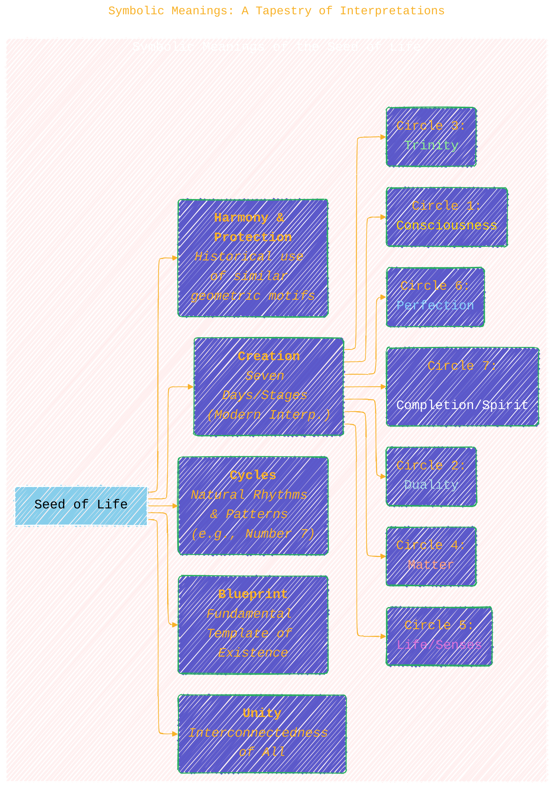

> ⚠️🏗️🚧🦺🧱🪵🪨🪚🛠️👷
> 
> This is a working draft in progress
> 
> 
> 
> gif image is provided by [Giphy](https://giphy.com)
> 
> ⚠️🏗️🚧🦺🧱🪵🪨🪚🛠️👷

----

# The Seed of Life: A Journey into Sacred Geometry

> **Disclaimer:**
>
> This document contains my personal notes on the topic,
> compiled from publicly available documentation and various cited sources.
> The materials are intended for educational purposes, personal study, and reference.
> The content is dual-licensed:
> 1. **MIT License:** Applies to all code implementations (Swift, Mermaid, and other programming languages).
> 2. **Creative Commons Attribution 4.0 International License (CC BY 4.0):** Applies to all non-code content, including text, explanations, diagrams, and illustrations.
---

## 1. Introduction: Unveiling the Seed of Life

The Seed of Life is a profound and ancient symbol found within the broader system of sacred geometry. It represents the seven days of creation, the fundamental building blocks of existence, and the divine blueprint for life itself. Composed of seven overlapping circles of equal size, it forms a pattern of exquisite symmetry and harmony, believed by many cultures and spiritual traditions to hold deep metaphysical significance. This geometric figure is not just an artistic design but is considered a visual representation of the interconnectedness of all life and the underlying order of the universe[^Critchlow]. (Critchlow, 1979; Lawlor, 1982).

----
## 2. Geometric Construction: The Genesis Pattern

The construction of the Seed of Life is a simple yet elegant geometric process, traditionally performed using only a compass and a straight edge. It begins with a central circle, representing the first day or the initial act of creation. Each subsequent circle is drawn with its center on the circumference of the preceding one, expanding outwards. This method of geometric construction using compass and straightedge is fundamental to classical geometry.

**The Steps:**

1.  **Day 1:** Draw a central circle.  
    $$C_0: (x-x_0)^2 + (y-y_0)^2 = r^2$$
2.  **Day 2:** Place the compass point anywhere on the circumference of the first circle and draw a second circle of the same radius.  
    Its center is on $C_0$.
3.  **Days 3-7:** Continue this process, placing the compass point at the intersections created on the circumference of the central circle, until six more circles are drawn around the central one. Each new circle's center is placed at an intersection point created by the previous circles on the circumference of the first circle ($C_0$). The sixth outer circle completes the primary structure.

This process naturally forms the six points of a hexagon around the central circle. The seven circles together constitute the Seed of Life.

*Visualizing the construction often involves drawing all circles to completion, where the Seed of Life emerges as the central motif before the pattern expands further into the Flower of Life.*

---

## 3. Symbolic Meanings: A Tapestry of Interpretations

The Seed of Life is rich in symbolism, interpreted through various cultural, spiritual, and philosophical lenses. While direct ancient textual references for "Seed of Life" specifically naming it as such are sparse, the "seven days of creation" interpretation is a common modern one (Melchizedek, 1999). Historically, geometric patterns with seven elements often carried significance.

*   **The Seven Days of Creation:** This is its most prominent modern meaning, where each circle represents a day in the Genesis story or a stage in the unfoldment of the universe.
    *   Circle 1: Light, Consciousness
    *   Circle 2: Duality, Separation (e.g., Heaven/Earth)
    *   Circle 3: Trinity, Stability (e.g., Mind/Body/Spirit)
    *   Circle 4: Elements, Material World
    *   Circle 5: Life, The Senses
    *   Circle 6: Perfection, Harmony (Man created)
    *   Circle 7: Completion, Rest (Spirit enters form)
*   **Cycles and Rhythms:** The overlapping circles can represent the natural cycles found in life – days of the week, musical notes, chakras, colors of the rainbow. The number seven frequently appears in cultural and religious contexts symbolizing completeness or cycles (e.g., "The Seven Classical Planets," "Seven Wonders of the Ancient World").
*   **Unity and Interconnection:** The way the circles interlock perfectly symbolizes the interconnectedness of all things, showing how individual parts create a unified whole. No circle stands alone; each is integral to the pattern. This resonates with philosophical concepts of unity in diversity.
*   **Protection and Harmony:** Historically, symbols derived from this type of geometry (hexagonal and circular motifs) were used for protection and to invoke harmony across various cultures (Budge, 1961, discusses apotropaic symbols generally).
*   **Blueprint of Life:** It is seen by proponents of sacred geometry as a fundamental template for all existence, containing the patterns from which all forms emerge.

----

## 4. Relationship to Other Sacred Geometry

The Seed of Life is not an isolated symbol but a foundational component of a larger, more complex geometric pattern known as the **Flower of Life**.

*   **Vesica Piscis:** The fundamental building block starts with two overlapping circles, forming an almond-shaped region in the center called the Vesica Piscis. This symbolizes the union of duality, the womb of creation, or a portal between worlds. The Seed of Life is essentially an extension of this principle, creating multiple Vesica Piscis forms. (Lawlor, 1982)  
    $$\text{Vesica Piscis} = C_1 \cap C_2$$  
    *(Where $C_1$ and $C_2$ are two circles of equal radius whose centers lie on each other's circumference.)*

*   **Flower of Life:** If the process of adding circles (as described in the Seed of Life construction) continues outwards, the pattern expands to form the Flower of Life, typically depicted with 19 complete circles. The Seed of Life is the central core or initial stage of the Flower of Life. (Schneider, 1994)
*   **Fruit of Life:** Within the Flower of Life, 13 circles can be picked out to form the Fruit of Life. Connecting the centers of these 13 circles gives rise to Metatron's Cube, which contains all five Platonic Solids.
*   **Tree of Life:** Some interpretations connect the structure of the Seed of Life and Flower of Life to the Kabbalistic Tree of Life, seeing overlays and correspondences in their nodes and pathways. (Halevi, 1980, for general Kabbalistic Tree of Life discussions).

---

## 5. Mathematical Properties and Observations

While much of the Seed of Life's significance is symbolic, its geometric construction yields interesting mathematical properties:

*   **Symmetry:** The Seed of Life exhibits six-fold rotational symmetry (D6 dihedral group if reflections are included, C6 cyclic group for rotation only) around its center point, typical of hexagonal patterns. Standard mathematical texts on group theory or geometry, such as Weyl (1952) on symmetry, provide the framework for understanding these properties.
*   **Ratios:** The specific intersections give rise to inherent geometric ratios. For example, the distance between the centers of any two adjacent outer circles is equal to the radius of the circles. The Vesica Piscis has specific proportions related to $\sqrt{3}$.
    *   If radius = $r$, the width of the Vesica Piscis is $2r \cdot \cos(30^\circ) = r\sqrt{3}$ and its height (major axis) is $2r$. The distance between the two centers of the circles forming the Vesica Piscis is $r$. The total length of the Vesica Piscis is $r + r + r = 3r$ *if measured from the outermost points where the circles segment each other through the line connecting their centers (height of the Vesica along the line of centers is $r$ if it's the segment length between intersection points)*. More accurately for the Vesica Piscis itself, its length along the axis connecting the centers is $2r$, and its width perpendicular to this is $r\sqrt{3}$.
*   **Circle Packing:** The arrangement of circles relates to problems in circle packing, specifically the hexagonal packing (or honeycomb lattice), which is the densest way to pack equal circles in two dimensions (Thue, 1910; Fejes Tóth, 1940).
*   **Tessellation Potential:** While the Seed of Life itself is a finite pattern, the underlying principle of circle packing has connections to tessellations and how space can be efficiently filled. Triangular and hexagonal grids emerge from connecting the centers of the circles.

*Note: While some sources claim connections to specific mathematical constants like Phi ($\phi$) directly within the basic Seed of Life, these are more explicitly and readily found in more complex structures derived from the Flower of Life or through specific constructions involving the Vesica Piscis. The $\sqrt{3}$ ratio is inherent in the Vesica Piscis construction which is fundamental to the Seed of Life.*

----

## 6. Cultural and Historical Significance

The Seed of Life, often as part of the Flower of Life, has appeared in various forms across numerous ancient cultures. Documenting these occurrences often relies on archaeological reports and art historical analysis.

*   **Ancient Egypt:** The Flower of Life pattern, which contains the Seed of Life, is famously found inscribed on granite pillars in the Temple of Osiris at Abydos. (e.g., documented by various Egyptologists; see "Temple of Millions of Years of Seti I" analyses). Many popular books on sacred geometry highlight this (cf. Melchizedek, 1999), though rigorous archaeological dating of these specific inscriptions is sometimes debated.
*   **Ancient China:** Similar rosette or hexagonal patterns (which the Seed of Life resembles) are found in ancient Chinese art and architecture. Fu, Xinian (2002) in "Chinese Architecture" discusses general traditional patterns.
*   **India:** Such geometric patterns are common in Mandalas, Yantras, and temple decorations. (Khanna, 1979, on Yantras).
*   **Europe:** In medieval art and architecture, these "rosette" or "hexfoil" patterns appear in churches, cathedrals (e.g., Gothic tracery), and folk art, sometimes associated with Christian mysticism or pre-Christian solar symbols. (Gombrich, 1979, on the sense of order in art).
*   **Leonardo da Vinci:** Studied the Flower of Life and its properties, including the Seed of Life within it, recognizing its mathematical and geometric importance. His notebooks contain sketches of these geometric constructions. (Richter, 1970, "The Notebooks of Leonardo da Vinci").

Its widespread appearance suggests a shared human understanding or intuition about the fundamental patterns of creation and life. While direct textual evidence for its specific ancient interpretation as "Seed of Life" might vary, the geometric form itself is undeniably ancient and widespread.

*It is important to note that while the *geometric pattern* is ancient and widespread, the specific term "Seed of Life" and its detailed popular interpretations are largely part of modern New Age and sacred geometry discourse. Ancient cultures may have had their own names and specific meanings for this geometric configuration.* (Hanegraaff, 1996, discusses New Age interpretations generally).

---

## 7. Summary: The Essence of the Seed

The Seed of Life serves as a powerful symbol and a foundational geometric pattern. It elegantly combines simplicity in construction with profound depth in meaning, illustrating concepts of creation, interconnectedness, and the underlying order of the cosmos. As the core of the Flower of Life, it invites contemplation on the origins of life and the universe.

---

<!-- 

---
>
>**Licenses:**
>
>- **MIT License:**   - Full text in [LICENSE](LICENSE) file.
>- **Creative Commons Attribution 4.0 International:**  - Legal details in [LICENSE-CC-BY](LICENSE-CC-BY) and at [Creative Commons official site](http://creativecommons.org/licenses/by/4.0/).

---

### References and Further Reading

*   Budge, E. A. Wallis. (1961). *Amulets and Talismans*. University Books. (General reference for apotropaic symbols).
*   Critchlow, Keith. (1976). *Islamic Patterns: An Analytical and Cosmological Approach*. Thames & Hudson. (Though focused on Islamic patterns, discusses underlying geometric principles relevant to such symbols).
*   Fejes Tóth, László. (1940). Über einen geometrischen Satz. *Mathematische Zeitschrift*, 46, 83–85. (Early work related to the hexagonal packing problem).
*   Fu, Xinian, et al. (2002). *Chinese Architecture*. Yale University Press. (For general traditional Chinese architectural patterns).
*   Gombrich, E.H. (1979). *The Sense of Order: A Study in the Psychology of Decorative Art*. Phaidon Press. (Discusses patterns in art).
*   Halevi, Z'ev ben Shimon. (1980). *Kabbalah: Tradition of Hidden Knowledge*. Thames & Hudson. (For context on the Tree of Life).
*   Hanegraaff, Wouter J. (1996). *New Age Religion and Western Culture: Esotericism in the Mirror of Secular Thought*. Brill. (For academic context on New Age interpretations).
*   Khanna, Madhu. (1979). *Yantra: The Tantric Symbol of Cosmic Unity*. Thames & Hudson. (Relevant for geometric symbols in Indian traditions).
*   Lawlor, Robert. (1982). *Sacred Geometry: Philosophy and Practice*. Thames & Hudson. (A foundational text in modern sacred geometry studies).
*   Melchizedek, Drunvalo. (1999). *The Ancient Secret of the Flower of Life, Volume 1 & 2*. Light Technology Publishing. (A popular modern source that extensively discusses the Seed of Life and Flower of Life, though its interpretations are New Age).
*   Michell, John. (1988). *The Dimensions of Paradise: The Proportions and Symbolic Numbers of Ancient Cosmology*. Thames & Hudson.
*   Pennick, Nigel. (1980). *Sacred Geometry: Symbolism and Purpose in Religious Structures*. Turnstone Press.
*   Richter, Jean Paul. (Ed.). (1970). *The Notebooks of Leonardo da Vinci*. Dover Publications. (Contains Leonardo's geometric sketches).
*   Schneider, Michael S. (1994). *A Beginner's Guide to Constructing the Universe: The Mathematical Archetypes of Nature, Art, and Science*. HarperPerennial. (Discusses geometric forms and their significance).
*   Thue, Axel. (1910). Über die dichteste Zusammenstellung von kongruenten Kreisen in einer Ebene. *Nyt Magazin for Naturvidenskaberne*, 48, 3-9. (Seminal work on circle packing).
*   Weyl, Hermann. (1952). *Symmetry*. Princeton University Press. (Classic mathematical text on symmetry).

[^Critchlow]: Critchlow, Keith. (1979). *Time Stands Still: New Light on Megalithic Science*. Gordon Fraser. (General work on sacred geometry by a key figure).

----

*Disclaimer: The study of sacred geometry, including the Seed of Life, often bridges mathematical principles with spiritual, philosophical, and esoteric interpretations. While the geometric construction is mathematically sound, many of its symbolic meanings are subject to individual belief and tradition. This list of references includes both academic works and influential popular texts within the field of sacred geometry; readers should discern the nature of each source accordingly.*

----
