> ⚠️🏗️🚧🦺🧱🪵🪨🪚🛠️👷
> 
> This is a working draft in progress
> 
> ⚠️🏗️🚧🦺🧱🪵🪨🪚🛠️👷

----

# Spirals Compendium
> **Disclaimer:**
>
> This document contains my personal notes on the topic,
> compiled from publicly available documentation and various cited sources.
> The materials are intended for educational purposes, personal study, and reference.
> The content is dual-licensed:
> 1. **MIT License:** Applies to all code implementations (Swift, Mermaid, and other programming languages).
> 2. **Creative Commons Attribution 4.0 International License (CC BY 4.0):** Applies to all non-code content, including text, explanations, diagrams, and illustrations.
---

## 📜 Overview of Spirals 🗺️

Here's a quick mind map to visualize the variety of spirals we'll be exploring:

---

## 💫 Detailed Exploration of Spirals

Let's take a closer look at each spiral, its defining equation, and interesting facts.

---

### 1. Circle ⭕
*   **First Described**: Ancient times
*   **Equation**:

    $$r = k$$

    Where $k$ is a constant (the radius).
*   **Comment**: The trivial spiral. It can be seen as a spiral where the distance from the center remains constant as the angle changes.
*   **Image**: 

---

### 2. Archimedean Spiral 🌀 (also *arithmetic spiral*)
*   **First Described**: c. 320 BC by Archimedes
*   **Equation**:

    $$r = a + b \cdot \theta$$

    Where $a$ is a constant that turns the spiral, and $b$ controls the distance between successive arms.
*   **Comment**: The distance between successive turnings is constant.
*   **Image**: 

---

### 3. Fermat's Spiral 🌿 (also *parabolic spiral*)
*   **First Described**: 1636 [^1]
*   **Equation**:
    
    $$r^2 = a^2 \cdot \theta$$
    
    Or 
    
    $$r = \pm a \sqrt{\theta}$$

*   **Comment**: A type of Archimedean spiral.
*   **Image**: 

---

### 4. Euler Spiral 🎢 (also *Cornu spiral* or *polynomial spiral*)
*   **First Described**: 1696 [^2]
*   **Equation**: Given parametrically by Fresnel integrals:

    $$x(t) = C(t) = \int_0^t \cos\left(\frac{\pi u^2}{2}\right) du$$

    $$y(t) = S(t) = \int_0^t \sin\left(\frac{\pi u^2}{2}\right) du
    $$

*   **Comment**: Its curvature changes linearly with its curve length. Used in road and railway engineering. Uses [Fresnel integrals](https://en.wikipedia.org/wiki/Fresnel_integral "Fresnel integral") [^3].
*   **Image**: 

---

### 5. Hyperbolic Spiral 🐚 (also *reciprocal spiral*)
*   **First Described**: 1704
*   **Equation**:
    
    $$r = \frac{a}{\theta}$$

*   **Comment**: The spiral approaches an asymptotic line.
*   **Image**: 

---

### 6. Lituus 🎺
*   **First Described**: 1722 by Roger Cotes
*   **Equation**:
    
    $$r^2 \cdot \theta = k$$
    
    Or 
    
    $$r = \sqrt{\frac{k}{\theta}}$$

*   **Comment**: The angle $\theta$ is inversely proportional to the square of the radius $r$. It has an asymptotic circle $r=0$.
*   **Image**:

---

### 7. Logarithmic Spiral 🐌 (also known as *equiangular spiral*)
*   **First Described**: 1638 by René Descartes [^4]
*   **Equation**:
    
    $$r = a \cdot e^{b \cdot \theta}$$
    
    Where $a$ and $b$ are constants.
*   **Comment**: Approximations of this are found in nature (e.g., nautilus shells, spiral galaxies). The angle between the tangent and the radial line at any point is constant.
*   **Image**:

---

### 8. Fibonacci Spiral 🌻
*   **First Described**: (Concept related to Fibonacci sequence, historical ties complex)
*   **Equation**: Constructed using [circular arcs](https://en.wikipedia.org/wiki/Circular_arc "Circular arc") connecting the opposite corners of squares in the Fibonacci tiling. Each arc has a radius equal to a Fibonacci number.
*   **Comment**: An approximation of the golden spiral. Often seen in representations of plant growth patterns.
*   **Image**:

---

### 9. Golden Spiral 🌟
*   **First Described**: (Concept related to the golden ratio, historical ties complex)
*   **Equation**:
    
    $$r = \varphi^{\frac{2 \cdot \theta}{\pi}}$$
    
    ,where $\varphi = \frac{1+\sqrt{5}}{2}$ is the golden ratio.

    (Note: Other forms exist, e.g., $r = a \varphi^{k\theta}$ )

*   **Comment**: A special case of the logarithmic spiral where the growth factor is related to the golden ratio.
*   **Image**:

---

### 10. Spiral of Theodorus 📐 (also known as *Pythagorean spiral*)
*   **First Described**: c. 500 BC by Theodorus of Cyrene
*   **Equation**: Constructed by contiguous right triangles. The first triangle is a right isosceles triangle with side length 1. Each subsequent triangle has one leg with unit length and the other leg being the hypotenuse of the prior triangle. The hypotenuses form the radii of the spiral: $\sqrt{1}, \sqrt{2}, \sqrt{3}, \dots, \sqrt{n}$ .
*   **Comment**: Approximates the Archimedean spiral.
*   **Image**:

---

### 11. Involute ⚙️
*   **First Described**: 1673 by Christiaan Huygens
*   **Equation**: For an involute of a circle of radius $r$ , with parameter $t$ (angle):
    
    $$x(t) = r(\cos(t+a) + t\sin(t+a))$$

    $$y(t) = r(\sin(t+a) - t\cos(t+a))$$

    (Parameter $a$ shifts the starting point of the involute.)
*   **Comment**: The path traced by the end of a taut string unwinding from a curve (here, a circle). Involutes of a circle appear like Archimedean spirals. Used in gear teeth design.
*   **Image**:

---

### 12. Helix 🧬
*   **First Described**: Ancient (e.g., Archimedes' screw)
*   **Equation**: In cylindrical coordinates $(r, \theta, z)$ :
    
    $$r(t) = \text{constant (e.g., 1)}$$

    $$\theta(t) = t$$

    $$z(t) = c \cdot t$$

    (Where $c$ is a constant related to the pitch.)
    The example in the table used $r(t)=1, \theta(t)=t, z(t)=t$ .
*   **Comment**: A three-dimensional spiral. It twists around an axis at a constant rate.
*   **Image**:

---

### 13. Rhumb Line 🧭 (also *loxodrome*)
*   **First Described**: 1537 by Pedro Nunes
*   **Equation**: On a sphere, a path of constant bearing (constant angle with all meridians). In Mercator projection, it's a straight line. Its equation on a sphere is more complex, often given parametrically.
*   **Comment**: A type of spiral drawn on a sphere. Navigators used loxodromes for sailing courses.
*   **Image**:

---

### 14. Cotes's Spiral 🪐
*   **First Described**: 1722 by Roger Cotes
*   **Equation**: The reciprocal of the radius $1/r$ is given by one of these forms, depending on constants $A, k, \varepsilon$ :
    
    $$\frac{1}{r} = \begin{cases} A\cosh(k\theta + \varepsilon) \\ A\exp(k\theta + \varepsilon) \\ A\sinh(k\theta + \varepsilon) \\ A(k\theta + \varepsilon) \\ A\cos(k\theta + \varepsilon) \end{cases}$$

*   **Comment**: Represents the solution to the two-body problem for an inverse-cube central force. The different cases correspond to different energy levels.
*   **Image**:

---

### 15. Poinsot's Spirals 🌌
*   **First Described**: By Louis Poinsot
*   **Equation**: Two forms are given:
    
    $$r = a \cdot \operatorname{csch}(n \cdot \theta) = \frac{a}{\sinh(n\theta)}$$

    $$r = a \cdot \operatorname{sech}(n \cdot \theta) = \frac{a}{\cosh(n\theta)}$$

*   **Comment**: Arise in the study of the motion of a rigid body.
*   **Image**:

---

### 16. Nielsen's Spiral 〰️
*   **First Described**: 1993 by Niels Nielsen [^5] (though the integrals are older)
*   **Equation**: Parametric, using sine integral (Si) and cosine integral (Ci):
    
    $$x(t) = \operatorname{Ci}(t) = -\int_t^\infty \frac{\cos u}{u} du$$

    $$y(t) = \operatorname{Si}(t) = \int_0^t \frac{\sin u}{u} du$$

*   **Comment**: A variation of the Euler spiral.
*   **Image**:

---

### 17. Polygonal Spiral 📈
*   **First Described**: (General concept)
*   **Equation**: Constructed by a sequence of line segments whose lengths typically follow an arithmetic or geometric progression, and whose angles turn by a fixed amount.
*   **Comment**: Special case approximation of arithmetic or logarithmic spiral. Often used in computer graphics.
*   **Image**:

---

### 18. Fraser's Spiral 😵
*   **First Described**: 1908 by James Fraser
*   **Equation**: N/A (It's an optical illusion, not defined by a single curve equation in this context). It's composed of concentric arcs that appear to form a spiral.
*   **Comment**: An optical illusion based on spirals, also known as the "twisted cord illusion" or "false spiral".
*   **Image**:

---

### 19. Conchospiral 🍦
*   **First Described**: (Concept related to conch shells)
*   **Equation**: In cylindrical coordinates $(r, \theta, z)$ :
    
    $$r = \mu^t \cdot a$$

    $$\theta = t$$

    $$z = \mu^t \cdot c$$

*   **Comment**: A three-dimensional spiral on the surface of a cone. As $t$ increases, the spiral moves away from the apex and its radius increases/decreases exponentially.
*   **Image**:

---

### 20. Calkin–Wilf Spiral 🌳
*   **First Described**: (Related to the Calkin-Wilf tree)
*   **Equation**: Formed by connecting points derived from the sequence of rational numbers in the Calkin-Wilf tree.
*   **Comment**: Visualizes the enumeration of positive rational numbers.
*   **Image**:

---

### 21. Ulam Spiral 🔢 (also *prime spiral*)
*   **First Described**: 1963 by Stanisław Ulam
*   **Equation**: Constructed by writing the positive integers in a square spiral and then marking the prime numbers.
*   **Comment**: Reveals patterns in the distribution of prime numbers, some of which are not fully understood.
*   **Image**:

---

### 22. Sacks Spiral 🎯
*   **First Described**: 1994 by Robert Sacks
*   **Equation**: An Archimedean spiral $r = a\sqrt{\theta}$ (a variant of Fermat's spiral) but integers are plotted such that perfect squares lie on the horizontal axis. Primes are then highlighted.
*   **Comment**: Variant of Ulam spiral and Archimedean spiral, designed to better display patterns in prime numbers by mapping integers to points $( \sqrt{n}\cos(2\pi\sqrt{n}), \sqrt{n}\sin(2\pi\sqrt{n}) )$ .
*   **Image**:

---

### 23. Seiffert's Spiral 🌐
*   **First Described**: 2000 by Alfred Seiffert [^6]
*   **Equation**: Using [Jacobi elliptic functions](https://en.wikipedia.org/wiki/Jacobi_elliptic_functions "Jacobi elliptic functions") $\operatorname{sn}(u,k), \operatorname{cn}(u,k)$ :
    
    $$r = \operatorname{sn}(s, k)$$

    $$\theta = k \cdot s$$

    $$z = \operatorname{cn}(s, k)$$

    (These are likely spherical coordinates or related parameters $s, k$ ).
    The original reference describes it with parametric equations for $x, y, z$ leading to a curve on a sphere.
*   **Comment**: A spiral curve on the surface of a sphere. [^7]
*   **Image**: N/A in the provided list.

---

### 24. Tractrix Spiral 🚜
*   **First Described**: 1704 by Pierre Varignon [^8]
*   **Equation**: Parametric equations:
    
    $$\begin{cases} r = A\cos(t) \\ \theta = \tan(t) - t \end{cases}$$

*   **Comment**: Related to the tractrix curve.
*   **Image**: N/A in the provided list.

---

### 25. Pappus Spiral 🗼
*   **First Described**: Studied by Pappus of Alexandria (~320 AD), later Blaise Pascal (17th century). The reference date is 1779. [^9]
*   **Equation**: Defined for a conical spiral. A 2D representation often uses $(r, \theta)$ with an additional parameter $\psi$ for the cone angle.
    
    $$\begin{cases} r = a\theta \\ \psi = k \end{cases}$$

    Where $r$ is the distance from the cone's axis in a plane perpendicular to the axis, $\theta$ is the angle of rotation, and $\psi$ is the constant angle that the curve makes with the generators of the cone.
*   **Comment**: A 3D conical spiral.
*   **Image**: N/A in the provided list.

---

### 26. Doppler Spiral 📡
*   **First Described**: (Related to Pappus spiral) [^10]
*   **Equation**:
    
    $$x = a \cdot (t \cdot \cos(t) + k \cdot t)$$
    
    $$y = a \cdot t \cdot \sin(t)$$

*   **Comment**: A 2D projection of Pappus spiral. The name suggests a connection to Doppler effects or wave phenomena.
*   **Image**:

---

### 27. Atzema Spiral 🔊
*   **First Described**: (Modern, by P. J. Atzema) [^11]
*   **Equation**:
    
    $$x = \frac{\sin(t)}{t} - 2 \cdot \cos(t) - t \cdot \sin(t)$$
    
    $$y = -\frac{\cos(t)}{t} - 2 \cdot \sin(t) + t \cdot \cos(t)$$

*   **Comment**: The curve that has a [catacaustic](https://en.wikipedia.org/wiki/Caustic_\(mathematics\) "Caustic (mathematics)") (envelope of reflected rays) forming a circle. Approximates the Archimedean spiral.
*   **Image**:

---

### 28. Atomic Spiral ⚛️
*   **First Described**: 2002 [^12]
*   **Equation**:
    
    $$r = \frac{\theta}{\theta - a}$$

*   **Comment**: This spiral has two [asymptotes](https://en.wikipedia.org/wiki/Asymptote "Asymptote"); one is the circle of radius $1$ (as $\theta \to \infty$ ) and the other is the line $\theta = a$ (where $r \to \infty$ ).
*   **Image**:

---

### 29. Galactic Spiral 🌠
*   **First Described**: 2019 [^13]
*   **Equation**: Differential equations:
    
    $$\begin{cases} dx = R \cdot \frac{y}{\sqrt{x^2+y^2}} d\theta \\ dy = R \cdot \left[\rho(\theta) - \frac{x}{\sqrt{x^2+y^2}}\right] d\theta \end{cases}$$

    Integrated to get coordinates (with backward rotation):
    
    $$\begin{cases} x_{\text{final}} = \sum dx \\ y_{\text{final}} = \sum dy + R \end{cases}$$

    Then $(x_{\text{final}}, y_{\text{final}})$ are rotated by $-\theta$ .
*   **Comment**: Developed to simulate spiral arms of disc galaxies. The parameter $\rho(\theta)$ determines the spiral pattern: $\rho < 1$ (spiral-ring), $\rho = 1$ (regular spiral), $\rho > 1$ (loose spiral). $R$ is the starting distance from the center.
*   **Image**:

---

## 🔗 Relationships Between Spirals

Some spirals are special cases or approximations of others. Here's a graph showing some of these connections:

Rendered code for Relationships Between Spirals Diagram, by Github Camo crawler bot

rendered_code_for_relationships_between_spirals_diagram

digraph SpiralRelationships {
    rankdir="LR"
    node [shape=box, style="rounded,filled", fillcolor="#E6E6FA"]
    Logarithmic_Spiral [label="Logarithmic Spiral\nr=a*e^(b*θ)"]
    Archimedean_Spiral [label="Archimedean Spiral\nr=a+b*θ"]
    Euler_Spiral [label="Euler Spiral\n(Fresnel Integrals)"]
    Ulam_Spiral [label="Ulam Spiral\n(Prime Spiral)"]
    Pappus_Spiral [label="Pappus Spiral\n(3D Conical)"]
    Circle [label="Circle\nr=k"]
    Fermat_Spiral [label="Fermat's Spiral\nr²=a²*θ"]
    Golden_Spiral [label="Golden Spiral\nr=φ^(2θ/π)", fillcolor="#FFDAB9"]
    Fibonacci_Spiral [label="Fibonacci Spiral\n(Circular Arcs)", fillcolor="#FFDAB9"]
    Spiral_of_Theodorus [label="Spiral of Theodorus\n(Right Triangles)", fillcolor="#FFDAB9"]
    Involute_of_Circle [label="Involute of Circle", fillcolor="#FFDAB9"]
    Nielsen_Spiral [label="Nielsen's Spiral\n(Si, Ci Integrals)", fillcolor="#FFDAB9"]
    Sacks_Spiral [label="Sacks Spiral", fillcolor="#FFDAB9"]
    Doppler_Spiral [label="Doppler Spiral\n(2D Projection)", fillcolor="#FFDAB9"]
    Atzema_Spiral [label="Atzema Spiral", fillcolor="#FFDAB9"]
    Polygonal_Spiral [label="Polygonal Spiral", fillcolor="#FFDAB9"]
    Logarithmic_Spiral -> Golden_Spiral [label="is special case of"]
    Golden_Spiral -> Fibonacci_Spiral [label="approximated by"]
    Archimedean_Spiral -> Spiral_of_Theodorus [label="approximated by"]
    Archimedean_Spiral -> Involute_of_Circle [label="appears like"]
    Euler_Spiral -> Nielsen_Spiral [label="is variation of"]
    Ulam_Spiral -> Sacks_Spiral [label="is variant of"]
    Archimedean_Spiral -> Sacks_Spiral [label="is also based on"]
    Pappus_Spiral -> Doppler_Spiral [label="is projected to"]
    Archimedean_Spiral -> Atzema_Spiral [label="approximated by"]
    Archimedean_Spiral -> Polygonal_Spiral [label="can be approximated by"]
    Logarithmic_Spiral -> Polygonal_Spiral [label="can be approximated by"]
    Archimedean_Spiral -> Fermat_Spiral [label="is related to (type of)"]
    Circle [ peripheries=2, style="filled", fillcolor="#D3D3D3", label="Circle (Trivial Spiral)\nr=k"]
    {
        rank=same
        Logarithmic_Spiral
        Archimedean_Spiral
        Euler_Spiral
        Ulam_Spiral
        Pappus_Spiral
        Circle
        Fermat_Spiral
    }
    label = "Relationships Between Mathematical Spirals\nArrows indicate 'derived from', 'special case of', 'approximates', etc."
    fontsize=16
}
rendered_code_for_relationships_between_spirals_diagram

Click to show/hide the full native DOT implementation with comment documentation.

```dot
/*
 * title: Relationships Between Spirals
 * author: Cong Le
 * version: 1.0
 * license(s): MIT, CC BY-SA 4.0
 * copyright: Copyright (c) 2025 Cong Le. All Rights Reserved.
 */
digraph SpiralRelationships {
    rankdir="LR";
    node [shape=box, style="rounded,filled", fillcolor="#E6E6FA"]; // Light purple nodes

    // Main Spirals
    Logarithmic_Spiral [label="Logarithmic Spiral\nr=a*e^(b*θ)"];
    Archimedean_Spiral [label="Archimedean Spiral\nr=a+b*θ"];
    Euler_Spiral [label="Euler Spiral\n(Fresnel Integrals)"];
    Ulam_Spiral [label="Ulam Spiral\n(Prime Spiral)"];
    Pappus_Spiral [label="Pappus Spiral\n(3D Conical)"];
    Circle [label="Circle\nr=k"]; // Adding Circle for completeness
    Fermat_Spiral [label="Fermat's Spiral\nr²=a²*θ"];

    // Variants/Special Cases
    Golden_Spiral [label="Golden Spiral\nr=φ^(2θ/π)", fillcolor="#FFDAB9"]; // Peach nodes for special cases
    Fibonacci_Spiral [label="Fibonacci Spiral\n(Circular Arcs)", fillcolor="#FFDAB9"];
    Spiral_of_Theodorus [label="Spiral of Theodorus\n(Right Triangles)", fillcolor="#FFDAB9"];
    Involute_of_Circle [label="Involute of Circle", fillcolor="#FFDAB9"];
    Nielsen_Spiral [label="Nielsen's Spiral\n(Si, Ci Integrals)", fillcolor="#FFDAB9"];
    Sacks_Spiral [label="Sacks Spiral", fillcolor="#FFDAB9"];
    Doppler_Spiral [label="Doppler Spiral\n(2D Projection)", fillcolor="#FFDAB9"];
    Atzema_Spiral [label="Atzema Spiral", fillcolor="#FFDAB9"];
    Polygonal_Spiral [label="Polygonal Spiral", fillcolor="#FFDAB9"];


    // Relationships
    Logarithmic_Spiral -> Golden_Spiral [label="is special case of"];
    Golden_Spiral -> Fibonacci_Spiral [label="approximated by"];
    Archimedean_Spiral -> Spiral_of_Theodorus [label="approximated by"];
    Archimedean_Spiral -> Involute_of_Circle [label="appears like"];
    Euler_Spiral -> Nielsen_Spiral [label="is variation of"];
    Ulam_Spiral -> Sacks_Spiral [label="is variant of"];
    Archimedean_Spiral -> Sacks_Spiral [label="is also based on"];
    Pappus_Spiral -> Doppler_Spiral [label="is projected to"];
    Archimedean_Spiral -> Atzema_Spiral [label="approximated by"];
    Archimedean_Spiral -> Polygonal_Spiral [label="can be approximated by"];
    Logarithmic_Spiral -> Polygonal_Spiral [label="can be approximated by"];
    Archimedean_Spiral -> Fermat_Spiral [label="is related to (type of)"]; // Fermat's is a type of Archimedean.
    
    // Trivial case note
    Circle [ peripheries=2, style="filled", fillcolor="#D3D3D3", label="Circle (Trivial Spiral)\nr=k"];

    // General comment for clarity
    {
        rank=same;
        Logarithmic_Spiral; Archimedean_Spiral; Euler_Spiral; Ulam_Spiral; Pappus_Spiral; Circle; Fermat_Spiral;
    }


    label = "Relationships Between Mathematical Spirals\nArrows indicate 'derived from', 'special case of', 'approximates', etc.";
    fontsize=16;
}
```

To view the DOT graph: You can use an online Graphviz viewer (like Edotor, VisuAlgo, or others) by pasting the code above.

---

## 📚 See Also

*   [Catherine wheel (firework)](https://en.wikipedia.org/wiki/Catherine_wheel_\(firework\) "Catherine wheel (firework)")
*   [List of spiral galaxies](https://en.wikipedia.org/wiki/List_of_spiral_galaxies "List of spiral galaxies")
*   [Parker spiral](https://en.wikipedia.org/wiki/Parker_spiral "Parker spiral")
*   [Spirangle](https://en.wikipedia.org/wiki/Spirangle "Spirangle")
*   [Spirograph](https://en.wikipedia.org/wiki/Spirograph "Spirograph")

---

<!-- 

---
>
>**Licenses:**
>
>- **MIT License:**   - Full text in [LICENSE](LICENSE) file.
>- **Creative Commons Attribution 4.0 International:**  - Legal details in [LICENSE-CC-BY](LICENSE-CC-BY) and at [Creative Commons official site](http://creativecommons.org/licenses/by/4.0/).

---

## 📖 References

[^1]: ["Fermat spiral - Encyclopedia of Mathematics"](https://www.encyclopediaofmath.org/index.php/Fermat_spiral). *www.encyclopediaofmath.org*. Retrieved 18 February 2019.
[^2]: Weisstein, Eric W. ["Cornu Spiral"](https://mathworld.wolfram.com/). *mathworld.wolfram.com*. Retrieved 2023-11-22.
[^3]: Weisstein, Eric W. ["Fresnel Integrals"](https://mathworld.wolfram.com/). *mathworld.wolfram.com*. Retrieved 2023-01-31.
[^4]: Weisstein, Eric W. ["Logarithmic Spiral"](http://mathworld.wolfram.com/LogarithmicSpiral.html). *mathworld.wolfram.com*. Wolfram Research, Inc. Retrieved 18 February 2019.
[^5]: Weisstein, Eric W. ["Nielsen's Spiral"](http://mathworld.wolfram.com/NielsensSpiral.html). *mathworld.wolfram.com*. Wolfram Research, Inc. Retrieved 18 February 2019.
[^6]: Weisstein, Eric W. ["Seiffert's Spherical Spiral"](https://mathworld.wolfram.com/). *mathworld.wolfram.com*. Retrieved 2023-01-31.
[^7]: Weisstein, Eric W. ["Seiffert's Spherical Spiral"](https://mathworld.wolfram.com/). *mathworld.wolfram.com*. Retrieved 2023-01-31. (Note: Same reference as [^6])
[^8]: ["Tractrix spiral"](http://www.mathcurve.com/courbes2d.gb/spiraletractrice/spiraletractrice.shtml). *www.mathcurve.com*. Retrieved 2019-02-23.
[^9]: ["Conical spiral of Pappus"](https://www.mathcurve.com/courbes3d.gb/spiraleconic/pappus.shtml). *www.mathcurve.com*. Retrieved 28 February 2019.
[^10]: ["Doppler spiral"](https://www.mathcurve.com/courbes2d.gb/doppler/doppler.htm). *www.mathcurve.com*. Retrieved 28 February 2019.
[^11]: ["Atzema spiral"](http://www.2dcurves.com/spiral/spiralat.html). *www.2dcurves.com*. Retrieved 11 March 2019.
[^12]: ["atom-spiral"](http://www.2dcurves.com/spiral/spiralas.html). *www.2dcurves.com*. Retrieved 11 March 2019.
[^13]: Pan, Hongjun. ["New spiral"](https://arpgweb.com/pdf-files/ajams7\(2\)66-76.pdf) (PDF). *www.arpgweb.com*. Retrieved 5 March 2021.
