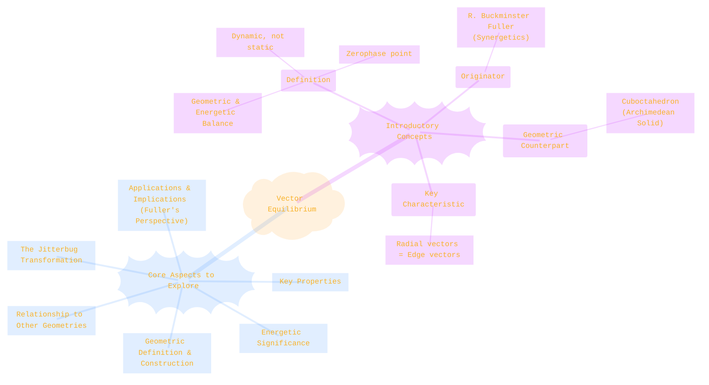
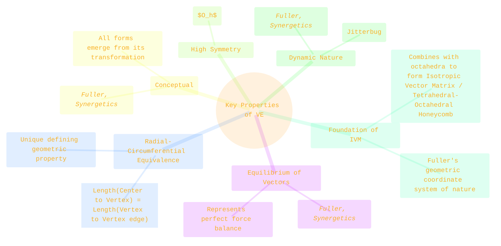
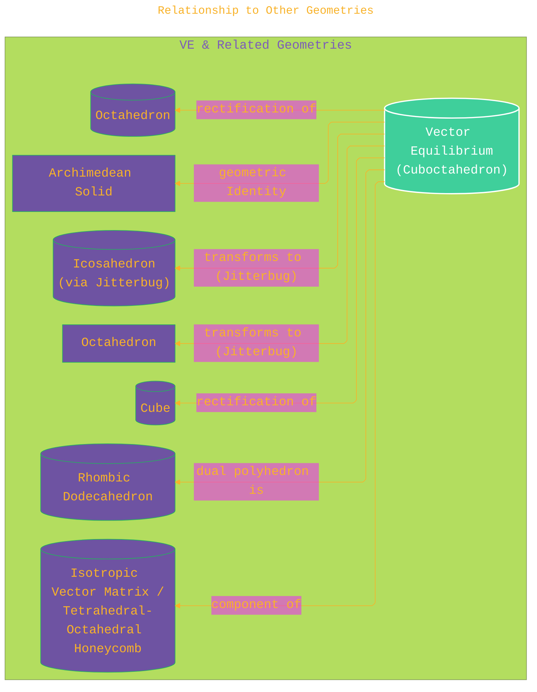
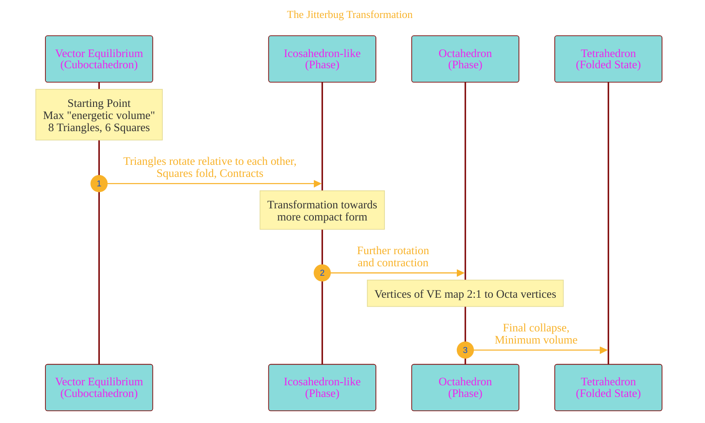
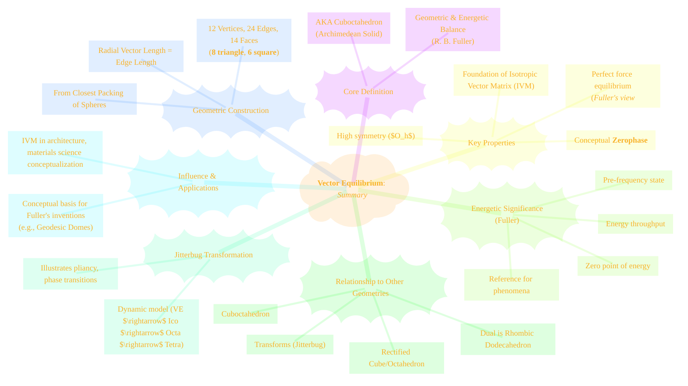

> ⚠️🏗️🚧🦺🧱🪵🪨🪚🛠️👷
> 
> This is a working draft in progress
> 
> 
> 
> gif image is provided by [Giphy](https://giphy.com)
> 
> ⚠️🏗️🚧🦺🧱🪵🪨🪚🛠️👷

----

# Vector Equilibrium: A Comprehensive Exploration

> **Disclaimer:**
>
> This document contains my personal notes on the topic,
> compiled from publicly available documentation and various cited sources.
> The materials are intended for educational purposes, personal study, and reference.
> The content is dual-licensed:
> 1. **MIT License:** Applies to all code implementations (Swift, Mermaid, and other programming languages).
> 2. **Creative Commons Attribution 4.0 International License (CC BY 4.0):** Applies to all non-code content, including text, explanations, diagrams, and illustrations.
---

## Introduction: The Concept of Perfect Balance

Vector Equilibrium (VE) is a geometric and energetic concept primarily developed and popularized by the visionary architect, designer, and inventor R. Buckminster Fuller (Fuller, 1975, 1979). It represents a state of perfect, non-static balance, a point of "zerophase" where positive and negative forces are in absolute equilibrium. Unlike static equilibrium, where forces cancel out to produce stillness, VE describes a dynamic system in which energy can flow without resistance or distortion. It is recognized in geometry as the **cuboctahedron**, and its unique characteristic, as emphasized by Fuller, is that all vectors from its center to its vertices are equal in length to the edges connecting those vertices.

---

## 1. Geometric Definition and Construction

Geometrically, the Vector Equilibrium is a polyhedron with 12 vertices, 24 identical edges, and 14 faces (8 equilateral triangles and 6 squares). It is an Archimedean solid, formally known as the cuboctahedron (Weisstein, n.d.; Cromwell, 1997). Fuller emphasized its derivation from the concept of the closest packing of spheres, a fundamental arrangement also seen in crystallography (Pauling, 1960).

**Construction from Sphere Packing:**

Imagine a central sphere surrounded by 12 identical spheres, all touching it and each other. This arrangement, known as the kissing number problem for 12 spheres in 3D ($k(3)=12$), represents the densest local packing (Conway & Sloane, 1999).
*   The 12 vertices of the Vector Equilibrium correspond to the centers of these 12 surrounding spheres.
*   The edges of the Vector Equilibrium are formed by connecting the centers of adjacent surrounding spheres.
*   The distance from the center of the central sphere to the center of any of the 12 surrounding spheres (radial vectors) is equal to the distance between the centers of any two adjacent surrounding spheres (edge vectors).

If we consider spheres of unit radius ($r=1$), then the diameter is $d=2$.
*   The length of the radial vectors = $2r = 2$.
*   The length of the edges of the Vector Equilibrium = $2r = 2$.

```mermaid
---
title: "Geometric Definition and Construction"
author: "Cong Le"
version: "1.0"
license(s): "MIT, CC BY-SA 4.0"
copyright: "Copyright (c) 2025 Cong Le. All Rights Reserved."
config:
  layout: elk
  theme: base
---
%%%%%%%% Mermaid version v11.4.1-b.14
%%%%%%%% Available curve styles include the following keywords:
%% basis, bumpX, bumpY, cardinal, catmullRom, linear, monotoneX, monotoneY, natural, step, stepAfter, stepBefore.
%%{
  init: {
    'flowchart': { 'htmlLabels': true, 'curve': 'linear' },
    'fontFamily': 'American Typewriter, monospace',
    'logLevel': 'fatal',
    'themeVariables': {
      'primaryColor': '#22BB',
      'primaryTextColor': '#F8B229',
      'lineColor': '#F8B229',
      'primaryBorderColor': '#27AE60',
      'secondaryColor': '#E2F1',
      'secondaryTextColor': '#6C3483',
      'secondaryBorderColor': '#A569BD',
      'fontSize': '20px'
    }
  }
}%%
flowchart TD
    A["Start:<br/> Closest Packing of Spheres <br><i>(cf. Kissing Number Problem, $k(3)=12$)</i>"] --> B("Imagine one central sphere")
    B --> C{"Place 12 identical spheres around it<br>all touching the central sphere and each other"}
    C --> D["Connect the centers of these 12 surrounding spheres"]
    D --> E(("Vector Equilibrium /<br/> Cuboctahedron"))
    E --> F["Geometric Properties<br>12 Vertices<br>24 Edges (all equal length)<br>14 Faces (8 triangles, 6 squares)<br><i>(Archimedean Solid)</i>"]
    F --> G{"Key Defining Feature<br><b>Radial Vector Length = Edge Length</b>"}

    style A fill:#174F68,stroke:#333,stroke-width:2px
    style E fill:#8CAC,stroke:#333,stroke-width:2px
    style G fill:#EE22,stroke:#333,stroke-width:2px
```

**Mathematical Coordinates:**

If the center of the Vector Equilibrium is at the origin (0,0,0) and the edge length is $L$, the vertices can be represented by permutations of (Coxeter, 1973):  
$(\pm L/\sqrt{2}, \pm L/\sqrt{2}, 0)$  
$(\pm L/\sqrt{2}, 0, \pm L/\sqrt{2})$  
$(0, \pm L/\sqrt{2}, \pm L/\sqrt{2})$

For unit radius spheres, $L=2$. So, vertices are at permutations of:  
$(\pm \sqrt{2}, \pm \sqrt{2}, 0)$  
$(\pm \sqrt{2}, 0, \pm \sqrt{2})$  
$(0, \pm \sqrt{2}, \pm \sqrt{2})$  
The distance from origin to any vertex is $\sqrt{(\sqrt{2})^2 + (\sqrt{2})^2 + 0^2} = \sqrt{2+2} = \sqrt{4} = 2$.  
The distance between adjacent vertices is also 2. This confirms the radial vector length equals the edge length.

---

## 2. Key Properties of Vector Equilibrium

The Vector Equilibrium, or cuboctahedron, possesses several unique and significant properties:

1.  **Equilibrium of Vectors (Fuller's Interpretation):** As its name suggests, Fuller posited it represents a perfect equilibrium of forces. The outward radial thrusts and the inward circumferential (tensional edge) restraints are perfectly balanced (Fuller, 1975, sec. 440.00).  
    Conceptually:
    $$
    \vec{F}_{\text{radial}} + \sum \vec{F}_{\text{circumferential}} = \vec{0} \quad \text{(at each vertex)}
    $$
2.  **Radial-Circumferential Equivalence:** The distance from its geometric center to any of its 12 vertices is exactly equal to the length of its 24 edges. This is a defining characteristic (Fuller, 1975, sec. 201.11).
3.  **Volumetric "Nothingness" (Fuller's Conceptualization):** Fuller stated that the VE has "no volume" in a conceptual sense. Because it is the state of perfect equilibrium, it represents a phase boundary or a "zerophase" from which all other forms can emerge (Fuller, 1975, sec. 440.08).
4.  **Symmetry:** It is a highly symmetrical Archimedean solid with octahedral symmetry group ($O_h$).
5.  **Dynamic Nature (Fuller's View):** It is not a rigid, static structure but a point of pure, unresisted transformation. Changes in energy can pass through it, or it can transform into other polyhedra (see Jitterbug transformation).
6.  **Foundation of the Isotropic Vector Matrix (IVM):** An omnidirectional, space-filling lattice composed of alternating VEs (cuboctahedra) and regular octahedra. Fuller considered this the underlying geometric coordinate system of nature (Fuller, 1975, sec. 410.01-410.05). This structure is also known as the tetrahedral-octahedral honeycomb in geometry.

---

## 3. Energetic Significance: The Zerophase Concept

For Fuller, the Vector Equilibrium was a fundamental concept in his synergetic energy-geometry (Fuller, 1975, 1979). He referred to it as the "zerophase" or "discontinuity point."

*   **Zero Point of Energy:** VE represents the condition of absolute equilibrium where energy is neither accumulating nor dissipating. It is the "Grand Central Station" of energy (Fuller, 1975, sec. 205.03).
*   **Reference for All Phenomena:** Because it represents total balance, any deviation from it signifies the presence of a phenomenon. All forms and processes can be understood as transformations relative to VE's perfect symmetry.
    $$
    \Delta E_{\text{system}} \approx E_{\text{observed}} - E_{\text{VE (conceptual zero)}}
    $$
*   **Throughput, Not Storage:** Energy can pass through VE without being "caught," as there are no unbalanced forces.
*   **Pre-frequency State:** Fuller associated VE with a pre-frequency or pre-time state, a pure potential from which specific frequencies could arise (Fuller, 1975, sec. 528.00).

```mermaid
---
title: "The Zerophase Concept"
author: "Cong Le"
version: "1.0"
license(s): "MIT, CC BY-SA 4.0"
copyright: "Copyright (c) 2025 Cong Le. All Rights Reserved."
config:
  layout: elk
  theme: base
---
%%%%%%%% Mermaid version v11.4.1-b.14
%%%%%%%% Available curve styles include the following keywords:
%% basis, bumpX, bumpY, cardinal, catmullRom, linear, monotoneX, monotoneY, natural, step, stepAfter, stepBefore.
%%{
  init: {
    'flowchart': { 'htmlLabels': true, 'curve': 'linear' },
    'fontFamily': 'American Typewriter, monospace',
    'logLevel': 'fatal',
    'themeVariables': {
      'primaryColor': '#B22B',
      'primaryTextColor': '#F8B229',
      'lineColor': '#F8B229',
      'primaryBorderColor': '#27AE60',
      'secondaryColor': '#E2F1',
      'secondaryTextColor': '#6C3483',
      'secondaryBorderColor': '#A569BD',
      'fontSize': '20px'
    }
  }
}%%
flowchart LR
    subgraph Energetic_Significance_of_VE["Energetic Significance of VE (Fuller's Synergetics)"]
    direction LR
        A["Vector Equilibrium (VE)"] -- Concept --> B("Zerophase Point")
        B --> C{"Represents absolute equilibrium<br>Energy neither accumulates nor dissipates"}
        C --> D["Zero Point of Energy"]
        A -- Analogy --> E("Grand Central Station of Energy")
        A -- Role --> F["Reference for All Phenomena"]
        F --> G("Deviations from VE = Observable Events/Structures")
        A -- Behavior --> H["Energy Throughput"]
        H --> I("Energy passes without distortion or storage")
        A -- "Fuller's View" --> J("Pre-Frequency / Pre-Time State")
        J --> K("Pure potential for phenomena")
    end

    style A fill:#2D8CAC,stroke:#333,stroke-width:2px
    style B fill:#174F68,stroke:#333,stroke-width:2px
    style D fill:#E67E22,stroke:#333,stroke-width:2px
    style F fill:#E67E22,stroke:#333,stroke-width:2px
    style H fill:#E67E22,stroke:#333,stroke-width:2px
    style J fill:#E67E22,stroke:#333,stroke-width:2px
```

---

## 4. Relationship to Other Geometries

Vector Equilibrium (Cuboctahedron) shares relationships with several important geometric forms (Sutton, 2002):

1.  **Cuboctahedron:** Its standard geometric name (Archimedean solid).
2.  **Cube and Octahedron:** The cuboctahedron is the rectified cube and also the rectified octahedron. It can be derived by truncating a cube or an octahedron to the midpoints of their edges (Cromwell, 1997).
3.  **Icosahedron and Dodecahedron:** Transformationally related via the Jitterbug mechanism.
4.  **Rhombic Dodecahedron:** The rhombic dodecahedron is the dual of the cuboctahedron. The centers of the faces of a VE form the vertices of a rhombic dodecahedron.
5.  **Isotropic Vector Matrix (IVM) / Tetrahedral-Octahedral Honeycomb:** This space-filling tessellation consists of cuboctahedra (VEs) and regular octahedra in a ratio of 1:1. Each vertex is shared by 4 cuboctahedra and 4 octahedra. This structure is a fundamental concept in Fuller's synergetics and has relevance in fields like materials science for describing certain crystal structures (e.g., FCC lattice coordination sequences).

---

## 5. The Jitterbug Transformation

The "Jitterbug" is a dynamic model and concept developed by Fuller to illustrate the transformability of the Vector Equilibrium (Fuller, 1975, sec. 450.00-458.11; Edmondson, 1987). It demonstrates how the VE can contract and rotate its triangular faces, transforming through various other polyhedral states.

**Phases of the Jitterbug Transformation:**

1.  **Start: Vector Equilibrium (Cuboctahedron)**:
    *   Represents the "zerophase" or maximum dynamic expansiveness in this sequence.

2.  **Transformation Initiated:**
    *   The 8 triangular faces rotate relative to each other.
    *   The 6 square faces "fold" along their diagonals (becoming pairs of triangles).

3.  **Icosahedral Phase (Approximate):**
    *   As the triangles rotate, the VE contracts. It can pass through a phase resembling an icosahedron.

4.  **Octahedral Phase:**
    *   Further contraction leads to an octahedral form. The 12 vertices of VE map to the 6 vertices of an octahedron (2:1).

5.  **Tetrahedral Phase (Folded State):**
    *   The transformation can continue until the structure collapses into a compact form often described as involving tetrahedra, the minimum structural system in Fuller's synergetics.

**Significance of the Jitterbug:**
*   **Illustrates Dynamic Nature:** Shows VE is not static.
*   **Phase Transitions:** Models how geometric structures (and by analogy, energetic systems) can shift phases.
*   **Conservation and Transformation:** Topological relationships change.
*   **Symmetry Breaking/Changing:** Demonstrates transitions between different symmetry groups. Fuller highlighted this model in some of his structural patents as well (e.g., relating to collapsible structures).

---

## 6. Potential Applications & Fuller's Inventions

While VE itself is largely a conceptual model in Fuller's work, the geometric principles it embodies (sphere packing, efficient space-filling, transformability) influenced his practical inventions. His work on geodesic domes (e.g., U.S. Patent 2,682,235, Fuller, 1954) relies on subdividing spherical surfaces into triangles, often derived from projecting polyhedra like the icosahedron (which is related to VE via Jitterbug). The structural efficiency and stability of such systems stem from distributing forces along multiple paths, a principle that can be seen as an extension of the balanced vector forces in VE.

The Isotropic Vector Matrix, of which VE is a part, has been used as a conceptual framework in fields like:
*   **Architecture and Structural Engineering:** For designing space frames and lightweight structures.
*   **Materials Science:** To model crystal structures and molecular arrangements (Hepburn, 2001).
*   **Art and Design:** As an inspiration for geometric patterns and sculptures.

---

## Conclusion: Synthesizing Vector Equilibrium

Vector Equilibrium, as conceptualized by R. Buckminster Fuller, is more than the geometric cuboctahedron. It represents a nexus of form, force, and transformation. Its perfect balance of radial and circumferential vectors and its role as the "zerophase" ground it in Fuller's synergetic philosophy. The Jitterbug transformation further underscores its dynamic nature. While Fuller's interpretations extend beyond conventional geometry, the underlying cuboctahedron, its properties, and its relationship to sphere packing and space-filling are well-established, offering a rich basis for exploring symmetry, balance, and spatial design.

---

## References

*   Conway, J. H., & Sloane, N. J. A. (1999). *Sphere Packings, Lattices and Groups* (3rd ed.). Springer. (For context on sphere packing)
*   Coxeter, H. S. M. (1973). *Regular Polytopes* (3rd ed.). Dover Publications. (Classical geometry reference)
*   Cromwell, P. R. (1997). *Polyhedra*. Cambridge University Press.
*   Edmondson, A. C. (1987). *A Fuller Explanation: The Synergetic Geometry of R. Buckminster Fuller*. Birkhäuser.
*   Fuller, R. B. (1954). *U.S. Patent No. 2,682,235: Building construction*. Washington, DC: U.S. Patent and Trademark Office. (Available via USPTO public patent databases or Google Patents)
*   Fuller, R. B. (1975). *Synergetics: Explorations in the Geometry of Thinking*. Macmillan Publishing Co.
*   Fuller, R. B. (1979). *Synergetics 2: Further Explorations in the Geometry of Thinking*. Macmillan Publishing Co.
*   Hepburn, J. S. A. (2001). The Isotropic Vector Matrix as a Framework for Presenting Molecular Structures. *Journal of Chemical Education*, *78*(5), 670. [DOI: 10.1021/ed078p670](https://doi.org/10.1021/ed078p670) (Illustrates IVM application)
*   Pauling, L. (1960). *The Nature of the Chemical Bond* (3rd ed.). Cornell University Press. (Classic text mentioning sphere packing in chemical structures)
*   Sutton, D. (2002). *Platonic & Archimedean Solids*. Walker & Company.
*   Weisstein, E. W. (n.d.). *Cuboctahedron*. From MathWorld--A Wolfram Web Resource. Retrieved from [https://mathworld.wolfram.com/Cuboctahedron.html](https://mathworld.wolfram.com/Cuboctahedron.html)

---

<!-- 

---
>
>**Licenses:**
>
>- **MIT License:**   - Full text in [LICENSE](LICENSE) file.
>- **Creative Commons Attribution 4.0 International:**  - Legal details in [LICENSE-CC-BY](LICENSE-CC-BY) and at [Creative Commons official site](http://creativecommons.org/licenses/by/4.0/).

---