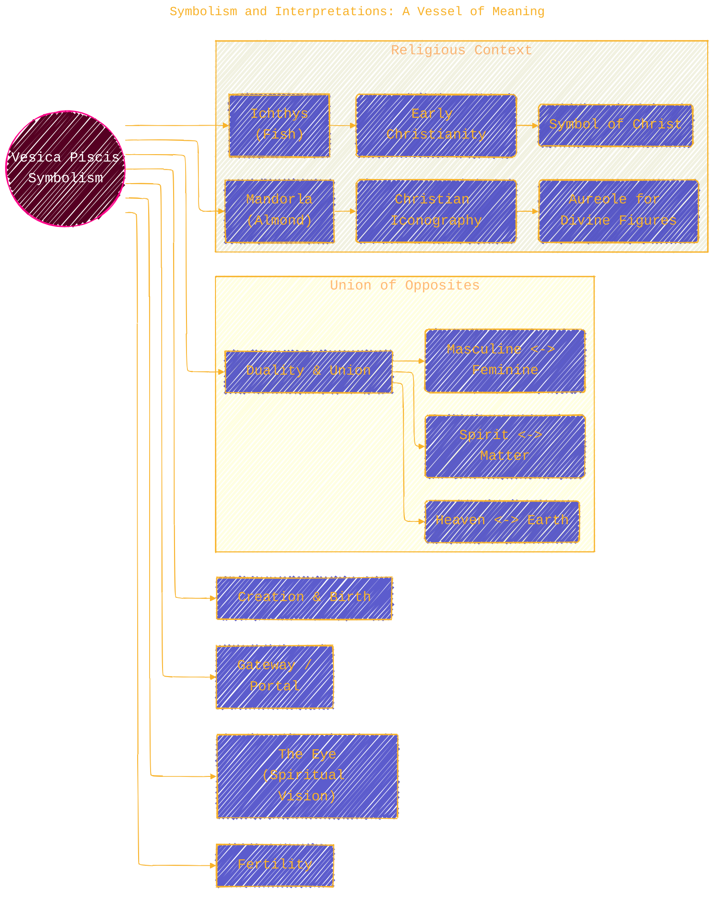

> ⚠️🏗️🚧🦺🧱🪵🪨🪚🛠️👷
> 
> This is a working draft in progress
> 
> 
> 
> gif image is provided by [Giphy](https://giphy.com)
> 
> ⚠️🏗️🚧🦺🧱🪵🪨🪚🛠️👷

----

# The Vesica Piscis: A Journey Through Geometry, Symbolism, and History
> **Disclaimer:**
>
> This document contains my personal notes on the topic,
> compiled from publicly available documentation and various cited sources.
> The materials are intended for educational purposes, personal study, and reference.
> The content is dual-licensed:
> 1. **MIT License:** Applies to all code implementations (Swift, Mermaid, and other programming languages).
> 2. **Creative Commons Attribution 4.0 International License (CC BY 4.0):** Applies to all non-code content, including text, explanations, diagrams, and illustrations.
---

## 1. Introduction: Unveiling the Vesica Piscis

The Vesica Piscis, Latin for "fish's bladder," is a fundamental and profoundly symbolic geometric figure formed by the intersection of two circles of equal radii, where the center of each circle lies on the circumference of the other. This simple construction gives rise to a shape rich in mathematical properties and imbued with deep symbolic meaning across various cultures and historical periods [1, 2]. It represents a primal form in sacred geometry, often seen as a symbol of creation, duality, union, and a gateway between worlds [3].

---

## 2. Defining the Vesica Piscis: The Geometric Genesis

The Vesica Piscis is born from a precise geometric operation. Its elegant form arises from the symmetrical overlap of two identical circles. This construction is described in classical geometric texts, including early translations and commentaries on Euclid's *Elements*, where the construction of an equilateral triangle (Book I, Proposition 1) inherently involves the framework of the Vesica Piscis [4].

**Core Construction Steps:**

1.  **Draw the First Circle:** Define a circle (Circle A) with a center point $C_1$ and a radius $R$.
2.  **Draw the Second Circle:** Select any point on the circumference of Circle A to be the center $C_2$ for a second circle (Circle B), also with radius $R$.
3.  **The Intersection:** The almond-shaped (or lenticular) region where these two circles overlap is the Vesica Piscis.

*Diagram Title: Formation of the Vesica Piscis*

---

## 3. Mathematical Properties: The Numbers Behind the Shape

The Vesica Piscis is not just visually appealing; it possesses distinct mathematical properties that have intrigued mathematicians and artists for centuries. These properties are derivable from fundamental Euclidean geometry [4, 5].

**Key Dimensions and Ratios:**  
Let $R$ be the radius of the two generating circles.

*   **Width (Minor Axis):** The distance between the two centers ($C_1$ and $C_2$) and the shortest dimension across the Vesica Piscis is equal to the radius $R$.
    $$
    \text{Width} = R
    $$
*   **Height (Major Axis):** The longest dimension of the Vesica Piscis, passing through its two "cusps" (the points where the circles intersect), is $R\sqrt{3}$. This can be derived by recognizing that the centers of the circles and the cusps form two equilateral triangles [5].
    $$
    \text{Height} = R\sqrt{3}
    $$
*   **Ratio of Height to Width:** This is a fundamental characteristic ratio of the Vesica Piscis.
    $$
    \frac{\text{Height}}{\text{Width}} = \frac{R\sqrt{3}}{R} = \sqrt{3} \approx 1.732
    $$
    This $\sqrt{3}$ proportion, also known as Theodorus's constant (though Theodorus's work focused on constructing lengths of square roots), is central to its geometric and symbolic interpretations [2].

**Angular Properties:**
*   The two arcs forming the boundary of the Vesica Piscis each span an angle of $120^\circ$ ($2\pi/3$ radians) from the center of their respective circles.
*   The angle formed at each of the two cusps of the Vesica Piscis is $120^\circ$.

**Area and Perimeter:**  
The formulas for the area and perimeter are standard geometric derivations [cf. 5, 6].

*   **Area ($A$):**
    $$
    A = 2 \times R^2 \left(\frac{\pi}{3} - \frac{\sqrt{3}}{4}\right) = R^2 \left(\frac{2\pi}{3} - \frac{\sqrt{3}}{2}\right) \approx 1.22837 R^2
    $$
*   **Perimeter ($P$):**
    $$
    P = 2 \times \left(R \cdot \frac{2\pi}{3}\right) = \frac{4\pi R}{3} \approx 4.18879 R
    $$

*Diagram Title: Key Mathematical Features of the Vesica Piscis*

----

## 4. Symbolism and Interpretations: A Vessel of Meaning

The Vesica Piscis is far more than a geometric curiosity; it is a potent symbol with manifold interpretations across cultures, religions, and esoteric traditions [1, 3]. Its form inherently suggests themes of intersection, union, and generation.

*   **Duality and Union:** It is perhaps most fundamentally seen as representing the union of two distinct entities or principles – spirit and matter, heaven and earth, masculine and feminine, conscious and unconscious. The overlapping region signifies integration and wholeness [3, 7].
*   **Creation and Birth:** The shape is often likened to a womb or a birth canal, symbolizing the source of creation, new beginnings, and the emergence of life or new forms [1].
*   **Gateway or Portal:** The Vesica Piscis can be interpreted as a portal or doorway between different realms or states of consciousness – a passage from one world to another. This concept is found in various mystical traditions [7].
*   **The Ichthys (Fish Symbol):** In early Christianity, the Vesica Piscis shape, often drawn horizontally, formed the "Ichthys" or fish symbol. "ΙΧΘΥΣ" (Ichthys) is an acronym for "Ἰησοῦς Χριστός, Θεοῦ Υἱός, Σωτήρ" (Iēsous Christos, Theou Huios, Sōtēr), meaning "Jesus Christ, Son of God, Savior" [8, 9]. The fish also related to stories like the feeding of the multitude.
*   **The Mandorla:** In religious art, particularly Christian iconography, an upright Vesica Piscis shape called a mandorla (Italian for "almond") often encloses the figure of Christ in Majesty, the Virgin Mary, or saints, signifying divinity, glory, or a sacred space [1, 10]. Examples can be found in numerous historical artifacts cataloged by museums like The Metropolitan Museum of Art [11].
*   **The Eye:** Its shape resembles an eye, often interpreted as the "third eye" or a symbol of spiritual vision, enlightenment, and consciousness [3].
*   **Fertility:** Related to its symbolism of birth, it's also associated with fertility and the generative forces of nature, a theme explored in comparative mythology [cf. 7].

*Diagram Title: Symbolic Meanings of the Vesica Piscis*

----

## 5. Historical Significance and Applications

The Vesica Piscis has appeared throughout human history, embedded in sacred art, architecture, and mystical systems.

*   **Ancient Civilizations:** Evidence of its use can be found in ancient Egyptian, Mesopotamian, Indian, and Greek art and architecture, often linked to sacred geometry and cosmological understanding [2, 12]. For example, some analyses of the proportions of Egyptian temples suggest underlying geometric principles related to it [cf. 13].
*   **Gothic Architecture:** The shape is prominent in Gothic architecture, particularly in the design of windows (rose windows often incorporate its geometry), arches, and ground plans of cathedrals [14, 15]. Its proportions, like the $\sqrt{3}$ ratio, were considered by master builders to embody divine harmony. Many detailed architectural surveys of cathedrals like Chartres or Notre Dame show these forms (e.g., see Viollet-le-Duc's *Dictionnaire raisonné de l'architecture française du XIe au XVIe siècle*) [16].
*   **Sacred Geometry:** It is a foundational element in sacred geometry, used to generate other shapes like the equilateral triangle, hexagon, and the Flower of Life pattern. It's seen as a key to understanding the geometric principles underlying the universe [2, 3].
*   **Art and Iconography:** Beyond the Mandorla, its structural principles are subtly present in the composition of many artworks, influencing balance and proportion.
*   **Esoteric Traditions:** Groups like the Freemasons and other mystical schools have incorporated the Vesica Piscis into their symbolism, often representing esoteric knowledge, spiritual development, and the aforementioned dualities [7, 17].
*   **Modern Design:** The shape continues to be used in modern logos, art, and design for its aesthetic appeal and inherent sense of balance and harmony.

*Diagram Title: Historical and Applied Context of the Vesica Piscis*

---

## 6. Conclusion: The Enduring Allure of the Vesica Piscis

The Vesica Piscis, arising from the simple intersection of two circles, unfolds into a symbol of immense depth and beauty. Its mathematical elegance, characterized by the $\sqrt{3}$ proportion, provides a framework that has been interpreted across millennia as representing fundamental dualities, the mystery of creation, and pathways to spiritual understanding [1, 2]. From ancient carvings to the soaring arches of Gothic cathedrals and the sacred art of diverse traditions, the Vesica Piscis continues to resonate as a timeless emblem of union, harmony, and the interconnectedness of all things [3, 14].

*Diagram Title: Comprehensive Summary of Vesica Piscis*

---

<!-- 

---
>
>**Licenses:**
>
>- **MIT License:**   - Full text in [LICENSE](LICENSE) file.
>- **Creative Commons Attribution 4.0 International:**  - Legal details in [LICENSE-CC-BY](LICENSE-CC-BY) and at [Creative Commons official site](http://creativecommons.org/licenses/by/4.0/).

---

## References

1.  Ghyka, M. (1977). *The Geometry of Art and Life*. Dover Publications. (Originally published 1946).
2.  Lawlor, R. (1982). *Sacred Geometry: Philosophy and Practice*. Thames & Hudson.
3.  Pennick, N. (1994). *The Sacred Art of Geometry: Temples of the Phoenix*. Wooden Books. (Reprinted, often under title "Sacred Geometry").
4.  Euclid. *Elements*. (Numerous translations and editions available, e.g., Heath, T. L. (1956). *The Thirteen Books of Euclid's Elements*. Dover Publications). Book I, Proposition 1 is key for construction.
5.  Weisstein, E. W. "Vesica Piscis." From *MathWorld*--A Wolfram Web Resource. [https://mathworld.wolfram.com/VesicaPiscis.html](https://mathworld.wolfram.com/VesicaPiscis.html) (Accessed on current date).
6.  Coxeter, H. S. M. (1969). *Introduction to Geometry*. John Wiley & Sons.
7.  Cooper, J. C. (1978). *An Illustrated Encyclopaedia of Traditional Symbols*. Thames & Hudson.
8.  Dölger, F. J. (1910-1943). *ΙΧΘΥΣ*. 5 vols. Aschendorff. (A foundational, although extensive and primarily German, work on the Ichthys symbol). A more accessible summary can be found in general encyclopedias of religion or Christian symbolism.
9.  Ferguson, G. (1961). *Signs & Symbols in Christian Art*. Oxford University Press.
10. Schiller, G. (1971). *Iconography of Christian Art, Vol. 1: Christ's Incarnation, Childhood, Baptism, Temptation, Transfiguration, Works and Miracles*. Lund Humphries.
11. The Metropolitan Museum of Art. *Collection Database*. Searching for "mandorla" or specific period artworks often yields examples. (e.g., [https://www.metmuseum.org/art/collection](https://www.metmuseum.org/art/collection) - results will vary).
12. Critchlow, K. (1976). *Islamic Patterns: An Analytical and Cosmological Approach*. Thames & Hudson. (Discusses geometric principles common in ancient and sacred art, some of which relate to Vesica Piscis constructions).
13. Schwaller de Lubicz, R. A. (1977). *The Temple in Man: Sacred Architecture and the Perfect Man*. Inner Traditions. (Interprets Egyptian architecture through a symbolic and geometric lens).
14. von Simson, O. (1956). *The Gothic Cathedral: Origins of Gothic Architecture and the Medieval Concept of Order*. Pantheon Books.
15. Frankl, P., & Crossley, P. (2000). *Gothic Architecture* (Revised ed.). Yale University Press Pelican History of Art.
16. Viollet-le-Duc, E. (1854–1868). *Dictionnaire raisonné de l'architecture française du XIe au XVIe siècle*. B. Bance. (Digitized versions available, e.g., via Gallica, the digital library of the Bibliothèque nationale de France: [https://gallica.bnf.fr/](https://gallica.bnf.fr/)).
17. MacNulty, W. K. (2006). *Freemasonry: Symbols, Secrets, Significance*. Thames & Hudson.

----
