# Understanding Sacred Geometry - A Diagrammatic Guide 
> **Disclaimer:**
>
> This document contains my personal notes on the topic,
> compiled from publicly available documentation and various cited sources.
> The materials are intended for educational purposes, personal study, and reference.
> The content is dual-licensed:
> 1. **MIT License:** Applies to all code implementations (Swift, Mermaid, and other programming languages).
> 2. **Creative Commons Attribution 4.0 International License (CC BY 4.0):** Applies to all non-code content, including text, explanations, diagrams, and illustrations.
---

## 1. Introduction: The Blueprint of Existence?

Sacred Geometry refers to the belief system that attributes symbolic and sacred meanings to certain geometric shapes and proportions. It posits that geometry and mathematical ratios are fundamental building blocks of the universe, reflecting an underlying order, consciousness, and the divine. Found across diverse cultures and historical periods, it explores the mathematical constants that appear in natural forms, musical harmony, architectural designs, and cosmological models, suggesting a universal geometric language.

---

## 2. Historical and Cultural Roots

The principles associated with Sacred Geometry are ancient, appearing independently and interconnectedly across various civilizations.

*   **Ancient Egypt:** Utilized precise geometric proportions in temple and pyramid construction (e.g., Great Pyramid of Giza), possibly linked to astronomical alignments and cosmological beliefs.
*   **Ancient Greece:** Philosophers like Pythagoras saw numbers and geometry as the key to understanding the cosmos. Plato, in his *Timaeus*, associated the five regular polyhedra (Platonic Solids) with the classical elements.
*   **Islamic Art & Architecture:** Features intricate geometric patterns (girih, zellij) reflecting principles of unity, order, and infinity, often avoiding figurative imagery.
*   **Gothic Cathedrals:** Employed geometric principles, possibly including the Golden Ratio, to create harmonious proportions, light effects, and symbolic spaces.
*   **Renaissance:** Artists and architects like Leonardo da Vinci (e.g., *Vitruvian Man*) explored the relationship between human proportions, geometry, and universal order.
*   **Indigenous Cultures:** Many cultures incorporate geometric symbols in art, rituals, and cosmology (e.g., Mandalas in Hinduism/Buddhism, Medicine Wheels in Native American traditions, Labyrinths).

*Diagram: Historical Flow of Sacred Geometry Concepts*

---

## 3. Key Geometric Forms and Symbols

Certain shapes and patterns are central to Sacred Geometry, each believed to hold specific meanings and properties.

### 3.1. The Platonic Solids

These are the five convex regular polyhedra. All faces are congruent regular polygons, with the same number of faces meeting at each vertex. Plato associated them with the classical elements:

1.  **Tetrahedron:** 4 triangular faces (Fire)
2.  **Hexahedron (Cube):** 6 square faces (Earth)
3.  **Octahedron:** 8 triangular faces (Air)
4.  **Dodecahedron:** 12 pentagonal faces (Aether/Spirit/Universe)
5.  **Icosahedron:** 20 triangular faces (Water)

They are considered fundamental building blocks, symbolizing the underlying structure of matter and the universe.

```mermaid
---
title: "Key Geometric Forms and Symbols - The Platonic Solids"
author: "Cong Le"
version: "1.0"
license(s): "MIT, CC BY 4.0"
copyright: "Copyright (c) 2025 Cong Le. All Rights Reserved."
config:
  layout: elk
  theme: base
---
%%%%%%%% Mermaid version v11.4.1-b.14
%%%%%%%% Available curve styles include the following keywords:
%% basis, bumpX, bumpY, cardinal, catmullRom, linear, monotoneX, monotoneY, natural, step, stepAfter, stepBefore.
%%{
  init: {
    'flowchart': { 'htmlLabels': false, 'curve': 'basis' },
    'fontFamily': 'Luminari',
    'themeVariables': {
      'primaryColor': '#D12',
      'primaryTextColor': '#F8B229',
      'lineColor': '#F8B229',
      'primaryBorderColor': '#27AE60',
      'secondaryColor': '#DE2F',
      'secondaryTextColor': '#6C3483',
      'secondaryBorderColor': '#A569BD',
      'fontSize': '18px'
    }
  }
}%%
flowchart LR
    subgraph Platonic_Solids["Platonic Solids<br/>(Regular Convex Polyhedra)"]
        PS(("Shapes")) --> T("Tetrahedron <br/>Fire<br/>🔥")
        T --> T_Expansion
        T_Expansion@{ shape: tri, label: "4<br/>Triangle" }


        PS --> H("Hexahedron <br/>Earth<br/>🌎")
        H --> H_Expansion
        H_Expansion["6<br/>Squares"]
        
        PS --> O("Octahedron<br/> Air<br/>🌬️")
        O --> O_Expansion
        O_Expansion@{ shape: tri, label: "8<br/>Triangle" }
        
        PS --> D("Dodecahedron <br/> Aether<br/>✡")
		D --> D_Expansion
		D_Expansion@{ shape: notch-pent, label: "12<br/>Pentagons" }
        
        PS --> I("Icosahedron<br/> Water<br/>🌊")
		I --> I_Expansion
        I_Expansion@{ shape: tri, label: "20<br/>Triangle" }



    end
    subgraph Properties["Properties"]
        Prop["Key Properties"] --> Prop1("All faces congruent regular polygons")
        Prop --> Prop2("Same number of faces meet at each vertex")
        Prop --> Prop3("Finite:<br/> Only 5 exist")
    end
    subgraph Symbolism["Symbolism"]
        Sym["Symbolic Meaning"] --> Sym1("Fundamental building blocks")
        Sym --> Sym2("Structure of matter/universe")
        Sym --> Sym3("Correspondence with elements")
    end

    style PS fill:#242,stroke:#333,stroke-width:2px
    style Prop fill:#422,stroke:#333,stroke-width:2px
    style Sym fill:#224,stroke:#333,stroke-width:2px
    
```

*Diagram: Overview of the Platonic Solids*

### 3.2. The Flower of Life and Related Patterns

This is a geometric figure composed of multiple evenly-spaced, overlapping circles arranged in a flower-like pattern with six-fold symmetry like a hexagon.

*   **Vesica Piscis:** Formed by the intersection of two circles of the same radius, where the center of each lies on the circumference of the other. Symbolizes union, creation, and a gateway.
*   **Seed of Life:** Formed from 7 circles placed with sixfold symmetry, forming a pattern of circles and lenses, acting as a component of the Flower of Life design. Represents the seven days of creation.
*   **Flower of Life:** An expanded pattern of overlapping circles. Seen as a template containing the basis of all matter, fundamental forms (like Platonic Solids), and life itself.
*   **Fruit of Life:** ==Composed of 13 circles selected from the Flower of Life. Connecting the centers of these circles yields== **Metatron's Cube**.
*   **Metatron's Cube:** ==Contains all five Platonic Solids hidden within its lines, linking the fundamental shapes and patterns.==

*Diagram: Relationship between Flower of Life Patterns*

### 3.3. Other Key Shapes

*   **Spiral (Logarithmic/Fibonacci):** Represents growth, expansion, cosmic energy (e.g., galaxies, shells).
*   **Torus:** A donut shape, representing energy flow, cycles, self-contained systems.
*   **Point, Line, Circle, Triangle, Square:** Basic elements with symbolic meanings (unity, duality, trinity, stability).
*   **Labyrinth/Spiral:** Path of journey, integration, pilgrimage.
*   **Mandala:** Circular diagram, representing cosmos, wholeness, focus for meditation.

### 3.4 Combined all the geometries - WIP

*Comprehensive Diagram*

---

## 4. Foundational Principles

Sacred Geometry is often underpinned by specific mathematical ratios and concepts.

### 4.1. The Golden Ratio (Phi, $\phi$)

An irrational number approximately equal to 1.618. It's defined when a line is divided into two parts such that the ratio of the whole line to the longer part is equal to the ratio of the longer part to the shorter part.

$$
\frac{a+b}{a} = \frac{a}{b} \equiv \phi
$$

Where $\phi = \frac{1 + \sqrt{5}}{2} \approx 1.6180339887...$

It is frequently linked to:
*   **Fibonacci Sequence:** (0, 1, 1, 2, 3, 5, 8, ...) where each number is the sum of the two preceding ones. The ratio of consecutive Fibonacci numbers approaches $\phi$ as the sequence progresses ($8/5=1.6$, $13/8=1.625$, etc.).
*   **Aesthetics and Harmony:** Believed to create aesthetically pleasing proportions found in art, architecture, and nature (e.g., Parthenon, sunflower seeds, pinecones, human body – though some claims are debated or exaggerated).
*   **Growth Patterns:** Appears in phyllotaxis (arrangement of leaves on a stem), shell growth, and other natural forms.

### 4.2. Fractals

Geometric shapes that exhibit self-similarity – meaning the same pattern repeats at different scales. They are infinitely complex and appear in natural phenomena.
*   **Examples:** Coastlines, snowflakes, ferns, lightning bolts, branching patterns (trees, rivers, lungs).
*   **Symbolism:** Represents infinity, interconnectedness, the idea of "as above, so below" (macrocosm reflected in the microcosm).

### 4.3. Harmony and Resonance

The idea that geometric forms and ratios correspond to vibrational frequencies and musical harmonies (linking back to Pythagorean ideas of the "music of the spheres"). Certain geometries are believed to create resonant fields beneficial for well-being or spiritual practice.

---

## 5. Applications and Belief Systems

Sacred Geometry is not just theoretical; it is applied and interpreted in various contexts:

*   **Architecture:** Designing temples, churches, mosques, and monuments with specific proportions and layouts believed to create sacred space, enhance acoustics, or align with celestial events.
*   **Art:** Creating mandalas, yantras, religious icons, and decorative patterns incorporating symbolic geometry for meditation, contemplation, or aesthetic harmony.
*   **Spirituality and Esotericism:** Used as tools for meditation, visualization, understanding consciousness, and mapping spiritual realms or energy fields (e.g., chakras, Kabbalistic Tree of Life correlations).
*   **Healing and Well-being (Alternative):** Some New Age practices employ geometric forms (crystals shaped as Platonic solids, geometric patterns) believing they have healing properties or can balance energy fields (Note: lacking scientific validation).
*   **Design:** Used in modern graphic design, product design, and art for its aesthetic appeal and perceived sense of balance and harmony.

----

## 6. Modern Perspectives and Critique

While Sacred Geometry holds significant historical, cultural, and artistic importance, its more metaphysical claims lack empirical scientific validation.
*   **Scientific Scrutiny:** Concepts like the pervasive influence of the Golden Ratio in nature or human anatomy are sometimes exaggerated or based on selective measurement. The universe operates on complex physical laws, not solely geometric predetermination in the esoteric sense.
*   **Psychology:** Humans have a natural tendency towards pattern recognition (apophenia/pareidolia), which may contribute to finding significance in geometric forms. Geometric patterns are fundamental to visual perception and aesthetics.
*   **Continuing Relevance:** Its principles continue to inspire artists, designers, architects, and spiritual seekers interested in universal patterns, symbolism, and the intersection of mathematics, nature, and consciousness.

---

## 7. Conclusion: A Synthesis

Sacred Geometry offers a lens through which to view the world as an ordered, interconnected system where mathematical forms hold profound meaning. It bridges mathematics, art, spirituality, and the natural world. While its esoteric interpretations remain outside mainstream science, its influence on human culture, creativity, and the search for meaning is undeniable. The core shapes and ratios continue to resonate due to their mathematical elegance and prevalence in the patterns we observe around us.

---
**Licenses:**

- **MIT License:**   - Full text in [LICENSE](LICENSE) file.
- **Creative Commons Attribution 4.0 International:**  - Legal details in [LICENSE-CC-BY](LICENSE-CC-BY) and at [Creative Commons official site](http://creativecommons.org/licenses/by/4.0/).

---